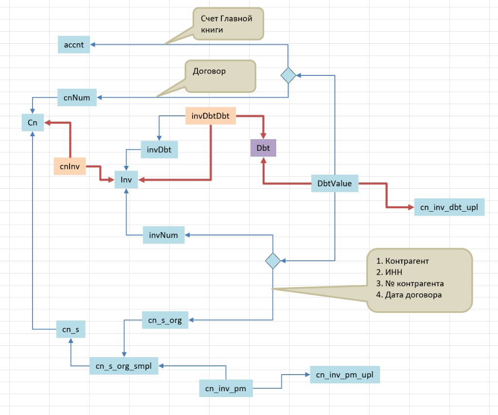
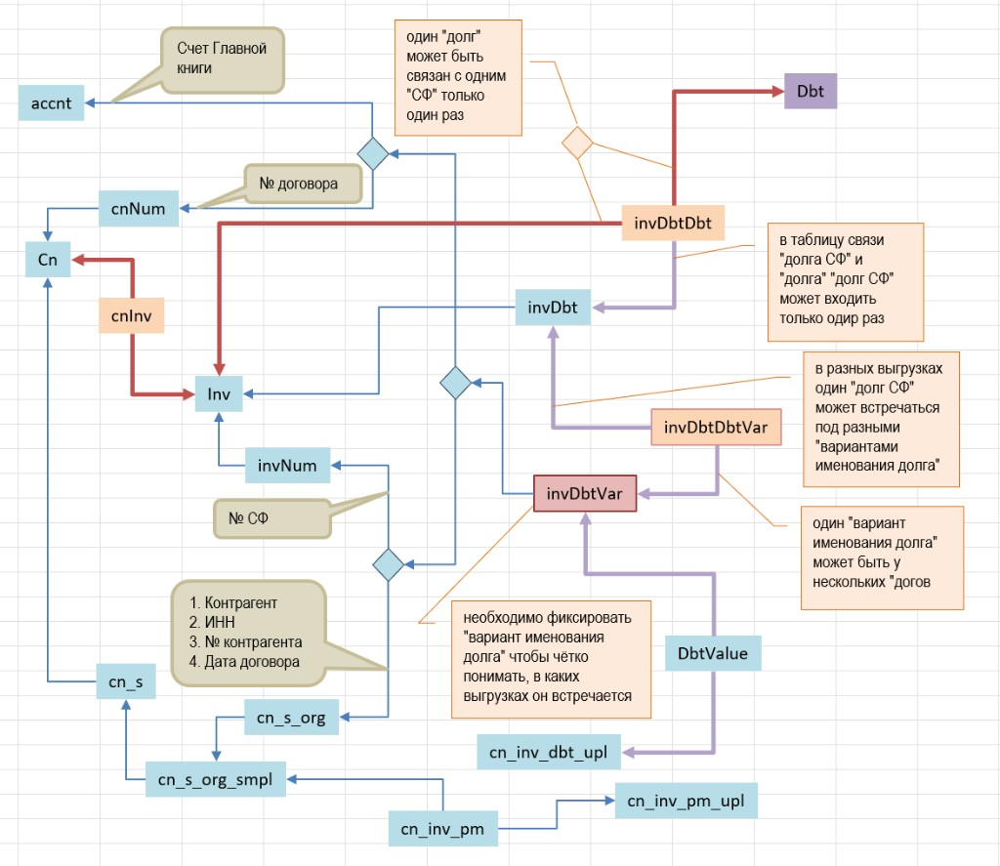

# СУДЗ — учёт проблем модели данных и способов решения

**Дата создания:** 2026-08-03  
**Последнее обновление:** 2026-08-15 (S63: ошибка эскиза pm→smpl без accnt; предпочтение варианта 1 — `cnInvAccntSmpl`)  
**Статус:** рабочий реестр (нарастающий)  
**План чата:** [chat-plan-26-0802-sudz.md](../../chats/chat-plan/chat-plan-26-0802-sudz.md)  
**Контекст модели:** [04-data-model.md](./04-data-model.md) · пример [04-2](./04-2_example-rslt-82-85.md) · **физ. схема + ER:** [08-target-schema.md](./08-target-schema.md)

Документ фиксирует **проблемы структуры/идентичности** данных СУДЗ и **попытки их решить** (в БД, костылях, ручных процедурах). Новые пункты добавляются по сегментам; статус попыток уточняется по фактам из FishEye.ags и Excel.

---

## 0. Как читать

| Колонка / ярлык | Смысл |
|-----------------|--------|
| **P#** | Проблема (стабильный ID в реестре) |
| **открыта** | Целевого решения нет или оно не работает в квартальном контуре |
| **частично** | Есть костыль / недоделанный слой; симптомы смягчены, корень не закрыт |
| **закрыта** | Подтверждённое решение в эксплуатации (пока нет) |
| **попытка** | Артефакт в `ags` / Access / Excel, нацеленный на проблему |
| **не про то** | Похожий по датам/связям артефакт, но решает другую задачу |

Сверка фактов: **dev FishEye.ags** + своды `2025-12` / `2026_03` / `2026-06` debit (2026-08-03).

---

## 1. Реестр проблем

### P1 — Смена объекта документа основания между выгрузками («осцилляция СФ»)

**Суть (уточнение S11).** Речь **не** о переименовании одного и того же счёта-фактуры, а о том, что в поле «Документ основания (счет-фактура)» бухгалтерия в разных выгрузках подставляет **разные объекты**:

| Тип объекта | Пример | Роль |
|-------------|--------|------|
| **Решение суда** (и подобные «зонтики») | `А19-16343/2021` | К одному решению относятся **несколько** долгов (см. P2) |
| **Исходный счёт-фактура** | `90` | Документ, по которому долг **образовался** и затем попал в суд |

Одна и та же логическая задолженность то видна под решением суда, то под исходной СФ. Match «по текущему `inv` / имени документа» ломается.

**Не путать с P5** (смена *имени* у того же объекта СФ) — такая проблема тоже есть, но это другой кейс.

**Канонический пример:** долг Rslt **85** (ВМК, 9527.42, договор `32-425/05-18` / `43243`): в сводах **`А19-16343/2021` ↔ `90`**. Разбор: [04-2](./04-2_example-rslt-82-85.md).

**Проверка `90` (S11)** — во всех доступных общих сводах на листе `762210`:

| Свод | Строк с документом `90` | Сумма / договор |
|------|-------------------------|-----------------|
| 31.12.2025 | **0** (долг 9527.42 сидит под `А19-16343/2021` вместе с ещё 6 долгами) | — |
| 31.03.2026 | **1** | 9527.42 / `32-425/05-18` |
| 30.06.2026 | **1** | 9527.42 / `32-425/05-18` |

Гипотеза владельца («у исходной СФ `90` в доступных выгрузках всегда один долг») — **подтверждена** на этих трёх сводах. В 2026.I–II тот же договор «разворачивается» с решения суда на исходные СФ `21`, `32`, `46`, `49`, `7`, `90` — у каждой **ровно одна** сумма; под `А19-16343/2021` остаётся один соседний долг (4 351 101.82).

**Почему критично:** контур `cn_inv_dbt` → `cnInvAccnt` и `invDbt` **завязаны на `inv`**. Пока ID долга = текущий документ основания, смена объекта (суд ↔ СФ) не чинится таблицей «рядом с inv».

**Статус:** **открыта**. (Бывший черновик **P3** «долг переходит между разными СФ» **поглощён** этим уточнением.)

| Попытка | Когда | Что сделано | Закрывает P1? |
|---------|-------|-------------|----------------|
| Ручной match в `ags_Yr_DbtChangesRslt` (красные строки) | текущая практика | Сумма + номер договора + дата договора | **нет** (процедура, не модель) |
| `cnInvAccnt` как «табличка задолженностей» | с ~2022-01 | Стабильный `ciaKey`, но при смене объекта документа match не удерживается | **нет** |
| Слой `inv` / `cnInv` (СФ гуляет между договорами) | с ~2022-01 | Это **P4**, не P1 | **нет** |
| `invDbt` + `invDbtValue` | 2022-12 / 2023-04 | Ключ всё ещё от `inv` | **нет** (см. §2) |

---

### P2 — Несколько задолженностей у одного документа основания в одной выгрузке

**Суть.** В одном своде на **один** номер в колонке «Документ основания» приходится **несколько** строк ДЗ. Типичный носитель — **решение суда** (зонтик), а не «обычная» однострочная СФ.

**Проверка на своде 31.12.2025** (лист `762210`):

| Документ основания | Договор | Число строк ДЗ | Заметка |
|--------------------|---------|----------------|---------|
| **А19-16343/2021** | `32-425/05-18` | **7** | По владельцу — **решение суда**; среди сумм есть 9527.42 (= долг 85 / исходная СФ `90`) |
| **А19-16352/2021** | `32-426/05-18` | **5** | Аналогичный кластер (соседний договор) |

В сводах 31.03.2026 и 30.06.2026 шесть из семи сумм с `А19-16343/2021` уже показаны под **отдельными** исходными СФ (`21`…`90`); под решением суда остаётся 1 долг — P2 для этого зонтика в эти кварталы «схлопнут» бухгалтерией, но в 31.12.2025 P2 налицо.

**Статус:** **закрыта целевой моделью** (`Dbt` / `invDbt` / `invDbtDbt`, S14–S32). Исторический костыль `ciaName` и задумка `idNum` в `invDbt` — артефакты старого контура; в новой структуре **не переносятся**.

| Попытка | Когда | Что сделано | Закрывает P2? |
|---------|-------|-------------|----------------|
| `ciaName` / `ciaNameNull` на `cnInvAccnt` | MS_Description + эксплуатация | Явное «имя» задолженности при одном документе/контрагенте | **костыль** (исторический; причина появления `invDbt`) |
| `invDbt.idNum` | 2022-12-06 | Несколько долгов на один `idInv` | **структурно могло бы**; **не используется** в текущих выгрузках |
| Ручное «уточнение основания» в Rslt | практика | Различение глазами | **нет** |
| Целевая модель `Dbt`+`invDbt`+`invDbtDbt` | S14–S32 | Каждый долг — отдельная сущность `Dbt`; на одном `Inv` допустимо N слотов `invDbt` без текстового дискриминатора | **да** — `ciaName` больше не нужен |

**Найден точный код разбора P2 (S29):** `btnCidufLoad_Click()` (загрузчик свода) диагностирует именно этот случай процедурой `invDbtDouble` — карточки (`cnInvAccnt`) с установленным `ciaName`, у которых больше одной строки `cn_inv_dbt`, сверяются с источником через метод `CiaNm.SumMatch(dbt_ttl, maxDate)`:

```sql
-- составной ключ сопоставления новой суммы с существующей "именованной" задолженностью
WHERE ci.ciInv = @iKey                                   -- тот же документ-основание (СФ)
  AND (cia.ciaName = @ciaName OR (@ciaName IS NULL AND cia.ciaName IS NULL))
  AND d.dbt_ttl = CCur(@curSum)                            -- точное совпадение суммы
```

Возвращает количество исторических совпадений и дату последнего (`Max(uplStatusOnDate)`). Это диагностика, **не** автоматическая запись — при неоднозначности лог просто предупреждает оператора, что «нужно проверить» (см. также шаг 7 воронки — `ciduTblCnCtptInvAccNameCountOneNot` — тот же класс сигнала «разнести по именам вручную»). Формально: **P2 на уровне создания новой строки решается ручным присвоением `ciaName` оператором, а последующее сопоставление — автоматически, но по точному совпадению суммы**, не по близости/эвристике. Полный разбор воронки: [04-data-model §2.7](./04-data-model.md#27-полный-алгоритм-btncidufload_click--цепочка-сопоставления-подтверждено-s29).

---

### P3 — *(поглощён P1, S11)*

Ранее: «задолженность переходит между разными СФ». Это и есть смена **объекта** документа основания (суд ↔ исходная СФ), а не отдельный класс. См. **P1**.

---

### P4 — СФ «гуляет» между договорами `cn`

**Суть.** Один `inv` со временем оказывается связан с другим `cn`.

**Статус:** **частично** закрыта контуром `inv` / `cnInv` (вместо жёсткого `cn_inv`). Не путать с P1/P2/P5.

---

### P5 — Смена имени у того же объекта счёта-фактуры

**Суть.** Отдельно от P1: у **одного и того же** объекта СФ может меняться отображаемое имя/номер (переименование), без смены сущности документа и без перехода «суд ↔ исходная СФ».

**Статус:** **открыта** (заявлено владельцем, S11); канонический пример в сводах пока не разобран. Не смешивать с P1.

---

### P6 — Двойной контур сторон/задолженностей и ручная синхронность FK

**Суть.** Сегмент «договор → сторона → организация → карточка задолженности» вырос **нативно** в два параллельных слоя:

```text
cn
 └─ cn_s                         # стороны, замеченные у договора (роль: заказчик/исполнитель)
      └─ cn_s_org_smpl           # сторона ↔ организация  БЕЗ дат
           ├─ cn_s_org           # та же связь + date_beg/end, csoCnDate, asbu… (допсоглашения)
           └─ cnInvAccntSmpl     # тройка: cnInv + СГК + cn_s_org_smpl
                └─ cnInvAccnt    # «полная» задолженность: ОБЯЗАНЫ оба FK
                     ├─ ciaCn_s_org       → cn_s_org      (с датами)
                     └─ ciaCnInvAccntSmpl → cnInvAccntSmpl (без дат)
```

Чтобы завести запись в **`cnInvAccnt`** (к которой цепляют долги из общего свода), нужно указать **и** `ciaCn_s_org`, **и** `ciaCnInvAccntSmpl`. Согласованность «`cn_s_org.csoCn_s_org_smpl` = `cnInvAccntSmpl.ciasCn_s_org_smpl`» **не обеспечена схемой** — остаётся на дисциплине пользователя. В текущем dev-снимке рассинхрона **0** из 12 693, но это не гарантия.

**Следствия:**

| Факт (dev, 2026-08-03) | Смысл |
|------------------------|--------|
| `cn_s_org_smpl` ~3 326; `cn_s_org` ~2 993; ~408 smpl **без** dated-интервала | Dated-слой не покрывает все простые стороны |
| У одного smpl до **8** интервалов `cn_s_org` | Смены по допсоглашениям — норма |
| `cnInvAccntSmpl` ~91 554; из них **~79 514 без** `cnInvAccnt` | PM-контур живёт на Smpl; «полная» задолженность — узкое СУДЗ-подмножество |
| `cn_inv_pm.ciaCnInvAccntSmpl` **NOT NULL** на всех ~479 268 | Привязка платежей — к Smpl |
| `cn_inv_pm.cidCnInvAccntCtpt` заполнен **0** раз | Платежи **не** ссылаются на `cnInvAccnt` |
| Хронология создания | smpl **2021-12-08** → AccntSmpl/pm **12-09** → `cn_s_org` dated **12-13** → `cnInvAccnt` **2022-01** |

**Статус:** **открыта** (структурный долг перед «идеальной» моделью).

**Связь с P7:** Smpl появился именно чтобы решить привязку `export_*` без даты договора; побочный эффект — текущая двойственность.

---

### P7 — В `export_*` нет даты договора → нельзя надёжно выбрать `cn_s_org`

**Суть.** Файл вида `export_606012_26-0422.XLSX` содержит договор **номером** (`Договор`), кредитора, агента, код стройки, СГК, документ/суммы/сроки — но **не** дату договора (и не интервал действия стороны). Привязка платежа/`cn_inv_pm` к dated-`cn_s_org` (а значит — к старому пути на «полную» карточку) **ломалась**.

**Что сработало (сохранить в целевой модели):** слой **без дат** — `cn_s_org_smpl` + `cnInvAccntSmpl`; `cn_inv_pm.ciaCnInvAccntSmpl` обязателен. Это **решённая** операционная проблема привязки PM.

**Цена:** P6 (два контура + ручной dual-FK на `cnInvAccnt`).

**Статус:** **частично закрыта** костылём Smpl; корень (единый элегантный порядок формирования) — нет.

**Проверка колонок export (S12):** `БЕ, Счет ГК, Кредитор, Наименование, Код стройки, Агент×2, Договор, Ссылка, Присвоение, Д/проводки, Д/документ, Срок оплаты, сальдо…, № докум., …` — даты договора нет.

---

### P8 — Непропорциональный объём хранения ради кода стройки *(зафиксирована, решение отложено)*

**Суть (S13, владелец).** От `export_*` / `cn_inv_pm` СУДЗ по сути нужен только **код стройки (`cstAgPn`)** для привязки платежа. Но чтобы получить его, каждая из ~479 268 строк `cn_inv_pm` обязана ссылаться на полноценный `cnInvAccntSmpl` (тройка «СФ+договор + СГК + сторона»), а из ~91 554 таких карточек **~79 514** не используются ничем, кроме PM (см. P6). Это непропорционально много данных ради одного кода.

**Статус:** **открыта, но явно отложена** владельцем — не решать в текущем цикле. Зафиксирована, чтобы не потерялась и не блокировала проектирование Dbt/DocBasis (§6). Возможное направление на будущее: денормализовать на строку PM минимально необходимое (номер договора текстом, код стройки, СГК) без обязательной полноценной карточки Smpl/Dbt; см. §6.7.

---

## 2. Попытка `invDbt` / `invDbtValue` (хронология и вердикт)

Оценка владельца домена (S10): **крайняя попытка** починить структуру данных СУДЗ; **P1 не решает**; **P2 могла бы** (несколько долгов на один СФ через `idNum`).

### 2.1. Хронология по метаданным таблиц и данным

| Когда | Событие |
|-------|---------|
| 2022-01 | `inv`, `invNum`, `cnInvAccnt` — контур СФ и «таблички задолженностей» |
| **2022-12-01** | Создана **`invDbt`** |
| 2022-12-05 | Создана **`cn_inv_dbt_upl`** (пакеты выгрузок; дальше живут в квартальном контуре) |
| **2022-12-06** | Создана **`invDbtTmpCiaRel`**; **все 5995** строк `invDbt` с **одним** `idTimeOfEntry` = `2022-12-06 17:38:17.440` — **разовая заливка**, не поток от последующих сводов |
| **2023-04-18** | Создана **`invDbtValue`** (FK на `invDbt` + **`idvUpl`** → выгрузка) — задумана как величина долга **в выгрузке** |
| после 2023-04 | **`invDbtValue` = 0 строк** навсегда (на дату сверки) |
| 2023–2025 | Квартальные **`cn_inv_dbt`** продолжают наполняться (последний пакет в dev: `upl_key=28`, `upl_date=2025-07-18`, строки `cidTimeOfEntry≈2025-07-25`) — **без** опоры на `invDbtValue` |
| 2023–2025 | Появляются `importDbt_*`, `invBranch_*` — см. §3 (**не** продолжение `invDbt`) |

### 2.2. Что есть в `invDbt` сейчас

- Ключ: (`idInv`, `idNum`) — как раз модель «N долгов на один СФ».
- Распределение: ~5879 СФ с 1 долгом; 37 с 2; 8 с 3; 1 с **18** (`idInv=6771`).
- Связь с `cnInvAccnt`: `invDbtTmpCiaRel` (~6366 строк) — мост разовой миграции/сопоставления, не живой match по выгрузкам.

### 2.3. Вердикт

| Проблема | `invDbt` / `invDbtValue` |
|----------|---------------------------|
| P1 смена объекта документа (суд ↔ СФ) | **Не решает** — идентичность долга остаётся внутри `inv` |
| P2 несколько долгов на одном документе | **Могла бы** (`idNum` + value по `upl`) — **не доведено**: value пуст, заливка 2022-12 не обновлялась под новые своды |
| Квартальный контур после 2023 | Идёт через **`cn_inv_dbt_upl` / `cn_inv_dbt` / `cnInvAccnt`**, не через `invDbtValue` |

**Вывод по гипотезе «позже не пытались решить P1/P2 структурно»:** для слоя **`invDbt*`** — **подтверждается**. После пустого `invDbtValue` (2023-04) сопоставимых **структурных** попыток идентичности долга вне/поверх `inv` в этом семействе таблиц нет. Продолжалась эксплуатация старого контура + ручной Rslt; рядом — **другие** эксперименты (§3).

---

## 3. Похожее «по связям от выгрузок» (не решение P1/P2)

Проверено на предмет «не прятали ли ещё одну попытку идентичности рядом с upl».

| Артефакт | Связь с выгрузками | Назначение (по схеме/именам) | К P1/P2 |
|----------|--------------------|------------------------------|---------|
| **`cn_inv_dbt_upl` + `cn_inv_dbt`** | Прямая: пакет и строки свода | Рабочий квартальный контур | Несёт симптомы P1/P2; не чинит |
| **`invDbtValue.idvUpl`** | Задумана связь с upl | Value долга в выгрузке | **недоделано**, 0 строк |
| **`importDbt_*`** (2023–2025) | Имена дат сводов / срезов; колонки вида `2025-01-24_ciaKey`, `2025-07-18_ciaKey`, `cur_new`, `mery_new`, `cstAgPn_new` | Staging / срез сравнения `ciaKey` и полей Rslt между датами | Оборот импорта/сверки, **не** новая сущность долга |
| **`invBranch_23q*` / `25q*`** | Квартальные суффиксы | Поля `og`, `sheme`, `cons`, `const_old` — ветвление/схемы строек | **не про то** (не СФ/долг) |
| **`cn_inv_dbt_double`** | Диагностика дублей при загрузке | В т.ч. `ciaName` | Костыль вокруг P2, не архитектура |

Итого: после `invDbt*` по линии «идентичность задолженности» новых таблиц-наследников нет; есть **архивы импорта** и **ветвление строек**, плюс живой **`cn_inv_dbt*`**.

---

## 4. Целевое направление по идентичности долга (P1/P2/P5) — М8–М10

Чтобы закрыть **P1+P2 (+P5)** одновременно, нужна сущность задолженности со стабильным ID, у которой:

1. **текущий** (и при необходимости исторический) документ основания / `inv` — **атрибут**, а не PK; допустимы и решение суда, и исходная СФ;
2. в одной выгрузке у одного документа основания допустимо **несколько** экземпляров долга (особенно у судебных «зонтиков»);
3. match строки свода ищет ID по согласованным правилам (минимум сумма + договор + дата; уточнять счёт ГК, контрагент, `ciaName` / уточнение основания).

Кандидаты: развитие **`cnInvAccnt`**, добивка **`invDbt`** (слабее для P1), или **новая** таблица — открытый вопрос **М8**.  
**Ограничение:** любая «идеальная» Debt должна стыковаться с порядком сторон из §5 (P6/P7), иначе снова dual-FK.

---

## 5. Целевой порядок: стороны → задолженность (предложения по P6/P7)

### 5.1. Принцип

**Идентичность контрагента по договору для привязок из выгрузок — без дат.  
Интервалы с датами — история допсоглашений, не обязательный вход в создание задолженности и не ключ привязки `cn_inv_pm`.**

Так сохраняется уже решённая привязка PM из `export_*` и убирается требование «два FK и синхронность на воле пользователя».

### 5.2. Целевой порядок формирования (логический)

```text
1. cn                         # договор (номер + дата как атрибуты cn)
2. cn_s                       # роль стороны у договора (заказчик / исполнитель / …)
3. PartyOrg                   # = нынешний cn_s_org_smpl
                              #    (cn_s + org) БЕЗ дат — канон «кто сторона»
4. PartyOrgPeriod             # = нынешний cn_s_org (опционально, 0..N)
                              #    date_beg/end, csoCnDate, asbu…
                              #    смена юрлица / допсоглашения во времени
5. inv / DocumentBasis        # документ основания (СФ, решение суда…) — см. P1: атрибут
6. cnInv (при необходимости)  # факт связи inv↔cn
7. Debt                       # ОДНА сущность задолженности (целевая)
                              #    обязательные FK: PartyOrg, Accnt (СГК)
                              #    документ основания / cnInv — атрибут(ы), не единственный ключ
                              #    discriminator (имя) — для P2
                              #    PartyOrgPeriod — НЕ требуется для создания
8. Факты выгрузок
                              #    cn_inv_pm  → Debt   (сегодня: → cnInvAccntSmpl)
                              #    cn_inv_dbt → Debt   (сегодня: → cnInvAccnt)
                              #    cstAgPn с export — как сейчас, через pm
```

Ключевое отличие от текущего `cnInvAccnt`: **один** обязательный FK на сторону-организацию — **PartyOrg (smpl)**, а не пара `(cn_s_org, cnInvAccntSmpl)`.

### 5.3. Варианты реализации (от эволюции к «чистому»)

| Вариант | Суть | Плюсы | Минусы |
|---------|------|-------|--------|
| **A. Инверсия (эволюционный)** | Сделать **`cnInvAccntSmpl` каноном Debt** (или 1:1 с Debt). `ciaName`/множественность перенести на Smpl или тонкую надстройку. `cn_s_org` — только история PartyOrg. `cnInvAccnt` — deprecate или view «Debt + период». | Минимальный риск для `cn_inv_pm` (уже на Smpl); сохраняет P7 | Миграция ~12 693 полных карточек и cmm/`cn_inv_dbt` с `ciaKey` |
| **B. Новая Debt + PartyOrg (целевой «идеал»)** | Новая таблица Debt; PartyOrg = smpl; Period = dated; Smpl/Accnt — staging/view на переход | Чистая семантика; один FK; история допсоглашений отделена | Больше миграции; М8 |
| **C. Жёсткая синхронизация (паллиатив)** | Dual-FK остаётся, но: атомарный API/форма «создать оба»; CHECK/trigger `cso…smpl = cias…smpl` | Быстро убирает «волю пользователя» | **Не** убирает два контура |

**Рекомендация для FEMSQ:** проектировать **B** как целевую семантику; на переход — **A** (опереться на уже рабочий Smpl↔pm); **C** — только страховка, если миграция откладывается.

### 5.4. Что обязательно сохранить из решения P7

1. Привязка строки `export_*` / `cn_inv_pm` **не требует** даты договора.
2. Ключ привязки из того, что есть в export: договор (номер) + организация + СГК + документ — через **PartyOrg + Accnt + document**, без dated-интервала.
3. `cnipCstAgPn` (стройка) остаётся на факте PM, не на PartyOrg.

### 5.5. Стыковка с P1/P2

- **P2:** несколько Debt на одном DocumentBasis — discriminator на Debt.
- **P1:** Debt не идентифицируется DocumentBasis; смена суд↔СФ обновляет атрибут.
- **P6:** исчезает, если Debt → только PartyOrg.

### 5.6. Открытые уточнения (не блокируют §5.1)

- Нужен ли на Debt явный FK на `cn`, или он всегда выводится через PartyOrg→cn_s→cn?
- Как выбирать PartyOrgPeriod «на дату» для отчётов, если период не на Debt?
- Сохранять ли `cnInv` как обязательное звено или достаточно `inv`?

---

## 6. Целевая модель СУДЗ: `Dbt` ↔ `DocBasis` многие-ко-многим (предложение, S13)

### 6.1. Оценка идеи владельца

Предложение: завести таблицу **задолженности** (`Dbt`), связанную с документом основания **многие-ко-многим**, а не через встроенный в идентичность `inv`, как сейчас у `cnInvAccnt`/`invDbt`.

**Это верный ход**, и вот почему M:N — не излишество, а точный слепок фактов:

| Наблюдение | Требует |
|------------|---------|
| P2: один документ (решение суда) в одной выгрузке → 7 задолженностей | **один документ → много Dbt** в одном срезе |
| P1: одна задолженность в разных выгрузках → разные документы (СФ `90` / решение суда) | **один Dbt → много документов** во времени |
| Оба факта одновременно, на одном и том же кластере (долг 85) | Ничего слабее M:N-связи с меткой выгрузки не описывает оба сразу |

**Важный уточняющий факт (S13):** сегодняшняя `cn_inv_dbt.doc_base` — это **свободный текст**, не внешний ключ на `inv`. Структурной связи «факт выгрузки → объект документа» в БД **нет вообще** — это надо построить, а не просто заменить один FK на другой. Отсюда вывод: мост Dbt↔документ нужно материализовать **из текста `doc_base` при загрузке**, распознавая/создавая объект документа.

### 6.2. Целевые сущности

Обозначения — рабочие логические имена (не окончательные идентификаторы БД); в скобках — соответствие текущим таблицам.

| Сущность | Роль | Из чего сегодня |
|----------|------|------------------|
| **`Cn`** | Договор: номер, дата (атрибуты, не идентичность стороны) | `cn` |
| **`CnParty`** | Роль стороны у договора (заказчик/исполнитель) | `cn_s` |
| **`PartyOrg`** | Сторона ↔ организация, **без дат** — канон «кто контрагент» | `cn_s_org_smpl` |
| **`PartyOrgPeriod`** | 0..N интервалов действия (допсоглашения, `date_beg/end`, `csoCnDate`) | `cn_s_org` |
| **`Accnt`** | Счёт ГК | `accnt` |
| **`DocBasis`** | Объект документа основания (СФ, решение суда, …) — стабильная идентичность | `inv` |
| **`DocBasisName`** | Историзированное **имя/номер** документа (P5) — уже 1:N в БД! | `invNum` (**уже существует**: 90 816 строк на 90 806 объектов `inv`; найдены случаи с 2 именами на один `inv`) |
| **`Dbt`** ⭐ | **Канон задолженности.** Стабильный ID, НЕ зависит от документа | новая; наследует смысл `cnInvAccnt`, но без документа в идентичности |
| **`DbtDoc`** ⭐ | **Мост M:N Dbt ↔ DocBasis**, с меткой выгрузки — идея пользователя | новая; заменяет `cn_inv_dbt` + `invDbt` по смыслу |

**`Dbt`** — обязательные FK: `PartyOrg`, `Accnt`. Плюс attribute-снимок для match (М9): номер и дата договора (денормализованные из `Cn` на момент создания/подтверждения), опционально — метка (человекочитаемое отличие двух Dbt на одном документе, декоративная, не для идентичности — замена `ciaName`, которая сегодня *обязана* быть уникализирующей).

**`DbtDoc`** — FK: `Dbt`, `DocBasis`, `upl` (пакет выгрузки, → `cn_inv_dbt_upl`); данные снимка: сумма, просрочка, срок погашения, дата начала. Это буквально сегодняшний `cn_inv_dbt`, только:
- `cidCnInvAccntCtpt` → **`Dbt`** (не `cnInvAccnt`);
- `doc_base` (текст) → **`DocBasis`** (реальный FK, распознанный при загрузке);
- уникальность **не** по (`Dbt`,`upl`) и **не** по (`DocBasis`,`upl`) — допустимы много-ко-многим в пределах одной выгрузки.

### 6.3. ER-эскиз

```text
Cn ── CnParty ── PartyOrg ──┬─ PartyOrgPeriod (0..N, история допсоглашений)
                             │
                             ▼
                            Dbt ◄──────────────┐  (FK: PartyOrg, Accnt)
                             │                 │
                             │  M:N через      │
                             ▼  DbtDoc          │
                     ┌───────────────┐          │
                     │   DbtDoc      │──────────┘ upl (cn_inv_dbt_upl)
                     │ (Dbt, DocBasis,│
                     │  upl, amount…) │
                     └───────┬───────┘
                             ▼
                          DocBasis ── DocBasisName (0..N, историзация имени, P5)

Accnt ──────────────────────┘ (FK на Dbt)

cn_inv_pm ───► Dbt (nullable, при матче)  [cnipCstAgPn → cstAgPn — как сейчас, независимо]
```

Один обязательный путь «вверх» от `Dbt` — через `PartyOrg`, без развилки (снимает **P6**). Документ — снаружи, через мост (снимает **P1**+**P2**). Имя документа снаружи документа (снимает **P5**, механизм уже есть в `invNum`).

### 6.4. Как это закрывает реестр

| Проблема | Механизм закрытия |
|----------|--------------------|
| **P1** (смена объекта документа) | `Dbt` не ссылается на `DocBasis` напрямую; текущий документ = последняя по `upl` строка `DbtDoc`. Смена суд↔СФ = новая строка моста, тот же `Dbt` |
| **P2** (много Dbt на одном документе) | Мост допускает N строк `DbtDoc` с одним `DocBasis` в одном `upl` — без `ciaName`-костыля; различие — атрибуты самих `Dbt` (сумма/договор) |
| **P5** (переименование документа) | Уже есть `DocBasisName`/`invNum`: имя — атрибут `DocBasis`, не сам `DocBasis` |
| **P6** (двойной FK на сторону) | `Dbt` имеет один FK — `PartyOrg`; `PartyOrgPeriod` — необязательная история, не участвует в идентичности |
| **P4** (СФ гуляет между договорами) | Не касается `Dbt` напрямую; `cnInv`/`DocBasis`↔`Cn` — отдельная связь, как сейчас |

### 6.5. Загрузка и match (детализация М9)

Мост требует активного шага при загрузке свода (сегодня этого шага физически не существует, т.к. `doc_base` — текст):

1. Разобрать `doc_base` (текст свода) → найти существующий `DocBasis` по имени в `DocBasisName` **на дату выгрузки**; если не найден — создать `DocBasis` + первую `DocBasisName`.
2. Найти кандидатов **`Dbt`** по анкер-атрибутам: `PartyOrg` (контрагент+сторона) + `Accnt` (лист свода) + номер/дата договора + сумма (с допуском). Основание — уже подтверждённая практика ручного match (сумма + номер и дата договора, S7/S9).
3. Если однозначный кандидат найден → создать строку `DbtDoc` (`Dbt`, `DocBasis`, `upl`, снимок суммы).
4. Если кандидатов **несколько на одном документе** (P2-кластер) → сопоставлять по сумме/остатку строго 1:1 внутри кластера; конфликт — в очередь на ручную проверку (аналог текущих красных строк Rslt), а не молчаливое создание дубликата.
5. Если кандидат не найден → новая `Dbt` (новый долг — только если это действительно новая просрочка, а не разовый сбой имени).

Это формализует то, что сегодня делает человек в `ags_Yr_DbtChangesRslt` — не меняя саму практику match, а перенося её на структуру, которая может её пережить между выгрузками.

### 6.6. Карта миграции (старое → новое)

| Сегодня | Роль сегодня | В целевой модели |
|---------|--------------|-------------------|
| `cnInvAccnt` (`ciaKey`) | «полная» задолженность, dual-FK | **`Dbt`**; `ciaCn_s_org`/`ciaCnInvAccntSmpl` схлопываются в один `PartyOrg` (после сверки на рассинхрон) |
| `cnInvAccntSmpl` | тройка СФ+договор+СГК+сторона, канон для PM | частично **`Dbt`** (Accnt, PartyOrg); частично — начальная строка **`DbtDoc`** (её `ciasCnInv`→`inv`) |
| `cn_inv_dbt` | значение долга в выгрузке, `doc_base`-текст | **`DbtDoc`** (тот же смысл + реальный FK на `DocBasis` вместо текста) |
| `invDbt` (`idInv`+`idNum`) | попытка N-долгов-на-СФ | заменяется естественной кратностью `DbtDoc`; отдельный `idNum`-дискриминатор не нужен |
| `invDbtValue` (пусто) | недоделанная величина по `upl` | заменяется полями снимка на `DbtDoc` |
| `invNum` | имена СФ на `inv` | **`DocBasisName`** — используется почти без изменений (P5 уже в основном решена структурно, не используется практикой) |
| `ciaName`/`ciaNameNull` | костыль-дискриминатор | не переносится как обязательное поле; допустима декоративная метка на `Dbt` |
| `cnInvCmm*` (`cnicInvAccnt` → `ciaKey`) | мероприятия/комментарии | перецепить на **`Dbt.dbt_key`** |
| `cn_inv_pm.ciaCnInvAccntSmpl` | привязка платежа | целевое: **`Dbt`** (nullable); `cnipCstAgPn` не трогать (P8 отдельно) |

### 6.7. P8 — сознательно не решаем сейчас

Модель `Dbt`/`DbtDoc` **не требует** решения P8: `cn_inv_pm` можно оставить на текущем механизме (через Smpl или на переходе — через nullable `Dbt`), пока не будет отдельно спроектирована облегчённая привязка «только код стройки». Явно не блокируем §6 этим вопросом.

### 6.8. Открытые решения перед реализацией

- ~~Выбор физических имён таблиц/полей~~ — **закрыто (S30):** camelCase как на эскизе (`Dbt`/`invDbtDbt`/`DbtValue`, `dbtKey`, …), стиль `cnInv*`/`invDbt`.
- Порог/алгоритм допуска при match по сумме (точное совпадение вначале; дальше — что считать «тем же» долгом при частичном погашении между кварталами).
- Нужен ли явный `is_current`/`valid_to` на `DbtDoc`, или «текущий документ» всегда вычисляется как «последний по `upl_date`». *(для эскиза S14–S16 снят через `UNIQUE(inv, dbt)` — пункт актуален только если вернёмся к модели §6)*
- Что делать с историческими `ciaKey`/`idciaCia` (мосты `invDbtTmpCiaRel`) при миграции — witness-таблица для сверки или дроп после проверки.

---

## 7. Ревизия целевой модели по эскизу владельца: `Dbt` / `invDbtDbt` / `DbtValue` (S14)

Владелец домена прислал собственный эскиз целевой структуры (Excel-схема). Разбор ниже проверяет эскиз по БД и уточняет §6.



*Источник: сегмент S16 (2026-08-03, обновлённый эскиз с исправленными направлениями стрелок у `invDbtDbt`). Файл: [assets/26-0803-sudz-target-sketch-dbt.png](./assets/26-0803-sudz-target-sketch-dbt.png). Лиловая — новая `Dbt`; голубые — существующие; оранжевые — M:N-мосты. Первая версия S14 (с перепутанными стрелками) заменена.*

### 7.1. Что на эскизе — и что это в `ags` на самом деле

| Узел эскиза | Цвет на эскизе | Статус в БД (проверено) |
|-------------|-----------------|---------------------------|
| `accnt`, `Cn`, `Inv`, `invNum`, `cn_s`, `cn_s_org`, `cn_s_org_smpl`, `cn_inv_pm`, `cn_inv_pm_upl`, `cn_inv_dbt_upl` | голубой (существующие) | Есть, без изменений |
| **`cnNum`** | голубой (существующие) | **Подтверждено — уже есть!** Создана **2022-01-11**, в тот же день, что и `invNum`. Историзирует номер **договора** (`cnnCn`→`cn`, `cnnNum`, есть `cnnType`/`cnNumType`) — точный симметричный аналог `invNum` для СФ. 2354 строки на 2328 договоров. Владелец интуитивно восстановил уже существующий, но неиспользуемый в текущей практике механизм — «переизобретать» его не нужно |
| **`cnInv`** | оранжевый (M:N) | **Подтверждено — уже есть и реально M:N.** 90 965 строк, 90 806 уникальных `inv`, 2328 договоров; **141** счёт-фактура привязана к **2+** договорам, один (`ciInv=6771`) — к **18**. Кстати, `ciInv=12032` (это ровно `iKey` нашего канонического долга 85) привязан к **2** договорам — механизм P4 уже живой |
| **`invDbt`** | оранжевый (M:N) | Есть, но **не M:N сегодня** — просто 1:N слот (`idInv`+`idNum`) поверх `inv`, замороженный разовой заливкой 2022-12-06 (S10). На эскизе используется как переиспользуемый уровень «слота долга у СФ» — потребует **оживления** (запись новых `idInv`+`idNum` при каждой загрузке, а не только в 2022) |
| **`Dbt`** | лиловый (новая) | Не существует. Канон задолженности |
| **`invDbtDbt`** | оранжевый (M:N, новая) | Не существует. Мост M:N между **`Inv`** и **`Dbt`** (`UNIQUE(inv, dbt)` — уточнено в S16, направление стрелок у владельца изначально было перепутано), поле `invDbt` — обязательное уточнение, какой именно слот («долг от СФ») имеется в виду |
| **`DbtValue`** | оранжевый по цвету, но по факту факт-таблица снимка | Не существует. Заменяет `cn_inv_dbt`, с явными FK на `accnt`/`cnNum`/`cn_s_org` для конкретной выгрузки, а не текстом |

Итог: из 16 узлов эскиза **13 уже есть в БД без изменений**, **1 есть, но требует оживления** (`invDbt`), и только **`Dbt` + `invDbtDbt` + `DbtValue` — по-настоящему новые**. Это заметно меньше нового объёма, чем в моём черновике §6 — эскиз лучше опирается на то, что уже построено.

### 7.2. Ключевое отличие от черновика §6: у `Dbt` нет FK на сторону

В §6 я закладывал на `Dbt` обязательный FK `PartyOrg`. На эскизе владельца **этого нет**: `Dbt` подключена только к «красной» цепи (`invDbtDbt`→`invDbt`→`Inv`→`cnInv`→`Cn`) и к `DbtValue`/выгрузке. Контрагент (`Контрагент`, `ИНН`, `№ контрагента`, `Дата договора`) — это **голубые**, то есть *свойства*, добываемые не из идентичности `Dbt`, а через `Cn`→`cn_s`→`cn_s_org(_smpl)` **и фиксируемые отдельно на каждой строке `DbtValue`** (снимок на момент конкретной выгрузки).

Это **сильнее** моего варианта: сегодня `cn_s` даёт максимум одну сторону на роль на договор (проверено: ни одного договора с 2+ «заказчик» или 2+ «исполнитель» в текущих данных), поэтому «сторона по долгу» однозначно выводима через `Cn`, и **не нужен отдельный FK на `Dbt` вообще** — исчезает сама предпосылка dual-FK (P6), а не просто схлопывается в одну ссылку. Явное допущение («на роль — одна сторона») стоит закрепить как бизнес-правило (см. §7.5).

Отдельно: «Общий свод» (в отличие от `export_*`) **содержит** и «Договор», и «Дата договора», и «Контрагент/ИНН/№ контрагента» (проверено на заголовках свода) — поэтому `DbtValue` вправе ссылаться на **датированный** `cn_s_org` для этих полей без противоречия с P7 (P7 — только про `export_*`, для `cn_inv_pm`, который остаётся на **`cn_s_org_smpl`**, причём частично это уже так: `cn_inv_pm.csoCn_s_org_smpl` заполнен в 390 028 из 479 268 строк).

### 7.3. Проверка по реестру: решает ли эскиз всё

| Проблема | Решает ли эскиз | Комментарий |
|----------|-------------------|-------------|
| **P1** (смена объекта документа) | ✅ Да | `invDbtDbt` — M:N между `Inv` и `Dbt`; один `Dbt` копит много строк `(inv, dbt)` во времени (по одной на каждый исторический `Inv`); документ на конкретный момент = то, что зафиксировано в `invNum_key` у соответствующей `DbtValue` (см. уточнение владельца в §7.5 — понятие «текущего» отдельно не нужно) |
| **P2** (много долгов на одном документе) | ✅ Да | `invDbt` (`idInv`+`idNum`) уже даёт многослотность на одном `Inv`; каждый слот — своя пара `(inv, dbt)`, `UNIQUE(inv, dbt)` не даёт двум слотам одного `Inv` схлопнуться на одну `Dbt` (S16) |
| **P4** (СФ гуляет между договорами) | ✅ Да, уже работает | `cnInv` — подтверждённый живой M:N (см. 7.1); эскиз не трогает |
| **P5** (переименование документа) | ✅ Да, уже работает | `invNum` — подтверждённый живой механизм; эскиз не трогает |
| **P6** (dual-FK на сторону) | ✅ Да, полнее чем в §6 | У `Dbt` вовсе нет FK на сторону — см. 7.2 |
| **P7** (export без даты) | ✅ Не затронута, остаётся решённой | `cn_inv_pm` продолжает работать через `cn_s_org_smpl` (dateless), независимо от `DbtValue`↔`cn_s_org` (dated) |
| **P8** (объём Smpl под `cstAgPn`) | — Сознательно не в scope | Эскиз не меняет `cn_inv_pm`/`cn_inv_pm_upl`; см. §6.7 |

**Вывод: эскиз закрывает весь текущий реестр (кроме сознательно отложенной P8), и делает это точнее моего черновика §6** — за счёт переиспользования уже живых `cnInv`/`invNum`/`cnNum` и отказа от party-FK на `Dbt`.

### 7.4. Может ли лечь имеющийся массив данных?

**Легко и без миграции** (переиспользуются как есть): `cn`, `cn_s`, `cn_s_org`, `cn_s_org_smpl`, `cnNum`, `cnNumType`, `inv`, `invNum`, `cnInv`, `accnt`, `cn_inv_dbt_upl`, `cn_inv_pm`, `cn_inv_pm_upl`.

**`Dbt` — миграция чистая:** источник — `cnInvAccnt` (12 693 строки); **все 42 367** строк `cn_inv_dbt` уже ссылаются на `cidCnInvAccntCtpt`, покрывая **12 648** из 12 693 карточек. Один `Dbt` на один `ciaKey` — прямое отображение, с картой `ciaKey → dbt_key` для перецепления `cnInvCmm*`.

**`invDbtDbt` / `DbtValue` — миграция **не тривиальна**, и вот почему:

1. **`cn_inv_dbt.doc_base` — свободный текст, не FK.** Вы правы, что для *дальнейшей* работы это неважно (новый процесс загрузки будет резолвить документ через match, не через текст). Но для **разовой миграции истории** это — единственная сохранившаяся зацепка, какой именно `Inv` фигурировал в конкретной старой строке `cn_inv_dbt`, потому что:
2. **`cnInvAccntSmpl.ciasCnInv` не отражает историю.** На примере долга 85: `ciaKey=15175` не менялся, пока СФ в выгрузках прыгал А19↔90 — то есть указатель `ciasCnInv`→`inv` фиксирован на *каком-то одном* моменте создания карточки и **не** передвигается при каждой новой выгрузке. Использовать его как «документ этого квартала» для старых строк — неверно.
3. **`inv`/`invNum`/`cnInv` при этом не заморожены** — растут каждый год (2022: 23 806 → 2025: 19 419 новых `inv`), то есть объекты документов для большинства старых текстов `doc_base`, скорее всего, где-то существуют — но связку «эта строка `cn_inv_dbt` → вот этот конкретный `inv`» нигде не хранили.
4. **`cn_inv_dbt` не хранит и часть «голубых» атрибутов вовсе**: нет `accnt`, нет контрагента/ИНН/даты договора построчно — это восстанавливается только через `cnInvAccnt`/`Smpl` **на текущий момент**, что для *прошлых* кварталов может быть уже неверно (снова P1-эффект).

**Рекомендация (практичная, без переизобретения парсинга `doc_base` как рабочего процесса):**

- Не пытаться дословно восстановить *каждую историческую* строку `DbtValue` с точным «слепком» атрибутов по кварталам прошлого — исходных данных для этого в `cn_inv_dbt` просто нет (только сумма/просрочка/срок и текст).
- **`invDbtDbt` мигрировать по одной seed-строке на `Dbt`**: текущий/последний известный `Inv` через `cnInvAccntSmpl.ciasCnInv`. Дальше цепочка живёт корректно только с момента **cutover**-загрузки (первая выгрузка, обработанная новым процессом).
- Старый `cn_inv_dbt` (42 367 строк) оставить как **архив только для чтения** («что показывал старый контур»), не выгружать насильно в `DbtValue`.
- Если для конкретных кластеров (как долг 85) нужна точная историческая реконструкция — это **точечная** задача (можно вручную, по образцу уже сделанного разбора [04-2](./04-2_example-rslt-82-85.md)), а не общий ETL по всем 42 тысячам строк.

#### 7.4.1. Количественная оценка: что нельзя корректно перегрузить (S18–S19)

**S18** оценивал восстановление исторического `Inv` из текста `doc_base` — и показал, что путь почти мёртвый (пустой текст у 95,9%). Владелец (S19) уточнил рамку: **`doc_base` пренебречь**; смотреть, мешают ли **неоднозначности** у узлов эскиза (один номер договора, один номер СФ, одна цепочка сторона→организация).

**Важная поправка к пути карточки:** `cnInvAccntSmpl.ciasCnInv` — FK на **`cnInv.ciKey`**, не на `inv.iKey`. Цепочка: `Smpl → cnInv → (ciInv, ciCn)`. Договор стороны карточки и `ciCn` совпадают у **всех 12 693** карточек.

##### Уровни A/B (без изменений)

| Уровень | Результат |
|---------|-----------|
| **A. `Dbt` из `cnInvAccnt`** | ✅ 12 693 |
| **B. суммы + `Dbt` + `upl` из `cn_inv_dbt`** | ✅ 42 367 |

##### Уровень E (S19): однозначная проекция карточки на эскиз (без `doc_base`)

Критерии владельца для «ничего не мешает перенести»:

1. у договора карточки **ровно один** `cnNum`;
2. у СФ карточки (`cnInv.ciInv`) **ровно один** `invNum`;
3. у стороны договора (`cn_s`) **ровно одна** связь `cn_s_org_smpl` (одна цепочка сторона→организация).

`accnt` и `ciaCn_s_org` у карточки и так заданы одним FK — неоднозначности выбора нет. (Несколько датированных `cn_s_org` на один `smpl` — 5 796 карточек — это история допсоглашений; в эскизе на `DbtValue` уходит **уже выбранный** `ciaCn_s_org`, не «все периоды».)

| Набор | Карточек (`cia`) | Строк `cn_inv_dbt` |
|-------|-----------------:|-------------------:|
| **Строго по критериям 1–3** | **9 327 (73,5%)** | **31 064 (73,3%)** |
| Только 1+1 номера (без требования «один smpl») | 12 220 (96,3%) | 41 124 (97,1%) |
| Не проходят строгие 1–3 | 3 366 | 11 303 |

**Почему не проходят (только карточки, взаимоисключающие «только эта причина»):**

| Причина | Карточек |
|---------|----------:|
| только несколько `cnNum` у договора | 442 |
| только несколько `invNum` у СФ | 4 |
| только несколько `smpl` у стороны | 2 893 |
| сочетания | остальное из 3 366 |

**Вывод S19:** да — при пренебрежении `doc_base`, если у договора один номер, у СФ один номер и одна цепочка сторона→организация, **неоднозначностей на эскизе нет**, и такие задолженности (**9 327** карточек / **31 064** фактов) можно перенести в `Dbt` + seed `invDbtDbt` + `DbtValue` с FK на единственные `cnNum`/`invNum`/`cn_s_org`/`accnt`. Оставшиеся **~3,4k** карточек требуют правила выбора при нескольких номерах/организациях (или ручной разборки) — это не «нельзя никогда», а «нужно доп. правило».

**Оговорка (не про неоднозначность ключей):** такая перегрузка сажает на исторические строки `DbtValue` **снимок карточки «как сейчас»** (СФ/номера/сторона), а не доказанный слепок ячеек свода на дату каждой старой выгрузки. Суммы/сроки/upl при этом — из факта выгрузки. Для целевого смысла `DbtValue` («аналог строки свода») это приемлемо как seed/cutover-база; полная ретро-верность голубых атрибутов по кварталам из `cn_inv_dbt` по-прежнему не восстановима — но уже не из‑за неоднозначности, а из‑за отсутствия полей.

#### 7.4.2. Уточнение блокера «несколько `smpl`» (S24): роль не помогает, помогает org

Проверены две гипотезы владельца по блокерам S19.

**Гипотеза «роль стороны (заказчик/исполнитель) сузит `smpl`-неоднозначность» — не подтвердилась.** Все **12 693** карточки `cnInvAccnt` — уже на единственной существующей роли **«исполнитель»** (`заказчик` в данных СУДЗ по долгам не встречается); в Excel (свод, Rslt, D644) роли вовсе нет, только «Контрагент/ИНН/№ контрагента» (в `export_*` — «Кредитор»). Значит «несколько `smpl` у стороны» — это не путаница ролей, а **смена организации** на одной и той же роли (2–3 `cn_s_org_smpl` на один `cn_s`, все — на разные организации; проверено на всех 43 сторонах с множественным `smpl`: 43/43 — разные `org_key`, 0 — дубли одной организации).

**Правило выбора, которое снимает блокер:** взять **не** «единственный `smpl` у стороны», а **`smpl` с той же организацией, что уже зафиксирована на карточке** (`ciaCn_s_org` → её `org_key`) — то есть организацию из Контрагент/ИНН свода/Rslt/карточки. У всех **2 893** карточек с несколькими `smpl` организация карточки **уникальна** среди «братских» `smpl` этой стороны (0 случаев дублирования).

| Правило | Карточек (из 12 693) |
|---------|----------:|
| Строго 1 `cnNum` + 1 `invNum` + 1 `smpl` (S19) | 9 327 |
| + `smpl` выбирается по org карточки (не «единственный») | **12 220** |
| Остаётся блокер (в основном несколько `cnNum`, единицы `invNum`) | **~473** |

**Итог S24:** «несколько `smpl` у стороны» перестаёт быть отдельным блокером миграции — карточка **уже** содержит однозначный выбор через `ciaCn_s_org`; правило переноса — «взять именно эту связь `smpl`↔org», а не искать формальную уникальность `cn_s`→`smpl`. Реальные оставшиеся блокеры — **только** несколько `cnNum` у договора (442) и, единично, несколько `invNum` у СФ (4) — и это, как и предполагал владелец, **не решается из текущих данных `ags`**: SQL Server хранит актуальный номер, не «какой был на дату свода»; для ретро-точности нужны **исторические Excel-своды**, которых на шаре пока нет за 2023–2025.

**Решение по порядку работ (S24):** исторические `cnNum`/`invNum`-блокеры и полную ретро-миграцию **отложить**; сосредоточиться на реализации живого квартального процесса (дерево [03-processes §S3](./03-processes.md)) на доступных Excel диапазона **Q4’2025 – Q2’2026** (есть начало годового портфеля + два квартала). К истории — вернуться отдельным этапом, когда либо появятся архивные своды, либо возникнет конкретная бизнес-потребность в ретро-точности. Подробности решения и таблица трейд-офф — там же, §S3, врез «Приоритет реализации».

### 7.5. Триггер синхронизации: разбор предложения

Идея верна и по сути неизбежна: MS SQL Server не умеет проверять межтабличные условия декларативным `CHECK` (он не видит другие таблицы) и не выразит «FK на условие через 3 перехода» иначе, чем через **триггер** (`AFTER INSERT, UPDATE`) — либо через выделенную хранимую процедуру записи, если гарантированно **все** записи идут через неё. Поскольку загрузка в `ags` пока происходит и через формы Access, и потенциально через будущий Java-загрузчик, полагаться только на процедуру нельзя — **нужен триггер на уровне таблицы** как последний рубеж.

**Что именно должен проверять триггер** — уточнение формулировки владельца, **пересмотрено (S15)** по замечанию владельца ниже.

#### Поправка владельца: ключ у `DbtValue` уже даёт однозначность, `cnInv` не нужно обходить

Первая версия (ниже вычеркнута по сути) ошибочно пыталась вывести «эталонный `Cn`» **из `Inv` через `cnInv`** — а `cnInv` подтверждённо M:N. Владелец справедливо указал: **не нужно** идти этим путём. У `DbtValue` и так есть **собственные прямые ключи**:

- ключ на конкретную строку `cnNum` (сторона «многие» → однозначно определяет `Cn` через `cnnCn`, сторона «один»);
- ключ на конкретную строку `invNum` (сторона «многие» → однозначно определяет `Inv` через `inInv`, сторона «один»).

Оба — уже проверенные факты в БД: `cnNum.cnnCn → cn` и `invNum.inInv → inv` строго many-to-one, коллизий нет. (Важно: ключ — это `cnnKey`/`inKey`, а не текст `cnnNum`/`inNum`: тексты повторяются между разными объектами — например, номер «90» реально встречается на многих разных `inv` — но это не мешает, пока ссылаются по ключу строки, а не по тексту.)

Значит, `Cn` и `Inv` для конкретной строки `DbtValue` определяются **напрямую и однозначно** — без единого обращения к `cnInv`. Роль `cnInv` в проверке — не «вычислить эталон», а **подтвердить правдоподобие**: что `Cn`, полученный из `cnNum`, действительно **входит в число** договоров, которым `cnInv` сопоставляет этот `Inv`. Это проверка **на членство во множестве**, а не на равенство единственному значению — она остаётся корректной и однозначной даже при M:N (проверено: у всех 90 806 `inv` есть хотя бы одна строка `cnInv`, множество никогда не пусто).

**Итоговая (исправленная) схема проверки** — для каждой строки `DbtValue(dbt, accnt, cnNum_key, invNum_key, cn_s_org, upl, …)`:

```text
AFTER INSERT, UPDATE ON DbtValue:
  inv_actual   := invNum_key → inInv                          -- однозначно
  cn_actual    := cnNum_key  → cnnCn                           -- однозначно
  cn_from_pm   := cn_s_org → cn_s_org_smpl → cn_s → cn_key     -- однозначно

  -- 1) правдоподобие: cn_actual — один из договоров этого Inv по cnInv
  если cn_actual NOT IN (SELECT ciCn FROM cnInv WHERE ciInv = inv_actual):
      RAISERROR + ROLLBACK

  -- 2) сторона согласована с тем же договором
  если cn_from_pm <> cn_actual:
      RAISERROR + ROLLBACK

  -- 3) для этой Dbt пара (inv_actual, dbt) когда-либо легитимно заведена в invDbtDbt (см. §7.5, S16 — без понятия «текущего»)
  если NOT EXISTS (SELECT 1 FROM invDbtDbt WHERE inv_key = inv_actual AND dbt_key = DbtValue.dbt):
      RAISERROR + ROLLBACK
```

Это закрывает именно ту рассинхронизацию, которая сегодня structurally возможна в `cnInvAccnt` (P6) — только теперь на уровне БД, а не «на воле пользователя». Отдельного поля `cn_key`-«якоря» на `invDbtDbt`/`DbtValue` для этого **не требуется** — владелец прав, БД уже даёт всё нужное через существующие ключи.

#### Вопрос владельца: что если у одного `Inv` несколько «долгов от СФ» (`invDbt`, `idNum`) окажутся привязаны к одной и той же `Dbt`?

Тогда шаг 3 выше (`SELECT inv FROM invDbtDbt WHERE dbt_key = …`) может вернуть 2+ строки, если для одной `Dbt` числятся 2 разных слота `invDbt` на одном и том же `Inv`. На практике это маловероятно (`idNum`-многослотность придумана именно для **разных** задолженностей на одном документе — каждый слот должен вести к **своей** `Dbt`, а не к одной и той же дважды), но теоретически ничто в самой M:N-структуре `invDbtDbt` этого не запрещает.

**Решение владельца (S16) — не темпоральный флаг, а структурный ключ.** Формулировка: *«если долг может "гулять" по СФ, то гулять по "долгам от СФ" в пределах одного СФ он не может»*. Отсюда прямой вывод про состав `invDbtDbt`:

- **`inv` + `dbt`** — основные поля, образующие **уникальную пару** (`UNIQUE(inv, dbt)`);
- **`invDbt`** — обязательное **уточняющее** поле: который именно слот («долг от СФ») в рамках этой пары `(inv, dbt)` имеется в виду.

```sql
ALTER TABLE ags.invDbtDbt
  ADD CONSTRAINT UX_invDbtDbt_InvDbt UNIQUE (inv_key, dbt_key);
```

Это **проще и надёжнее** предыдущего варианта на `is_current` (снят как избыточный):

- constraint жёсткий и постоянный, а не «пока флаг верно выставлен» — не зависит от того, аккуратно ли загрузчик каждый раз переставляет `is_current`;
- **история P1 не страдает**: один `Dbt` по-прежнему копит много строк `invDbtDbt` — по одной на каждый исторический `Inv`, через который проходил долг; уникальность бьёт только по паре `(inv, dbt)`, а не по `dbt` целиком;
- **P2 не страдает**: на одном `Inv` — несколько **разных** `dbt`, у каждой свой отдельный `(inv, dbt)`;
- ровно та ситуация, о которой шёл вопрос («один и тот же `Dbt` дважды на одном `Inv`, но через разные `idNum`»), становится структурно невозможной — вторая попытка вставить `(inv=X, dbt=A, invDbt=slot2)` при существующей `(inv=X, dbt=A, invDbt=slot1)` упадёт по constraint'у, а не «скорее всего не случится».

Шаг 3 триггера при этом упрощается — не нужно фильтровать по «текущести», достаточно проверить факт существования пары:

```text
  -- 3) для этого Dbt пара (inv_actual, dbt) когда-либо легитимно заведена
  если NOT EXISTS (SELECT 1 FROM invDbtDbt WHERE inv_key = inv_actual AND dbt_key = DbtValue.dbt):
      RAISERROR + ROLLBACK
```

**Симметричный вопрос** (не поднимался владельцем, но напрашивается тем же способом рассуждения): может ли один и тот же слот `invDbt` (конкретные `idInv`+`idNum`) оказаться привязан сразу к двум **разным** `Dbt`? Смысл `invDbt`-слота — это ровно одно, отдельное вхождение долга на документе, поэтому естественно закрыть и это:

```sql
ALTER TABLE ags.invDbtDbt
  ADD CONSTRAINT UX_invDbtDbt_Slot UNIQUE (invDbt_key);
```

Вместе оба constraint'а дают: `(inv, dbt)` ↔ `invDbt` — взаимно однозначное соответствие внутри `invDbtDbt`, без единого мутируемого флага.

**Уточнение владельца: у «текущего» `Inv` отдельного смысла нет.** Снимаю формулировку выше — она вводила лишнюю сущность. Главное назначение `DbtValue` — не «кэш текущего состояния долга», а **совокупность полей, позволяющая восстановить аналог строки листа `Дт Задолженность на …(Общий свод).xlsx` для конкретной, отдельно взятой выгрузки**. У самой `DbtValue`, привязанной к своему `upl`, вопрос «а какой `Inv` сейчас у этого `Dbt`» просто не возникает — он и так зафиксирован в строке (через `invNum_key`). Если понятие «текущего» когда-то потребуется (например, для карточки долга в UI без привязки к конкретной выгрузке) — это не отдельный флаг/поле, а просто «`Inv` из самой поздней по дате выгрузки», не более того. Но такой потребности пока не возникало, и вводить под неё структуру заранее не нужно.

**Ограничение триггера, которое стоит держать в уме:** он проверяет **внутреннюю согласованность** ключей относительно уже выбранного `Cn`, но **не проверяет содержательно**, что сам `accnt`/`cn_s_org`/`cnNum`, вписанные в `DbtValue`, **действительно совпадают с ячейками конкретного файла выгрузки** — это уже забота корректности загрузчика (ETL/форма), а не БД. Триггер — страховка от рассинхрона структуры, не подтверждение полного соответствия файлу.

### 7.6. По замечанию про `doc_base`

Согласен для **целевого процесса**: раз match идёт по сумме/договору/стороне (а не по тексту документа), `doc_base` как *входной* сигнал для сопоставления действительно не нужен и может остаться чисто вспомогательным полем на `DbtValue`/`cn_inv_dbt` (для человека, для сверки на глаз). Уточнение из §7.4: он остаётся полезен **только один раз** — как последняя зацепка при (частичной, по потребности) реконструкции истории уже накопленных 42 367 строк, если для каких-то конкретных долгов такая реконструкция понадобится.

### 7.7. Что осталось уточнить перед реализацией

- ~~Нужно ли явное поле `cn_key`-«якорь» на `invDbtDbt`/`DbtValue`~~ — **снято (S15):** не нужно, `DbtValue` уже однозначно определяет `Cn`/`Inv` через собственные ключи `cnNum`/`invNum`; `cnInv` используется только для проверки membership.
- ~~Нужен ли `is_current` на `invDbtDbt`~~ — **снято (S16):** заменено на `UNIQUE(inv, dbt)` + `UNIQUE(invDbt)` — структурный constraint вместо мутируемого флага.
- ~~Физические имена таблиц/полей~~ — **закрыто (S30):** вариант «как на эскизе» — `Dbt` / `invDbtDbt` / `DbtValue` + camelCase-ключи (`dbtKey`, …), в стиле уже живого контура `cnInv*` / `invDbt` (не snake_case `cn_*`).
- ~~Правило «одна сторона на роль на договор»~~ — **переоткрыто (S31):** ранее (S30) закрепили жёсткий `UNIQUE(cn_key, cn_s_type)`. Владелец уточнил модель массовых договоров: один `Cn` + много исполнителей (`cn_s` type=2) + много `Inv` — ближе к жизни («один договор, объехали 80 землевладельцев»). Жёсткий UNIQUE это запретил бы. Эскиз уже допускает 1:N `Cn`→`cn_s`. Ждём решения: снять UNIQUE / оставить мягким допущением / другой вариант — см. §7.8.
- ~~Формат «оживления» `invDbt`~~ — **закрыто (S30):** та же таблица `invDbt` (`idInv`, `idNum`, `idNote`, `idTimeOfEntry`) — писать новые строки при каждой загрузке поверх существующих 5995 (разовая заливка 2022-12-06 остаётся как есть, никак не выделяется отдельно). Обоснование: колонки уже точно те, что нужны эскизу (`idInv`+`idNum` — слот «долг от СФ»), заводить отдельную таблицу с тем же смыслом избыточно.
- ~~Порог принятия решения по П.4 §7.4~~ — **закрыто (S30):** отдельный критерий не нужен, вопрос закрыт решением S24 (историческая миграция отложена целиком в пользу живого квартального процесса); вернуться по потребности, если/когда понадобится восстановить конкретный старый долг.

### 7.8. Проверка: смена стороны договора «во времени» и гипотеза «`Dbt` = прото-долг, `DbtTrue` = каноничный долг» (S30)

Перед принятием `UNIQUE(cn_key, cn_s_type)` (§7.7) владелец попросил разделить два обстоятельства и проверить третье — гипотезу о структуре `Dbt`.

**Проверка 1 — сторона договора может меняться «в течение жизни» договора, но в один момент времени она одна.**

По `ags.cn_s` / `ags.cn_s_org_smpl` / `ags.cn_s_org`:

- Правило «максимум одна строка `cn_s` на роль (`cn_s_type`) на договор (`cn_key`)» держится **без исключений**: `SELECT cn_key, cn_s_type, COUNT(*) FROM ags.cn_s GROUP BY cn_key, cn_s_type HAVING COUNT(*)>1` → **0 строк**.
- При этом организация за этой ролью — не константа: у **104 из ~3 198** ролей (`cn_s_key`) есть **более одного** `cn_s_org_smpl` с **разным** `csosOrgId` (реальная смена контрагента — правопреемство/переоформление). Даты смены не всегда зафиксированы структурно (часть `cn_s_org` — без `date_beg`/`date_end`, только факт наличия доп. соглашения), но по смыслу это **последовательная** смена, не параллельное дублирование.

Вывод: обе части интуиции подтверждены. Сторона **может** измениться за время жизни договора (104 роли — тому пример), но на **любой конкретный момент времени** (а значит — и в любой конкретной квартальной выгрузке) у роли **всегда одна** сторона — это не допущение, а подтверждённый факт данных.

**Проверка 2 — в квартальной выгрузке (Общий свод) у долга всегда одна сторона.**

Построчно проверены все три доступных «Общих свода» (`2025-12`, `2026_03`, `2026-06`; см. §5.5) через `openpyxl`:

- На уровне **строки долга** сторона всегда одна — это гарантирует сам макет свода (одна строка = один `№ контрагента` + один `Контрагент`, они физически не могут отличаться внутри одной ячейки/строки).
- Но текстовый номер «Договор» **не эквивалентен** уникальной паре (договор, сторона): в одном файле `2026_03` найдено **29 значений** «Договор», под которыми **в одной и той же выгрузке** фигурируют **десятки разных** реальных контрагентов — в основном массовые договоры аренды земли с физлицами (пример: `717-575 230823` — 80 разных ФИО; `1590-2ПК-49 050525` — 68 ФИО). Это **не** «один долг с двумя сторонами», это **много разных долгов** (у каждого — свой документ-основание и сумма), которым присвоен общий текстовый номер договора. В самой БД встречается то же явление, но реже: 10 значений `cn_number` соответствуют более чем одному `cn_key`.
- Случаев вида «одна и та же строка долга (тот же документ-основание/сумма) с двумя разными сторонами в одной выгрузке» **не найдено** ни в одном из 3 файлов.

Вывод: опасение «бухгалтерия пришлёт один долг в двух местах с разными сторонами» **не подтверждено фактами** ни в одной из доступных выгрузок. Наблюдаемая неоднозначность — другого рода (много долгов под одним текстовым номером договора), и она уже снимается тем, что ключ сопоставления — не текст «Договор», а `cn_key` (через `cnNum`→`Cn`), который для массовых договоров при корректной загрузке должен получать **свой `cn_key` на каждого контрагента**, а не единый на текст.

**Обрабатывает ли эскиз массовые договоры с одним текстом номера?** Да. Более того, после уточнения владельца (S31) правильная бизнес-модель ближе к жизни — **один `Cn` + много исполнителей + много `Inv`**, а не 80 отдельных `Cn` с одинаковым текстом номера:

| Уровень | Как эскиз это держит |
|---------|----------------------|
| Один юридический договор | Один `Cn` / один текст в `cnNum` («составили один договор и объехали 80 землевладельцев») |
| Роль «исполнитель» | **Одна** строка `cn_s` (`cn_s_type=2`) на этот `cn_key` — роль в договоре одна, `UNIQUE(cn_key, cn_s_type)` не нарушается |
| 80 исполнителей-физлиц | 80 строк `cn_s_org_smpl` (и `cn_s_org`) **на эту одну** `cn_s` — множественность живёт на уровне «роль→организация» (`csosCn_s → cn_s_key`), это уже 1:N в текущей схеме, менять ничего не нужно |
| 80 долгов / СФ | 80 `Inv` (через `cnInv` M:N к тому же `Cn`); у каждого — свой `invDbt` / `Dbt` / `DbtValue` |
| Сторона конкретной строки долга | Не из `Cn` «в целом», а из `DbtValue.cn_s_org` — снимок **конкретного** исполнителя (нужного `cn_s_org_smpl`) на дату выгрузки, выбранного по анкер-атрибутам (Контрагент/ИНН/№ контрагента/Дата договора) |

Это как раз то, для чего у `Dbt` **нет** FK на сторону (§7.2): сторона — свойство снимка `DbtValue`, а не идентичности договора. Текст номера при этом спокойно один на всех, а роль в договоре — тоже одна («исполнитель»); дробится именно организация под ролью, а не сама роль.

**Следствие для `UNIQUE(cn_key, cn_s_type)` (C6/S30):** ~~пересмотр~~ **не требуется — переоткрытие в S31 было основано на неверном прочтении своей же модели.** `UNIQUE(cn_key, cn_s_type)` держит «одну роль на договор» (роль — абстракция *«кто исполнитель»*, а не *«сколько физлиц»*) и это не противоречит 80 физлицам под этой ролью: множественность организаций уже структурно живёт на `cn_s_org_smpl` (1:N от `cn_s`), а не требует множества `cn_s`. Решение **возвращено к исходному (S30): закрепить `UNIQUE(cn_key, cn_s_type)`** — подробности и финальное подтверждение владельца в §7.10.

Оговорка про **загрузчик**: текущий Access `CnNotLoad` при `countCnName > 1` (повтор номера среди *новых* строк одной загрузки) не автосоздаёт ни `Cn`, ни `cn_s_org_smpl`, а показывает для ручной обработки — то есть массовые договоры сейчас в Access, видимо, разбираются вручную (и, вероятно, не всегда единообразно — отсюда всего 10, а не 29+, коллизий `cn_number` в текущей БД: часть массовых договоров могла быть вручную разнесена по разным `Cn`). Для FEMSQ-загрузчика нужно явное правило: найти/создать **один** `Cn` по тексту номера (+дата, если есть) и **одну** `cn_s` на роль, а каждого нового землевладельца — как **новую** строку `cn_s_org_smpl`/`cn_s_org` на эту `cn_s` (не новый `Cn` и не новую `cn_s`).

**Проверка 3 — гипотеза «`Dbt` — не сама задолженность, а прото-задолженность; каноничная сущность — `DbtTrue`, связанная с `Dbt` один-ко-многим».**

Гипотеза **уже реализована в эскизе §7**, только зеркально по именам:

- **`Dbt`** (эскиз владельца) — каноничная, стабильная идентичность долга, **без** FK на документ и **без** FK на сторону (§7.2) — это и есть смысл пользовательского «`DbtTrue`».
- **`DbtValue`** — факт-снимок конкретной выгрузки (сумма, просрочка, срок, **сторона на дату этой выгрузки** через `cn_s_org`) — это и есть смысл пользовательского «`Dbt`-как-прото-долга».
- Связь между ними — ровно «один-ко-многим», как и предполагалось: один `Dbt` ← много `DbtValue` (по одной на каждую выгрузку, где он встречается).

Более того, сценарий, которого опасается владелец («одна и та же задолженность продублирована с двумя сторонами»), в этой архитектуре **структурно исключён**, а не просто «не обработан»: сторона у `DbtValue` — не свободный текст, введённый оператором, а **производная** от `Cn` (через `cn_s`→`cn_s_org(_smpl)`) на момент загрузки (§7.2, §7.5), выбираемая match'ом по анкер-атрибутам до **конкретной** организации/физлица (даже если под ролью их 80 — см. уточнение по массовым договорам ниже). Получить для «одного долга» (одного документа-основания) две разные стороны можно только если это на самом деле **два разных долга/документа** у двух разных исполнителей под одной ролью — а это уже не дублирование одного долга, а два разных, легитимных `Dbt`, что и наблюдается на практике (массовые договоры).

**Итог по §7.7 («`UNIQUE(cn_key, cn_s_type)`»):** правило подтверждено данными без единого исключения (0 нарушений на всех существующих строках `cn_s`) и **не противоречит** множественности исполнителей в массовых договорах, т.к. эта множественность живёт уровнем ниже — на `cn_s_org_smpl` (1:N от одной `cn_s`), а не на самой `cn_s` (см. уточнение выше). «Смена стороны во времени» и «риск задвоения в одной выгрузке» относятся не к этому правилу, а к отдельному, уже закрытому эскизом механизму (datedный `cn_s_org` внутри одной роли, §7.2/§7.5). Отдельная сущность `DbtTrue` **не нужна** — гипотеза уже покрыта парой `Dbt`(канон)/`DbtValue`(снимок).

**Решение владельца (S30, подтверждено S32 после уточнения по массовым договорам):** `UNIQUE(cn_key, cn_s_type)` закрепляется как жёсткий constraint на `cn_s`. Вопрос закрыт.

*(Историческая заметка: между S30 и S32 вопрос был кратко переоткрыт в S31 из-за неверного прочтения собственной модели — предполагалось, что 80 исполнителей потребуют 80 строк `cn_s`. Владелец уточнил (S32): роль одна («исполнитель»), организаций под ней может быть много — противоречия с `UNIQUE(cn_key, cn_s_type)` нет, `cn_s_org_smpl` уже поддерживает 1:N от `cn_s`. Переоткрытие снято, решение S30 в силе без изменений.)*

### 7.9. Второй эскиз владельца — `invDbtVar` / `invDbtDbtVar`, «вариант именования долга» (S32)

Владелец прислал обновлённый эскиз (заменяет версию S16), добавляющий третий слой поверх уже принятой пары `Dbt`/`invDbtDbt`/`invDbt`:



Файл сохранён в `docs/development/notes/domain/sudz/assets/26-0807-sudz-target-sketch-dbtvar.png`; предыдущая версия (S16) оставлена в той же папке как `26-0803-sudz-target-sketch-dbt.png` для истории.

**Что нового по сравнению с S16.** Ядро идентичности долга — верхний слой (`Cn`→`cnNum`, `Inv`→`invNum`, `cnInv`, `invDbtDbt`→`Dbt`, `UNIQUE(inv,dbt)`+`UNIQUE(invDbt)`) **не изменилось**: это по-прежнему толстая красная стрелка на эскизе, она решает P1/P2 ровно так же, как в §7.2–§7.6. Но нижний слой (`DbtValue`) **переработан** — введена промежуточная сущность-«снимок контекста»:

- **`invDbtVar`** (новая сущность) — «вариант именования / контекста долга»: денормализованный снимок «в каком контексте выглядел этот `invDbt`-слот в конкретной выгрузке». По эскизу сюда переезжает то, что раньше висело на `DbtValue`: `cnNum`, `invNum`, `accnt`, `cn_s_org`. Это **не** формализация `ciaName` (см. ниже).
- **`invDbtDbtVar`** (новая, мост M:N) — связывает `invDbt` и `invDbtVar`: один `invDbt` в разных выгрузках может встречаться под разными «вариантами» (например, сменился `cn_s_org` — другой землевладелец из массового договора, или, что и тревожно, сменился `accnt`); один и тот же «вариант» в принципе может относиться к нескольким `invDbt` (подписи на эскизе утверждают M:N в обе стороны).
- **`DbtValue`** **больше не хранит** прямые FK на `cnNum`/`invNum`/`cn_s_org`/`accnt` — все они теперь приходят **только** через `invDbtVar` (подтверждено владельцем, S32). `DbtValue` сужается до чистого «снимка величины» (сумма, просрочка, срок) + FK на `invDbtVar` + FK на `cn_inv_dbt_upl` (выгрузка).

**`ciaName` ≠ `invDbtVar` (уточнение владельца, S33).** `ciaName` на `cnInvAccnt` — **исторический костыль**, который позволил под одним СФ держать несколько долгов, пока не было отдельной сущности задолженности; именно эта нужда и привела к появлению таблицы `invDbt` (P2, §1). В целевой модели несколько долгов на одном `Inv` выражены структурно (`invDbt` + связь через `invDbtDbt` к разным `Dbt`) — **потребности в `ciaName` больше нет**, атрибут **не переносится** ни в `invDbtVar`, ни куда-либо ещё. Статистика по БД (157/12 693 карточек с заполненным `ciaName`, 24 различных значения) — лишь масштаб костыля в старом контуре, не аргумент за сохранение поля.

**Важное следствие — денормализация и обязательный триггер-страж (решение владельца, S32).** Поскольку `cnNum`/`invNum` на `invDbtVar` теоретически и так выводимы через цепочку `invDbt`→`Inv`→`cnInv`→`Cn`→`cnNum` (а `accnt`/`cn_s_org` — нет, это самостоятельные атрибуты снимка), возникает риск, что `invDbtVar` через `invDbtDbtVar` может быть по ошибке (баг сопоставления, ручной ввод) привязан к «чужому» `invDbt` — то есть к записи с `cnNum`/`invNum`, не совпадающими с реальным договором/СФ этого слота. Владелец прямо потребовал: **нужен триггер**, не допускающий попадания в `invDbtVar` реквизитов чужого договора/СФ — то есть на вставку/обновление строки в `invDbtDbtVar` (или самой `invDbtVar`, если у неё будет собственный FK на конкретный `invDbt`) должна быть проверка: `invDbtVar.cnNum_key`/`invDbtVar.invNum_key` обязаны совпадать с `cnNum`/`invNum`, которые фактически выводятся из `invDbt`→`Inv` этой связи. Это отдельная задача при реализации DDL (не просто документационная договорённость, а конкретный `TRIGGER`/аналог `CHECK` с подзапросом, т.к. чистый `CHECK` в MS SQL Server не может ссылаться на другие таблицы).

**Функция «сторож» по счёту Главной книги.** Если один и тот же `invDbt`-слот (через связанные `invDbtVar`) вдруг получает нетипичный для себя `accnt` — это повод насторожиться: вероятная ошибка загрузки/классификации либо значимое событие для ручной проверки. Технически это диагностика (отчёт/правило «покажи `invDbt`, у которых `accnt` в новом `invDbtVar` отличается от всех предыдущих»), а не ограничение целостности — она не должна участвовать в автоматическом сопоставлении (для идентичности уже есть red-путь `invDbtDbt`/anchor-match).

**Скоуп «стража» (уточнение владельца, S32).** Сигнал не должен размываться на глобальном уровне: раз `invDbtVar` содержит `cnNum`/`invNum`/`accnt`/`cn_s_org` конкретного контекста, «нетипичность» естественно проверяется **в разрезе конкретного `invDbt` слота** (сравниваются только `invDbtVar`, реально связанные с одним и тем же `invDbt` через `invDbtDbtVar`). Отдельного скоупирования по `cnNum`/`accnt` сверх связи через `invDbtDbtVar` + триггер-страж не требуется.

**Совместимость с историческими данными.** Поля `invDbtVar` (`cnNum`/`invNum`/`accnt`/`cn_s_org`) заполняются так же, как раньше заполнялись эти поля на `DbtValue` (§7.6) — меняется только целевая таблица-приёмник. `ciaName` **не мигрирует**. Для новых выгрузок `invDbtVar` создаётся «на лету» при первом появлении нового сочетания контекстных атрибутов для слота, `invDbtDbtVar` — при каждой такой привязке.

**Приоритет к MVP (решение владельца, S32):** `invDbtVar`/`invDbtDbtVar` **включаются в объём MVP** (сегмент S3, кварталы IV.2025–II.2026), а не откладываются в бэклог.

**Итог.** Новый эскиз **не ломает** уже согласованное ядро идентичности долга (P1/P2/§7.2–§7.7 в силе как есть, включая `UNIQUE(cn_key, cn_s_type)` — эта часть эскиза `cn_s`/`cn_s_org` не затрагивает), но **меняет** состав `DbtValue` (сужает до величины) и **добавляет** обязательную к реализации сущность-«контекст» `invDbtVar` + мост `invDbtDbtVar` + защитный триггер против попадания «чужих» реквизитов. Логических ошибок, блокирующих реализацию, не найдено; открытых вопросов не осталось — все три сняты решением владельца в S32.

---

## 8. Журнал сегментов по реестру

### S10 — 2026-08-03

- Заведён этот реестр (P1–P4).
- Подтверждены 7 и 5 долгов на `А19-16343/2021` и `А19-16352/2021` в своде 31.12.2025 / `762210`.
- `invDbt`: разовая заливка **2022-12-06**; `invDbtValue` создан **2023-04-18**, **0** строк; вердикт владельца по P1/P2 зафиксирован.
- Похожие артефакты от выгрузок: `importDbt_*`, `invBranch_*` — не продолжение решения идентичности.

### S11 — 2026-08-03

- **P1 уточнён:** не переименование СФ, а смена **объекта** документа основания (решение суда `А19-16343/2021` ↔ исходная СФ `90`).
- **P3 поглощён P1.** Заведена **P5** (переименование того же объекта СФ) — отдельно, пример пока нет.
- `90` на `762210` в сводах 31.03 и 30.06.2026 — **ровно 1** долг (9527.42); в 31.12.2025 `90` нет (сумма под А19). В 2026.I–II остальные суммы договора «развернуты» на СФ `21`/`32`/`46`/`49`/`7`/`90` (по одному долгу).

### S12 — 2026-08-03

- Узел сторон/Smpl/Accnt: **P6** (dual-FK + ручная синхронность), **P7** (export без даты → Smpl решил pm).
- Факты: pm → только Smpl; ~79 k Smpl без полной `cnInvAccnt`; sync smpl↔org на существующих cia = 0 рассинхронов.
- Предложен целевой порядок §5 (PartyOrg без дат → Debt; Period опционально); варианты A/B/C.

### S13 — 2026-08-03

- Заведена **P8** (непропорциональный объём Smpl ради `cstAgPn`) — зафиксирована, решение сознательно отложено.
- Оценена и принята идея владельца: **`Dbt` ↔ `DocBasis` многие-ко-многим** (§6) — закрывает P1+P2 одним механизмом.
- Найден факт: `cn_inv_dbt.doc_base` — свободный текст, а не FK на `inv`; мост нужно строить из текста при загрузке.
- Найден готовый механизм для **P5**: `invNum` уже 1:N к `inv` (90 816 строк / 90 806 объектов, есть кейсы с 2 именами) — переиспользуется как `DocBasisName`.
- Собрана целевая ER-схема (`Cn→CnParty→PartyOrg[→PartyOrgPeriod]`, `Dbt` с FK `PartyOrg`+`Accnt`, мост `DbtDoc`→`DocBasis`→`DocBasisName`) + карта миграции старых таблиц + шаги match (М9) + открытые решения перед реализацией.

### S14 — 2026-08-03

- Разобран собственный эскиз владельца (`Dbt`/`invDbtDbt`/`DbtValue`/`cnNum`) — §7. Проверен по БД.
- **Находка:** `cnNum` уже существует (создана 2022-01-11, тот же день, что `invNum`) — готовый симметричный аналог `invNum` для номера договора, переизобретать не нужно.
- **Находка:** `cnInv` подтверждена как реально живой M:N (141 СФ на 2+ договора, один — на 18; в т.ч. `iKey=12032` — наш канонический долг 85 — на 2 договора).
- **Находка:** `invDbt` не заморожен по смыслу таблицы, но заморожен по данным (заливка только 2022-12-06); `inv`/`invNum` растут по сей день (19–24 k новых `inv`/год 2022–2025).
- Эскиз владельца **не даёт `Dbt` собственного FK на сторону** (сильнее черновика §6) — сторона выводится через `Cn`→`cn_s`→`cn_s_org(_smpl)` или фиксируется как снимок на `DbtValue`; допущение «1 сторона на роль на договор» подтверждено на всех 2329 договорах.
- Проверка по реестру: эскиз закрывает **P1, P2, P4, P5, P6**, не задевает решённую **P7**, сознательно не трогает отложенную **P8** — реестр закрыт целиком (кроме P8).
- Миграция: `Dbt` — чисто из `cnInvAccnt` (12 648/12 693 покрыты `cn_inv_dbt`). `invDbtDbt`/`DbtValue` — **не тривиально**: `doc_base` свободный текст, `cnInvAccntSmpl.ciasCnInv` не двигался при смене СФ (P1-эффект), `cn_inv_dbt` не хранит `accnt`/контрагента/дату договора построчно. Рекомендация: seed `invDbtDbt` одной строкой на `Dbt` (текущий `Inv`), старый `cn_inv_dbt` — архив на чтение, точечная реконструкция истории — по необходимости.
- Триггер синхронизации — подтверждён как верный SQL Server-паттерн (CHECK не видит другие таблицы). Уточнено, что нужно проверять (принадлежность `cn_s_org`/`cnNum` тому же `Cn`, что у `Dbt` через красную цепь) и вскрыто осложнение: `cnInv` M:N делает «эталонный `Cn`» неоднозначным без явного поля — рекомендовано зафиксировать `cn_key` явно на `invDbtDbt`/`DbtValue` в момент match'а.
- По `doc_base`: согласие, что для целевого процесса не нужен; уточнено, что может понадобиться разово для точечной исторической реконструкции.

### S15 — 2026-08-03

- **Поправка владельца принята:** ранее предложенный отдельный «якорь» `cn_key` на `invDbtDbt`/`DbtValue` (S14, §7.5) — избыточен. `DbtValue` уже однозначно определяет `Cn` и `Inv` напрямую через собственные ключи `cnNum`/`invNum` (many→one, коллизий нет); `cnInv` (M:N) используется в триггере только для проверки **членства во множестве** («этот `Cn` — один из допустимых для этого `Inv`»), что остаётся корректным даже при M:N. Схема триггера в §7.5 переписана.
- **Новый теоретический вопрос владельца:** может ли один `Inv` с несколькими слотами `invDbt` (`idNum`) оказаться привязан **несколькими** слотами к одной и той же `Dbt` — тогда «текущий документ у `Dbt`» неоднозначен. Признано маловероятным на практике, но не запрещённым структурой M:N `invDbtDbt` как таковой.
- **Решение (S15):** частичные уникальные индексы на `invDbtDbt` — `UNIQUE(dbt_key) WHERE is_current=1` и `UNIQUE(invDbt_key) WHERE is_current=1` — делают «текущую» связь `Dbt↔Inv` гарантированно 1:1 по построению, не полагаясь на «маловероятность»; P2 не страдает (там разные `Dbt`, у каждой своя текущая связь).

### S16 — 2026-08-03

- **Владелец предложил более простое и надёжное решение** того же вопроса (взамен `is_current` из S15): раз долг может «гулять» по СФ, но **не может** гулять по «долгам от СФ» в пределах одного СФ — значит, идентичность строки `invDbtDbt` естественно строится на паре **`(inv, dbt)`** (уникальной), а `invDbt` (слот) — обязательное уточняющее поле, а не часть ключа.
- Заменено: `UNIQUE(dbt_key) WHERE is_current=1` / `UNIQUE(invDbt_key) WHERE is_current=1` (S15, мутируемый флаг) → `UNIQUE(inv_key, dbt_key)` + `UNIQUE(invDbt_key)` (S16, жёсткий структурный constraint, без флага). История P1 не страдает (много строк на разные `inv` для одной `dbt`), P2 не страдает (разные `dbt` на одном `inv`).
- Триггер (§7.5, шаг 3) упрощён: вместо фильтра по `is_current` — простая проверка существования пары `(inv_actual, dbt)`.
- Отмечена и закрыта та же логика с обратной стороны: `UNIQUE(invDbt_key)` — один слот («долг от СФ») не может принадлежать двум разным `Dbt`.
- Владелец также отметил, что в предыдущем эскизе были перепутаны направления стрелок у `invDbtDbt` — актуальная связь: `invDbtDbt` — мост между `Inv` и `Dbt` напрямую (не между слотом `invDbt` и `Dbt`), `invDbt` — уточняющий атрибут. Уточнено в §7.1.

### S17 — 2026-08-03

- **Снято понятие «текущего `Inv`» как отдельной сущности** (было предложено мной в конце S16 и признано владельцем избыточным). Назначение `DbtValue` — не кэш «текущего состояния» долга, а совокупность полей, восстанавливающая аналог строки листа «Общий свод» **для конкретной выгрузки**; вопрос «а какой документ сейчас» у самой `DbtValue` не возникает — он зафиксирован в её собственном `invNum_key`. Если понятие «текущего» когда-то понадобится (вне контекста конкретной выгрузки, например для карточки в UI) — это не поле/флаг, а просто «`Inv` из самой поздней выгрузки»; но такой потребности пока не возникало.

### S18 — 2026-08-03

- Количественная оценка «что нельзя корректно перегрузить» в §7.4.1: из 42 367 строк `cn_inv_dbt` уровень A (`Dbt`) и B (суммы+upl) — ок; уровень C (исторический `Inv` по `doc_base`) — **40 622** пустой текст + **1 504** без match = **42 126 (99,4%)** неразрешимы; **241** уникальный match по договору, но **0** совпадений с seed `ciasCnInv`; уровень D (голубые FK на дату выгрузки) — **0**, полей в факте нет.

### S19 — 2026-08-03

- Владелец: `doc_base` пренебречь; критерий переноса — отсутствие неоднозначностей (1 `cnNum`, 1 `invNum`, 1 цепочка сторона→`smpl`).
- Поправка: `ciasCnInv` → `cnInv.ciKey` (не `inv`); `ciCn` = договор стороны у всех 12 693 карточек.
- По строгим критериям: **9 327** карточек / **31 064** фактов переносимы в эскиз без неоднозначности; ещё 12 220/41 124 — если не требовать «один smpl». Блокеры: в основном несколько `smpl` у стороны (2 893) и несколько `cnNum` (442). Несколько `invNum` — единично (4).

### S24 — 2026-08-06

- Проверена гипотеза владельца: роль стороны («исполнитель») **не** сужает `smpl`-неоднозначность — все 12 693 карточки уже на единственной роли «исполнитель»; в Excel роли нет вовсе (§7.4.2).
- Найдено рабочее правило: `smpl` выбирается **по организации карточки** (`ciaCn_s_org`), а не «единственный на сторону» — снимает все **2 893** случая; уникальность org среди «братских» `smpl` — 100%. Итоговый переносимый набор без доп. правил на `cnNum`/`invNum` — **12 220** карточек (было 9 327).
- Подтверждена гипотеза владельца по `cnNum`/`invNum`: это не решается текущими данными `ags` (сервер хранит актуальный номер, не срез на дату свода) — нужны исторические Excel, которых нет на шаре за 2023–2025.
- **Решение по порядку работ:** историю (оставшиеся ~473 карточки, ретро-`cnNum`/`invNum`) отложить; приоритет — реализация живого квартального процесса на Excel Q4’2025–Q2’2026 ([03-processes §S3](./03-processes.md)).

### S29 — 2026-08-06

- Пользователь предоставил полный экспорт `Form_CnInvDbtUpl>File_f` (`btnCidufLoad_Click()`) — найден точный код разбора **P2**: метод `CiaNm.SumMatch()` сопоставляет новую сумму с существующей задолженностью по составному ключу `(документ-основание, ciaName, dbt_ttl)` точным совпадением суммы; используется диагностически в шаге `invDbtDouble` воронки загрузки.
- Полный разбор всей воронки (10 подпроцедур `btnCidufLoad_Click`, включая создание договора/СФ/карточек и правило игнорирования при неоднозначности) — в [04-data-model §2.7](./04-data-model.md#27-полный-алгоритм-btncidufload_click--цепочка-сопоставления-подтверждено-s29).

### S30 — 2026-08-06

- Начат разбор C6 по одному вопросу за раз (владелец). Физические имена таблиц/полей — **закрыто**: вариант «как на эскизе» (camelCase, `Dbt`/`invDbtDbt`/`DbtValue`), см. §7.7.
- Второй вопрос («`UNIQUE(cn_key, cn_s_type)` или мягкое допущение») — владелец попросил сначала проверить два обстоятельства и гипотезу, прежде чем закрывать. Проверено фактами (БД `ags.cn_s`/`cn_s_org_smpl`/`cn_s_org` через DBHub + все 3 доступных «Общих свода» через `openpyxl`):
  - Правило «максимум одна `cn_s` на роль на договор» — **0 нарушений** на всех существующих строках.
  - Сторона роли **может смениться** за время жизни договора (104 из ~3 198 ролей — реальная смена организации), но всегда **последовательно**, не параллельно.
  - В квартальных сводах номер «Договор» как текст — **не** уникален на пару (договор, сторона): 29 случаев в одном файле, где под одним текстом — десятки разных контрагентов (массовые договоры с физлицами); случаев «один долг — две стороны в одной выгрузке» **не найдено**.
  - Гипотеза «`Dbt` = прото-долг, `DbtTrue` = канон, 1:N» — **уже реализована** в эскизе §7, зеркально по именам (`Dbt`=канон, `DbtValue`=снимок); риск «задвоения стороны» структурно исключён, т.к. сторона у `DbtValue` — производная от `Cn`, а не свободный ввод.
  - Полный разбор — [§7.8](#78-проверка-смена-стороны-договора-во-времени-и-гипотеза-dbt--прото-долг-dbttrue--каноничный-долг-s30).
- Рекомендация по второму вопросу C6 подтверждена владельцем: `UNIQUE(cn_key, cn_s_type)` закрепляется как жёсткий constraint. Вопрос закрыт. В16 частично закрыт.
- Третий вопрос C6 (формат «оживления» `invDbt`) — владелец выбрал: та же таблица `invDbt`, новые строки при каждой загрузке, старые 5995 строк остаются внутри без выделения. Вопрос закрыт.
- Четвёртый (последний) вопрос C6 (порог для точечной исторической реконструкции) — владелец подтвердил: отдельный критерий не нужен, вопрос закрыт решением S24 (история отложена целиком), вернуться по потребности. **C6 полностью закрыт.**

### S31 — 2026-08-06/07

- Владелец уточнил про массовые договоры: «почему для 80 исполнителей нельзя иметь один `Cn` с 80 `Inv` и разными сторонами?» — что по факту эскиз и так позволяет, но формулировка в §7.8 (ошибочно — «80 строк `cn_s`») предполагала конфликт с `UNIQUE(cn_key, cn_s_type)`. Решение по этому UNIQUE **кратко переоткрыто** в ожидании уточнения.

### S32 — 2026-08-07

- Уточнение владельца снимает переоткрытие S31: «сторона одна — исполнитель, но „сторона+организация“ может быть и 80» — то есть множественность живёт на `cn_s_org_smpl` (1:N от одной `cn_s`), а не на самой `cn_s`. Текст §7.8 исправлен (было ошибочно «80 строк `cn_s`», стало «80 строк `cn_s_org_smpl` на одну `cn_s`»). **`UNIQUE(cn_key, cn_s_type)` возвращён к решению S30 без изменений — противоречия с массовыми договорами нет.**
- Владелец прислал второй эскиз (замена версии S16), добавляющий `invDbtVar`/`invDbtDbtVar` — «снимок контекста долга» для истории/диагностики (алерт по нетипичному `accnt`). Разобран в [§7.9](#79-второй-эскиз-владельца--invdbtvar--invdbtdbtvar-вариант-именования-долга-s32); размещён в `assets/26-0807-sudz-target-sketch-dbtvar.png`. Верхнее ядро идентичности долга (P1/P2, `Dbt`/`invDbtDbt`, `UNIQUE(cn_key, cn_s_type)`) не меняется. По трём уточняющим вопросам получены решения владельца: (1) `DbtValue` теряет прямые FK на `cnNum`/`invNum`/`cn_s_org`/`accnt` — они переезжают на `invDbtVar`, `DbtValue` сужается до величины (сумма/просрочка/срок); (2) отдельного скоупирования «стража» не требуется — он и так скоупирован связью через `invDbtDbtVar` на конкретный `invDbt`, но владелец потребовал **обязательный защитный триггер**, не допускающий попадания в `invDbtVar` реквизитов «чужого» договора/СФ (реализуется как `TRIGGER` с подзапросом, не `CHECK`, т.к. MS SQL Server не разрешает `CHECK` со ссылкой на другие таблицы); (3) `invDbtVar`/`invDbtDbtVar` включены в объём MVP, не в бэклог. Все вопросы C6-раздела по второму эскизу закрыты.

### S33 — 2026-08-07

- Владелец уточнил: `ciaName` — **не** прообраз `invDbtVar`, а исторический костыль P2 (причина появления таблицы `invDbt`); в новой структуре несколько долгов на одном СФ выражены через `Dbt`/`invDbt`/`invDbtDbt`, поэтому **`ciaName` не переносится**. Исправлен §7.9 и статус P2. Следующий шаг — точная физическая спецификация полей/ключей/индексов/триггеров целевой модели → заведён [08-target-schema.md](./08-target-schema.md) (Mermaid ER + таблицы, правим параллельно).

---

## 9. Ошибка эскиза dbtvar: `cn_inv_pm` → `cn_s_org_smpl` без СГК (S63)

**Дата:** 2026-08-15  
**Артефакты:** [26-0807-sudz-target-sketch-dbtvar.png](./assets/26-0807-sudz-target-sketch-dbtvar.png) (ошибочная связь); [26-0815-sudz-target-sketch-pm-accnt-fix.png](./assets/26-0815-sudz-target-sketch-pm-accnt-fix.png) (слева — ошибка, справа — вариант 1); живой ER [26-0815-sudz-er-live-pm-accnt.png](./assets/26-0815-sudz-er-live-pm-accnt.png).

### 9.1. В чём ошибка

На эскизе S32 (`dbtvar`) платежи (`cn_inv_pm`) были нарисованы от **`cn_s_org_smpl`**. Тогда у платежа **нет пути к `accnt`**. Та же логика ломает **`cn_PrDoc`** (освоение лимитов): без якоря «СФ+договор + СГК + сторона» документ не встраивается в расчёт по счетам ГК.

Это **ошибка целевого эскиза**, а не описание живой БД.

### 9.2. Факты живой `ags` (DBHub, 2026-08-15)

| Факт | Значение |
|------|----------|
| FK `cn_inv_pm.ciaCnInvAccntSmpl` → `cnInvAccntSmpl` | **NOT NULL**, объявлен |
| `cn_inv_pm` строк / null `ciaCnInvAccntSmpl` | **479 268 / 0** |
| null `csoCn_s_org_smpl` на pm | **89 240** (вторичное поле, не якорь) |
| FK `cn_PrDoc.cnpdCnInvAccntSmpl` → `cnInvAccntSmpl` | **NOT NULL** |
| `cnInvAccntSmpl` строк | **91 554** |
| smpl, используемых pm / PrDoc / `cnInvAccnt` | **88 215 / 2 646 / 12 040** |
| smpl только под PM (без `cnInvAccnt`) | **~76 866** |

Тройка Smpl (`ciasCnInv` + `ciasAccnt` + `ciasCn_s_org_smpl`) — уже **канон привязки PM и PrDoc** (см. P7). Access-форма `cnNum` подтверждает: платежи и первичные документы висят на `AccntSmpl_f` / `ciasKey`.

### 9.3. Варианты исправления

| # | Суть | Плюсы | Минусы |
|---|------|-------|--------|
| **1** | Оставить/вернуть якорь **`cnInvAccntSmpl`** для PM и PrDoc; долги — новая структура (`Dbt`/`invDbtVar`/…) | Совпадает с живой схемой и Access; P7 сохранён; нет ETL ~0.5M pm; освоение лимитов не переписывать сразу | Не полное избавление от Smpl; два контура (долг vs PM/PrDoc) |
| **2** | Добавить на PM и PrDoc прямые FK на **`accnt`** (+ скорее всего ещё cnInv/org) | Теоретически можно deprecate Smpl | Массовые переделки VBA/запросов/форм/отчётов; дублирование тройки; срок «в тумане» |

**Вариант 1.5 (отложенный):** когда-нибудь перецепить PM/PrDoc на `Dbt`, **если** у `Dbt` появятся Accnt+PartyOrg (сейчас на эскизе их нет — Accnt на `invDbtVar`). Это по сути снова тройка/контекст, только под другим именем — не экономит работу сейчас.

### 9.4. Решение владельца (S63, 2026-08-15) — **вариант 1 утверждён**

**Принято:**

1. Эскиз dbtvar корректируется: `cn_inv_pm` / `cn_PrDoc` → **`cnInvAccntSmpl`** → `accnt` (+ `cnInv`, `cn_s_org_smpl`). Левая ошибочная связь pm→`cn_s_org_smpl` **отменяется**.
2. Пока всё работоспособно — **Smpl / живые FK pm и PrDoc не трогать**. Оптимизация «избавиться от Smpl» — только в далёком будущем, не блокер и не near-term sunset.
3. Явный мост **`Dbt`↔`cnInvAccntSmpl` не нужен**. Навигация «долг → платежи → стройки» достаточна через цепочку:  
   `Dbt` → `invDbtDbt` → `invDbt` → `invDbtDbtVar` → `invDbtVar` → `cn_s_org` → … → `cnInvAccntSmpl` → `cn_inv_pm` (стройка).  
   **Первичные документы в СУДЗ не используются.**
4. **Освоение лимитов** — вне ближайшего MVP СУДЗ; FEMSQ уже частично в этом процессе → ничего не ломать; детальная модель — **после** СУДЗ.

**Мотивация владельца (сохранить как контекст):**  
`cn_s_org_smpl` / `cn_s_org` воспринимаются как отражение реального мира (сторона договора / допсоглашения с датами). `cnInvAccntSmpl` / `cnInvAccnt` — искусственная группировка полей записи долга/платежа/документа, отсюда «кольца» связей и желание когда‑нибудь избавиться. Сейчас альтернатив варианту 1 нет; работоспособность важнее идеала модели.

**Следствие для целевой модели СУДЗ:**  
- долги — `Dbt` / `invDbtVar` / `DbtValue` (как раньше);  
- PM остаётся на живом `cnInvAccntSmpl`;  
- deprecate в горизонте СУДЗ — прежде всего роль **`cnInvAccnt` как ID долга**, не обязательный drop Smpl.
