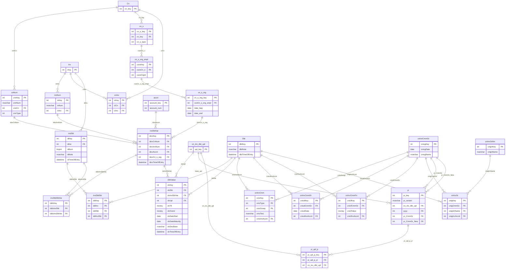

# СУДЗ — целевая физическая схема (DEV: `sudz`; прод: `ags`)

**Дата создания:** 2026-08-07  
**Последнее обновление:** 2026-08-09 (S59b: приёмка D644 / Свод)  
**Статус:** DEV-контур MVP на `sudz`; лаборатория `test_sudz`; **прод — влитие в `ags`**  
**План чата:** [chat-plan-26-0802-sudz.md](../../chats/chat-plan/chat-plan-26-0802-sudz.md)  
**Контекст:** [04-3 проблемы/решения](./04-3_problems-solutions.md) · эскиз [assets/26-0807-sudz-target-sketch-dbtvar.png](./assets/26-0807-sudz-target-sketch-dbtvar.png) · [07-readiness](./07-readiness.md)  
**SQL-пакеты:** [26-0807-sudz-target-schema](../../sql/26-0807-sudz-target-schema/) (`sudz` DEV) · [26-0807-sudz-test-schema](../../sql/26-0807-sudz-test-schema/) (лаборатория)

Документ фиксирует **точный** перечень таблиц, колонок, ключей, индексов и триггеров целевой модели СУДЗ. ER ниже — рабочая диаграмма в Cursor (Mermaid): правим её **параллельно** со спецификацией полей.

### Где физически создаём объекты

| Контур | Схема | Что делаем |
|--------|-------|------------|
| **DEV — целевой MVP (S48)** | **`sudz`** | Канон для GraphQL/UI (0067+): `Dbt`…`DbtValue`, зеркала cmm/yr, витрины `Yr_DbtChanges*` |
| **DEV — лаборатория** | `test_sudz` | Сохранена; эксперименты; **не** удалять |
| **Ссылки на живое** | **`ags`** | Cross-schema FK на `ags.cn` / `inv` / `cnNum` / … с DEV |
| **Прод (решение S48a)** | **`ags`** | Новые объекты СУДЗ (`Dbt`, `invDbtVar`, витрины, …) создаются **в `ags`**; пакет `MSSQL2012/` из `sudz.*` → `ags.*` + синтаксис 2012 |

**Решение 0066 / S48:** на DEV — отдельная схема **`sudz`** (не трогать живой `ags` до готовности).  
**Уточнение владельца S48a:** на **проде** размещение — в **`ags`**. Песочницу/`sudz` на прод как схему не переносим — переносим объекты.

Синтаксис на DEV может быть 2016+; перед продом — адаптация под **SQL Server 2012 SP4**.

---

## 0. Легенда ER

| Цвет / стиль | Смысл |
|--------------|--------|
| Без пометки / «живые» | Уже в `ags`, DDL не трогаем; на ER для связей |
| Новые / оживляемые | Создаются в **`sudz`** (лаборатория — `test_sudz`) |
| Красный путь | Идентификация долга: `Cn`→…→`invDbtDbt`→`Dbt` |
| Фиолетовый путь | История контекста: `DbtValue`→`invDbtVar`↔`invDbtDbtVar` |

**Не переносится:** `ciaName` / `ciaNameNull` (костыль P2) — см. [04-3 §7.9 / S33](./04-3_problems-solutions.md#79-второй-эскиз-владельца--invdbtvar--invdbtdbtvar-вариант-именования-долга-s32).

---

## 1. ER-диаграмма (Mermaid, правим здесь)

> В Cursor: открыть Preview (`Ctrl+Shift+V`) или Markdown Preview Enhanced — диаграмма обновится после правки блока.

**Как править вместе:** меняете узел/связь в Mermaid → сразу правим соответствующую таблицу в §2–§3. Версию документа поднимаем при каждом согласованном изменении состава.

---

## 2. Новые таблицы (`sudz.*` / зеркало в `test_sudz.*`)

Именование — camelCase как на эскизе (решение C6/S30). Префиксы колонок — по аналогии с `cnInv*` / `invDbt*`.  
На DEV-MVP объекты живут в схеме **`sudz`** (S48); лаборатория `test_sudz` сохраняет ту же структуру. На **проде** те же объекты — в **`ags`** (S48a); до прод-пакета `ags` новыми таблицами СУДЗ не наполняем.

### 2.1. `sudz.Dbt` — канон задолженности

Стабильная идентичность долга. **Без** FK на сторону / документ / счёт (см. [04-3 §7.2](./04-3_problems-solutions.md#72-ключевое-отличие-от-черновика-6-у-dbt-нет-fk-на-сторону)).

| Колонка | Тип | Null | Описание |
|---------|-----|------|----------|
| `dbtKey` | `int` IDENTITY | NO | PK |
| `dbtNote` | `nvarchar(255)` | YES | Свободная пометка (не дискриминатор) |
| `dbtTimeOfEntry` | `datetime` | NO | DEFAULT `getdate()` |

| Артефакт | Определение |
|----------|-------------|
| PK | `PK_Dbt` (`dbtKey`) |
| Индексы | пока нет (по потребности UI/отчётов) |
| FK | нет |

**Миграция seed:** 1 строка на `cnInvAccnt.ciaKey` (карта `ciaKey → dbtKey` для перецепления `cnInvCmm*`).

---

### 2.2. `test_sudz.invDbtDbt` — мост `Inv` ↔ `Dbt` через слот `invDbt`

Красный путь идентичности. Каждый исторический «долг проходил через этот СФ/слот» — отдельная строка.

| Колонка | Тип | Null | Описание |
|---------|-----|------|----------|
| `iddKey` | `int` IDENTITY | NO | PK (суррогат) |
| `iddInv` | `int` | NO | FK → `ags.inv.iKey` (денорм. из `invDbt.idInv` для `UNIQUE(inv,dbt)` и читаемости) |
| `iddDbt` | `int` | NO | FK → `test_sudz.Dbt.dbtKey` |
| `iddInvDbt` | `int` | NO | FK → `test_sudz.invDbt.idKey` (слот) |
| `iddTimeOfEntry` | `datetime` | NO | DEFAULT `getdate()` |

| Артефакт | Определение |
|----------|-------------|
| PK | `PK_invDbtDbt` (`iddKey`) |
| UNIQUE | `UX_invDbtDbt_InvDbt` (`iddInv`, `iddDbt`) — один долг ↔ один СФ не более одного раза (S16) |
| UNIQUE | `UX_invDbtDbt_Slot` (`iddInvDbt`) — слот `invDbt` входит в мост один раз (S16) |
| FK | `iddInv` → `ags.inv(iKey)` |
| FK | `iddDbt` → `test_sudz.Dbt(dbtKey)` |
| FK | `iddInvDbt` → `test_sudz.invDbt(idKey)` |
| Триггер | `trg_invDbtDbt_InvMatchesSlot`: `iddInv` = `invDbt.idInv` для выбранного слота (§4.3) |

---

### 2.3. `test_sudz.invDbtVar` — вариант контекста («именование») долга

Фиолетовый путь. Снимок контекста выгрузки: номер договора, № СФ, счёт ГК, сторона-организация. **Без** `ciaName`.

| Колонка | Тип | Null | Описание |
|---------|-----|------|----------|
| `idvvKey` | `int` IDENTITY | NO | PK |
| `idvvCnNum` | `int` | NO | FK → `cnNum.cnnKey` |
| `idvvInvNum` | `int` | NO | FK → `invNum.inKey` |
| `idvvAccnt` | `int` | NO | FK → `accnt.account_key` |
| `idvvCn_s_org` | `int` | NO | FK → `cn_s_org.cn_s_org_key` |
| `idvvTimeOfEntry` | `datetime` | NO | DEFAULT `getdate()` |

| Артефакт | Определение |
|----------|-------------|
| PK | `PK_invDbtVar` (`idvvKey`) |
| UNIQUE | `UX_invDbtVar_Context` (`idvvCnNum`, `idvvInvNum`, `idvvAccnt`, `idvvCn_s_org`) — один и тот же контекст не плодим повторно |
| FK | на `ags.cnNum`, `ags.invNum`, `ags.accnt`, `ags.cn_s_org` |

**Открыто к подтверждению:** ~~достаточно ли UNIQUE по четвёрке, или нужен ещё опциональный текстовый `idvvLabel`?~~ **Закрыто (S36):** UNIQUE по четвёрке без label — создано в БД.

---

### 2.4. `test_sudz.invDbtDbtVar` — мост `invDbt` ↔ `invDbtVar`

| Колонка | Тип | Null | Описание |
|---------|-----|------|----------|
| `iddvKey` | `int` IDENTITY | NO | PK |
| `iddvInvDbt` | `int` | NO | FK → `test_sudz.invDbt.idKey` |
| `iddvInvDbtVar` | `int` | NO | FK → `test_sudz.invDbtVar.idvvKey` |
| `iddvTimeOfEntry` | `datetime` | NO | DEFAULT `getdate()` |

| Артефакт | Определение |
|----------|-------------|
| PK | `PK_invDbtDbtVar` (`iddvKey`) |
| UNIQUE | `UX_invDbtDbtVar_Pair` (`iddvInvDbt`, `iddvInvDbtVar`) |
| FK | `iddvInvDbt` → `test_sudz.invDbt(idKey)`; `iddvInvDbtVar` → `test_sudz.invDbtVar` |
| Триггер | §4.2 — реквизиты `invDbtVar` не «чужие» относительно `invDbt`→`Inv`/`Cn` |

---

### 2.5. `test_sudz.DbtValue` — величина долга в выгрузке

Заменяет роль `cn_inv_dbt` в новом контуре. Контекст — **только** через `invDbtVar` (решение S32).

| Колонка | Тип | Null | Описание | Источник-аналог |
|---------|-----|------|----------|-----------------|
| `dvKey` | `int` IDENTITY | NO | PK | — |
| `dvDbt` | `int` | NO | FK → `Dbt.dbtKey` | `cidCnInvAccntCtpt` → карта |
| `dvInvDbtVar` | `int` | NO | FK → `invDbtVar.idvvKey` | — |
| `dvUpl` | `int` | NO | FK → `cn_inv_dbt_upl.upl_key` | `cn_inv_dbt_upl` |
| `dvTtl` | `money` | NO | Сумма ДЗ | `dbt_ttl` |
| `dvOverd` | `money` | NO | Просрочка | `dbt_overd` |
| `dvDateStart` | `date` | YES | Начало | `cn_inv_date_start` |
| `dvDateMaturity` | `date` | YES | Срок | `cn_inv_date_maturity` |
| `dvDocBase` | `nvarchar(255)` | YES | Текст из свода (вспомог., не для match) | `doc_base` |
| `dvTimeOfEntry` | `datetime` | NO | DEFAULT `getdate()` | `cidTimeOfEntry` |

| Артефакт | Определение |
|----------|-------------|
| PK | `PK_DbtValue` (`dvKey`) |
| UNIQUE | `UX_DbtValue_DbtUpl` (`dvDbt`, `dvUpl`) — один долг — одна строка на выгрузку (как `Задолженность_Выгрузка` на `cn_inv_dbt`) |
| FK | `dvDbt` → `test_sudz.Dbt`; `dvInvDbtVar` → `test_sudz.invDbtVar`; `dvUpl` → **`test_sudz.cn_inv_dbt_upl`** (S39: sandbox-выгрузки; в `ags` нет пакетов новее 30.06.2025) |
| Индекс | `IX_DbtValue_Upl` (`dvUpl`) — выборки по выгрузке |
| Триггер | §4.1 — согласованность `Dbt`↔`invDbtVar` через `invDbtDbt` / membership в `cnInv` |

**Не переносятся в `DbtValue`:** `debt_type`, `link`, `number`, `mark` — уточнить по потребности; пока вне MVP, если не понадобятся отчётам.

---

## 3. Живые таблицы `ags` и зеркала в песочнице

### 3.1. `test_sudz.invDbt` — слот долга у СФ (суррогатный PK, S35)

В песочнице **не копируем** составной PK из `ags.invDbt`: заводим суррогат `idKey`, чтобы FK из мостов были одноколоночными. Бизнес-уникальность слота — `UNIQUE(idInv, idNum)`. На прод при cutover — отдельное решение (оживить `ags.invDbt` с ALTER или мигрировать).

| Колонка | Тип | Null | Описание |
|---------|-----|------|----------|
| `idKey` | `int` IDENTITY | NO | PK (суррогат) |
| `idInv` | `int` | NO | FK → `ags.inv(iKey)` |
| `idNum` | `tinyint` | NO | Номер слота на СФ, DEFAULT 1 |
| `idNote` | `nvarchar(255)` | YES | Пометка |
| `idTimeOfEntry` | `datetime` | NO | DEFAULT `getdate()` |

| Артефакт | Статус |
|----------|--------|
| PK `idKey` | `PK_invDbt` |
| UNIQUE `(idInv, idNum)` | `UX_invDbt_InvNum` |
| FK | `idInv` → `ags.inv(iKey)` |
| Тестовые данные | только в `test_sudz.invDbt` (не в `ags.invDbt`) |

---

### 3.2. `ags.cn_s` — constraint уже есть (не трогаем)

| Артефакт | Статус |
|----------|--------|
| UNIQUE `(cn_key, cn_s_type)` | **уже существует** как индекс `cn_cnSType` (проверено DBHub) — отдельный `ALTER` не нужен |
| Действие | Документировать. Множественность исполнителей — на `cn_s_org_smpl` (1:N) |

---

### 3.3. Без изменений в `ags` (только FK из `test_sudz`)

`ags.cn` / `ags.cnNum` / `ags.inv` / `ags.invNum` / `ags.cnInv` / `ags.accnt` / `ags.cn_s_org` / `ags.cn_s_org_smpl` / `ags.cn_inv_dbt_upl` / `ags.cn_inv_pm*` — DDL не меняем.

Старый контур `ags.cn_inv_dbt` / `ags.cnInvAccnt` / `ags.cnInvAccntSmpl` — архив read-only после будущего cutover.

---

### 3.4. Зеркала комментариев / года (`test_sudz.cnInvCmm*` / `cnInvGr` / `yr`) — S40

Живые `ags.cnInvCmm*` **не** ALTER’им. В песочнице — зеркала с тем же составом колонок; колонки `*InvAccnt` по имени сохранены, но FK ведут на **`test_sudz.Dbt.dbtKey`**.

| Таблица | Назначение | FK на `Dbt` | Прочие FK |
|--------|------------|-------------|-----------|
| `cnInvCmmGr` | Группа комментариев периода («общая» / специалист) | — | — |
| `cnInvCmm` | Текстовый комментарий | `cnicInvAccnt` | `cnicGroup`→`cnInvCmmGr`; `cnicType`→`ags.cnInvCmmTp` |
| `cnInvCmmAg` / `Cst` / `Dt` / `Fn` | Типизированные комментарии | `*InvAccnt` | группа → sandbox `cnInvCmmGr`; типы/`ogAg`/`cstAgPn` → `ags.*` |
| `cnInvGrNm` | Имена произвольных групп долгов | — | sandbox-справочник |
| `cnInvGr` | Долг ∈ именованной группе внутри `cnInvCmmGr` | `cnigInvAccnt` | `cnigCmmGr`, `cnigGrName` |
| `yr` | Год-вариант; база + актуальная группа (+ группа новых) | — | `cn_inv_dbt_upl`→sandbox upl; `yyyy`→`ags.yyyy`; `yr_CmmGr`→`cnInvCmmGr`; **`yr_CmmGr_New`→`cnInvCmmGr`** (S52a, nullable; только Rslt повтор) |
| `yr_upl_p` | Год → квартальные выгрузки (1:N) | — | `yr`, sandbox `cn_inv_dbt_upl` |

**Seed (скрипт `11_SEED_cmm_yr_2026.sql`):**

| Объект | Ключи / содержание |
|--------|---------------------|
| `cnInvCmmGr` | 901 IV.2025, 902 I.2026, 903 II.2026 — «общие» |
| `yr` | `yr_key=901` «2026», база upl **901**, `yyyy=28`, `yr_CmmGr=903` (актуально II.2026) |
| `yr_upl_p` | 901↔901/902/903 |
| `cnInvCmm` / `Dt` / `Fn` | тестовые строки для `dbtKey` 82 и 85 |
| `cnInvGrNm` | + `901` «Рассмотреть углубленно в сентябре» |
| `cnInvGr` | долг **85** в группе 903 под именем 901 |

Скрипты: `10_CREATE_TABLE_cnInvCmm_mirrors.sql`, `11_SEED_cmm_yr_2026.sql`.

---

### 3.5. Мини-витрина Rslt (`Yr_DbtChanges_mini`) — S41

Заготовка под `ags.Yr_DbtChanges` на модели песочницы. **Не** копия полной процедуры (нет Cst/Ag-пивотов, строек `fnCiasDbtUplCst`, колонок сбора `*_new`).

| Объект | Тип | Назначение |
|--------|-----|------------|
| `test_sudz.vw_Yr_DbtFact` | VIEW | Длинный факт: `yr` × выгрузка × `Dbt` (+ контекст из `invDbtVar`) |
| `test_sudz.vw_Yr_DbtChanges_mini_2026` | VIEW | Широкая витрина seed-года 901: 3 as-of + `mery`/`curator`/`notes`/`forecast_date`/`agent_overd`/`debt_group` |
| `test_sudz.Yr_DbtChanges_mini` | PROC `@yr` | Динамический PIVOT по `uplStatusOnDate` выгрузок года |

**Отличие от `ags.Yr_DbtChanges`:** зерно строки = **`dbtKey`**; комментарии JOIN по `Dbt`, а не по тройке `(iKey, account_num, ciaNameNull)`.

Вызов: `EXEC test_sudz.Yr_DbtChanges_mini @yr = 901;` · скрипт `12_CREATE_Yr_DbtChanges_mini.sql`.

---

### 3.6. Сверка мини-Rslt ↔ Excel (долги 82/85) — S42

**Эталон Excel (имена колонок):**  
- `excel/2025-12/debit/ags_Yr_DbtChangesRslt_26-0212_26-0217.xlsx`  
- `excel/2026_03/debit/ags_Yr_DbtChangesRslt_26-0505.xlsx` (строки **82** / **85**)  

**Мини:** `test_sudz.vw_Yr_DbtChanges_mini_2026` / `EXEC Yr_DbtChanges_mini @yr=901`.  
Маппинг эталона: [03-processes §1.2.6](./03-processes.md#126-маппинг-полей-sql--колонки-excel-четыре-файла-с-соответствием-s22).

**D644** (`Приложение 1…xlsx` / `*D644*`) — ✅ S44, см. §3.6.4 (`Yr_DbtChangesD644`).

#### 3.6.0. Целевой контракт шапки Rslt — решения владельца (S42a)

| Тема | Решение |
|------|---------|
| **Имена технических колонок (row3)** | Как в эталонных Rslt: префикс периода = **`upl_date`** (`2026-01-30_*`, `2026-04-21_*`, …), суффиксы как в Excel (`_cnNumEnum`, `_csoCnDate`, `_ITN`, `_CtptOrg`, `_Maturity`, `_Ttl`, `_Overd`, `_CstAgPn*`, `_AgOrg`, `_погашено`, …). `uplStatusOnDate` — для подписей «по состоянию на…» / D644, не для имён колонок витрины. |
| **Боковик (слева от блоков кварталов)** | Только: **`account_num`** («Счет Главной книги») + скрытый **`dbtKey`**. Без `iKey`, без левого `invNumEnumN`, без `ciaNameNulln`. |
| **СГК при смене счёта у одного `Dbt`** | В норме долг **не** меняет Счёт главной книги. Если по выгрузкам года у одного `dbtKey` встретилось **несколько** различных `account_num`, в боковике выводится **склейка всех найденных СГК** (упорядоченный список через ` / `) — сигнал пользователю проверить данные. Один СГК — одно значение, как обычно. |
| **Реквизиты документа основания** | **Не** в боковике. В **каждом** блоке квартала — колонка в духе Excel (человекочитаемо «Реквизиты документа основания…»; техн. — `{upl_date}_invNumEnum` или согласованный с Access аналог). |
| **Вместо «уточнение основания» (`ciaName`)** | **`invDbt.idNum`** — тоже **в блоках кварталов** (`{upl_date}_idNum`), не в боковике. |
| **Legacy** | `{d}_ciaKey`, левый `iKey`, `ciaName*` — не переносим. |
| **Поля сбора `*_new`** | По-прежнему слой 1.1.2 (пустые/UI), не ядро витрины БД. |

Следствие для кейса **85**: смена СФ А19→`90` видна **только** в колонках документа соответствующих `upl_date`, без «якоря» слева (в отличие от текущего Excel, где слева остаётся А19).

#### 3.6.1. Что уже совпадает (ценности / зерно)

| Проверка | Excel 26-0505 | Мини `test_sudz` | Вердикт |
|----------|---------------|------------------|---------|
| Зерно строки | фактически `iKey`+`ciaName` (+ ручной match) | **`dbtKey`** | ✅ целевое |
| 82 суммы/сроки YE↔Q1 | Ttl `70525000.01`; Overd `…01→0`; Maturity `2024-10-30→2027-10-31` | те же | ✅ |
| 85 смена документа | слева А19 + в Q1 doc=`90` | per-period `invNum` А19→`90` | ✅ по данным; по шапке — довести до боковика §3.6.0 |
| 85 суммы | `9527.42` | те же | ✅ |
| Комментарии JOIN | тройка `(iKey, account, ciaName)` | по **`dbtKey`** | ✅ |

#### 3.6.2. Gaps колонок: Excel Rslt ← мини (с учётом §3.6.0)

| Группа | Статус | Действие |
|--------|--------|----------|
| **A. Ключ даты** | ✅ | Пивот/`AS` по **`upl_date`** |
| **B. `csoCnDate`** | ✅ S42b | В блоке квартала |
| **C. `org_id_value_l`** | ✅ S42b | БУиРГ type=1 |
| **D. Cst/Ag** | ✅ S42c | `{d}_CstAgPn*` / `{d}_AgOrg` через `DbtUplCstAg` (sandbox-замена `fnCiasDbtUplCst`) |
| **E. `_погашено`** | ✅ S42d/S45 | `NULLIF(Overd(база)−Overd(d), 0)`; на базе нет колонки |
| **F. Legacy** | ✅ не берём | — |
| **G. Документ** | ✅ S42b | `{upl_date}_invNumEnum` в каждом блоке |
| **G2. `idNum`** | ✅ S42b | `{upl_date}_idNum` |
| **H. Куратор / код стройки (год)** | ✅ S42c/e | `cnInvCmm` type 8 + `cnInvCmmCst` type 2; кураторы 82/85 из Excel |
| **I. `*_new`** | вне ядра | слой сбора |
| **J. Имена суффиксов** | ✅ | `cnNumEnum`, `invNumEnum`, … |
| **K. Боковик** | ✅ | `dbtKey` + `account_num` (+ склейка СГК) |
| **L. Порядок колонок** | ✅ S43 | date-major внутри блока (как Excel) |

**Сверх Excel (хвост):** `notes`, `forecast_date`, `agent_overd`, `debt_group`.

#### 3.6.3. Gaps текста/seed

| Поле | Статус |
|------|--------|
| Куратор 82/85 | ✅ Сербул / Дедова (S42e) |
| Мероприятия | ✅ полные тексты из D644_26-05 (S44, `18`) |
| Стройка/агент | ✅ seed `DbtUplCstAg` + `cnInvCmmCst` |

#### 3.6.4. D644 — `Yr_DbtChangesD644` (S44)

**Эталон:** `excel/2026_03/debit/Приложение 1…xlsx`, лист `ags_Yr_DbtChangesRsltD644_26-05`.  
**Процедура:** `EXEC test_sudz.Yr_DbtChangesD644 @yr=901, @curr_upl=902;` · скрипты `18`+`19`.  
**Логика Access** (`23-0421_sql.docx`, «Стало» 25.05.2026): Rslt → LEFT JOIN `ags_cstAgPn` ON `[Код стройки]=cstapIpgPnN` → `cstapOgName` AS Агент; WHERE `Overd(base)>0`.

| Решение владельца | Реализация |
|-------------------|------------|
| Документ (col 8) | `invNumEnum` **базовой** выгрузки года (`yr.cn_inv_dbt_upl`) — для 85 остаётся `А19-16343/2021`, не `90` |
| Агент (col 2) | `cstapOgName` по **разрешённому** «Код стройки» (комментарии года → fallback `CstAgPnCode` curr/base); **не** period `{d}_AgOrg` |
| Мероприятия | полный текст из D644 Excel → `cnInvCmm` type=1, `yr_CmmGr` |
| Даты в именах колонок seed | сравнивать **значения**; `_base/_curr_upl_date` служебные |
| Шапка письма | вне SQL |

| Проверка 82/85 | D644_26-05 | `test_sudz` @901/@902 | Вердикт |
|----------------|------------|------------------------|---------|
| СГК / агент / ИНН / договор | 606012 / Газпром инвест / …; 762210 / … | те же | ✅ |
| счет-фактура | `7947`; `А19-16343/2021` | те же (база) | ✅ |
| Overd base→curr / погашено | 70.5M→0 / 70.5M; 9527.42→9527.42 / пусто | те же (`NULLIF`) | ✅ |
| Код стройки / комментарий | `051-2001061` / DS№37…; `051-2000707` / суд.текст | те же (len 382 / 3168) | ✅ |

**Вызов:** для квартального отчёта передавать `@curr_upl` среза (иначе `MAX(upl_date)` года). Фильтр Access `cn_inv_dbt_upl=N Or Null` в sandbox не воспроизводится — отбор только `Overd(base)>0`.

#### 3.6.5. План доведения

| Шаг | Статус |
|-----|--------|
| **S42a** контракт шапки | ✅ |
| **S42b** fact/mini под контракт | ✅ (`13`) |
| **S42c** Cst/Ag | ✅ (`14` seed + `15`) |
| **S42d** погашено | ✅ (`15`) |
| **S42e** кураторы Excel | ✅ (`14`); полные mery — ✅ S44 (`18`) |
| **S43** полный контракт Rslt + `Yr_DbtChanges` | ✅ date-major + `EXEC test_sudz.Yr_DbtChanges` (`16`) |
| **S44** D644 | ✅ `Yr_DbtChangesD644` (`18`+`19`); см. §3.6.4 |
| **S45** регрессия на `26-0212` | ✅ `yr=900`, 5 срезов; см. §3.6.6 |

**Вне трека песочницы:** реализация UI/GraphQL — задачи **0066–0070** (после приёмки S47). Полный числовой паритет годового свода с Excel — после seed всего портфеля (сейчас 82/85).

#### 3.6.8. Приёмка витрины и переход к разработке (S47)

**Решение владельца (S47):** контракт `Yr_DbtChanges` / `Yr_DbtChangesD644` / `Yr_DbtChangesD644Svod` **принят для MVP** с оговорками §3.6.4–3.6.7.  
Эскизы: [02-9_sudz-mvp-screens.md](../../UI/02-9_sudz-mvp-screens.md). Backlog: задачи **0065** (закрыта) … **0070**, дерево **02.03**.

Порядок реализации: **0066** DDL/cutover ✅ → **0067** GraphQL read ✅ → **0068** UI Rslt ✅; далее **0070** исходящие; **0069** загрузка свода — по готовности match.

#### 3.6.9. Cutover DEV → схема `sudz` (S48 / задача 0066)

- Пакет: [26-0807-sudz-target-schema](../../sql/26-0807-sudz-target-schema/) (`apply-dev.sh`).
- Smoke: `EXEC sudz.Yr_DbtChangesD644 @yr=901, @curr_upl=902` и `@yr=900, @curr_upl=805` — долги 82/85.
- `test_sudz` не удалена (2 строки `Dbt` на месте).
- **Прод (S48a):** объекты уходят в **`ags`** через пакет `MSSQL2012/` (`sudz.*` → `ags.*`, синтаксис 2012); схема `sudz` на прод не создаётся.

#### 3.6.7. Регрессия S46 — D644_26-03 (`yr=900`) + годовой свод

**D644 (Приложение 2):** `EXEC test_sudz.Yr_DbtChangesD644 @yr=900, @curr_upl=805;`  
base=`2025-01-24` (801), curr=`2026-01-30` (805); mery/cst — seed `20` (группа 805).

| Проверка 82/85 | D644_26-03 | `test_sudz` | Вердикт |
|----------------|------------|-------------|---------|
| СГК / агент / doc | 606012 / Газпром инвест / `7947`; 762210 / … / `А19-…` | те же | ✅ |
| Overd base=curr / погашено | 70.5M / 70.5M / пусто; 9527.42 / … / пусто | те же (`NULL`) | ✅ |
| Код стройки / mery | `051-2001061` + Протокол №61/2025…; `051-2000707` + суд.текст | len 407 / 3168 | ✅ |

**Годовой свод:** `EXEC test_sudz.Yr_DbtChangesD644Svod @yr=900, @curr_upl=805;` · скрипт `21`.  
Эталон формы: лист `СВОД по субсчетам Д644` (Access SQL в docx **нет** — формулы сняты с Excel).  
12 счетов эталона + result set `ВСЕГО`; имена из `ags.accnt`.

| Счёт (sandbox) | overd_base | погашено | остаток | % |
|----------------|------------|----------|---------|---|
| 606012 (долг 82) | 70525000.01 | 0 | 70525000.01 | 0 |
| 762210 (долг 85) | 9527.42 | 0 | 9527.42 | 0 |
| остальные из списка | 0 | 0 | 0 | 0 |
| **ВСЕГО** | 70534527.43 | 0 | 70534527.43 | 0 |

Числа Excel-миллиардов **не** воспроизводятся: в песочнице только 82/85. Форма строк и арифметика — рабочие.

#### 3.6.6. Регрессия S45 — `ags_Yr_DbtChangesRslt_26-0212` (5 срезов)

**Эталон:** `excel/2025-12/debit/ags_Yr_DbtChangesRslt_26-0212_26-0217.xlsx`, стр. **129** (долг 82) / **134** (долг 85).  
**Песочница:** `yr_key=900`, upl **801–805** с `upl_date` = `2025-01-24` / `04-21` / `07-18` / `10-21` / `2026-01-30`.  
**Вызов:** `EXEC test_sudz.Yr_DbtChanges @yr = 900;` · seed `17_SEED_yr_2025_5slices_S45.sql`.

| Проверка | Excel 26-0212 | `test_sudz` @900 | Вердикт |
|----------|---------------|------------------|---------|
| Число блоков дат | 5 | 5 тех же `upl_date` | ✅ |
| Боковик | `iKey`+счёт+док+ciaName | `dbtKey`+`account_num` | ✅ целевой контракт |
| 82 суммы/Overd/Maturity ×5 | `70525000.01` / `2024-10-30` | те же | ✅ |
| 82 СФ | `7947` стабилен | `invNumEnum`=`7947` ×5 | ✅ |
| 82 Cst/Ag ×5 | `051-2001061` / Газпром инвест | те же | ✅ |
| 82 погашено | пусто (без изменения Overd) | `NULL` (`NULLIF(…,0)`) | ✅ |
| 85 осцилляция СФ | слева А19; Q1–Q3 col=`90`; Q4 пусто→А19 | `А19→90→90→90→А19` | ✅ |
| 85 суммы | `9527.42` ×5 | те же | ✅ |
| 85 Cst периода | пусто | `NULL` | ✅ |
| 85 / 82 куратор + код стройки года | Дедова / Сербул; `051-2000707` / `051-2001061` | те же | ✅ |
| Legacy `ciaKey` / `*_new` | есть | нет | ✅ намеренно |

**Сознательные отличия (не дефект):** `idNum=1` вместо Excel `ciaNameNulln='3'`; полные тексты мероприятий — seed-заглушки; служебный хвост `notes`/`forecast_date`/… может присутствовать.

---

## 4. Триггеры

### 4.1. `trg_DbtValue_Consistency` (на `DbtValue`) — **создан в БД (S38)**

После INSERT/UPDATE — из `dvInvDbtVar` взять `idvvCnNum` / `idvvInvNum` / `idvvAccnt` / `idvvCn_s_org`; проверить:

1. `cnNum.cnnCn` ∈ множество договоров `cnInv` для `Inv` из `invNum.inInv`;
2. существует строка `invDbtDbt` с `(iddInv = invNum.inInv, iddDbt = dvDbt)`;
3. существует `invDbtDbtVar`, связывающая слот этого `invDbtDbt` с данным `invDbtVar` (S5 — жёстко).

Детали логики — [04-3 §7.5](./04-3_problems-solutions.md) (адаптировано под перенос FK с `DbtValue` на `invDbtVar`).

### 4.2. `trg_invDbtDbtVar_NoForeignContext` (на `invDbtDbtVar`) — **создан в БД (S37)**

Запрет «чужих» реквизитов (S32): через `iddvInvDbt` → `invDbt.idInv`; `invDbtVar.idvvInvNum` → `invNum.inInv` **должен** совпадать с этим `idInv`; `invDbtVar.idvvCnNum` → `cnNum.cnnCn` **должен** входить в `cnInv` для этого `Inv`.

### 4.3. `trg_invDbtDbt_InvMatchesSlot` (на `invDbtDbt`) — **создан в БД (S35)**

`iddInv` = `invDbt.idInv` для строки `iddInvDbt` → `invDbt.idKey`.

---

## 5. Что сознательно не входит в v0.1

| Тема | Решение |
|------|---------|
| `ciaName` / декоративная метка на `Dbt` | не переносится (S33) |
| Историческая полная реконструкция всех `cn_inv_dbt` → `DbtValue` | отложена (S24); seed — cutover + живой процесс |
| `invDbtValue` (пустая, 0 строк) | deprecate / не использовать; заменена `DbtValue` |
| Права/роли | вне MVP (I1/S27) |
| P8 / Smpl под `cstAgPn` | отложено |

---

## 6. Открытые вопросы спецификации (закрываем по одному)

| # | Вопрос | Рекомендация | Статус |
|---|--------|--------------|--------|
| S1 | Нужен ли суррогат `iddKey` на `invDbtDbt`, или PK = `(iddInv, iddDbt)`? | Суррогат + два UNIQUE — удобнее для логов/FK | ✅ принято (создано в БД) |
| S2 | UNIQUE на `invDbtVar` по четвёрке контекста — ок? | Да | ✅ принято (создано в БД, без label) |
| S3 | Переносить ли `dvDocBase` в MVP? | Да, как вспомогательный текст из свода | ✅ принято (в таблице) |
| S4 | Поля `debt_type` / `link` / `number` / `mark` из `cn_inv_dbt` | Вне MVP, пока не потребуются отчёты | ✅ вне MVP |
| S5 | Жёсткость п.3 триггера 4.1 (`invDbtDbtVar` обязателен) | Да — иначе фиолетовый путь неполон | ✅ принято (в триггере) |

---

## 7. Журнал

### S33 — 2026-08-07

- Создан документ; ER Mermaid v0.1; спецификация новых таблиц `Dbt` / `invDbtDbt` / `invDbtVar` / `invDbtDbtVar` / `DbtValue`; оживление `invDbt`; зафиксировано, что `UNIQUE(cn_key, cn_s_type)` уже есть в БД (`cn_cnSType`); `ciaName` исключён из схемы.

### S34 — 2026-08-07

- Владелец: проектируемые артефакты и тестовые данные — в отдельной схеме **`test_sudz`** (не в `ags`).
- На DEV создана схема `test_sudz` (owner `dbo`); SQL-пакет [26-0807-sudz-test-schema](../../sql/26-0807-sudz-test-schema/).
- Спецификация переведена на `test_sudz.*` + cross-schema FK на `ags.*`; для `invDbt` в песочнице — зеркало структуры, без записи в `ags.invDbt`.
- Создание таблиц — после закрытия вопросов S1–S5 (или по решению владельца начать с `Dbt`/`invDbt`).

### S34b — 2026-08-07

- Создана `test_sudz.Dbt` (`dbtKey` IDENTITY PK, `dbtNote`, `dbtTimeOfEntry` + DEFAULT, `MS_Description`). Скрипт: `01_CREATE_TABLE_Dbt.sql`.
- Создана `test_sudz.invDbt` — зеркало `ags.invDbt` (PK `(idInv,idNum)`, FK → `ags.inv`, DEFAULT на `idNum`/`idTimeOfEntry`). Скрипт: `02_CREATE_TABLE_invDbt.sql`. Следующая по зависимостям — `invDbtDbt`.
- Создана `test_sudz.invDbtDbt` — мост с PK-суррогатом `iddKey`, `UX_invDbtDbt_InvDbt`, `UX_invDbtDbt_Slot`, FK на `ags.inv` / `test_sudz.Dbt` / `test_sudz.invDbt`. Скрипт: `03_CREATE_TABLE_invDbtDbt.sql`. S1 закрыт.

### S35 — 2026-08-07

- Владелец: суррогатный PK на `invDbt` для упрощения FK.
- Пересозданы `test_sudz.invDbt` (`idKey` IDENTITY PK + `UNIQUE(idInv,idNum)`) и `test_sudz.invDbtDbt` (одна колонка `iddInvDbt` → `idKey`; триггер `trg_invDbtDbt_InvMatchesSlot`).
- Скрипты: `04_RECREATE_invDbt_surrogate.sql`; обновлены `02`/`03`. Спека §2.2 / §2.4 / §3.1 / §4.3 синхронизирована. Следующая — `invDbtVar`.

### S36 — 2026-08-07

- Создана `test_sudz.invDbtVar` (`idvvKey`, FK на `ags.cnNum`/`invNum`/`accnt`/`cn_s_org`, `UX_invDbtVar_Context` по четвёрке, без label). Скрипт: `05_CREATE_TABLE_invDbtVar.sql`. S2 закрыт. Следующая — `invDbtDbtVar`.

### S37 — 2026-08-07

- Создана `test_sudz.invDbtDbtVar` + триггер `trg_invDbtDbtVar_NoForeignContext` (совпадение `invNum.inInv` со слотом; `cnNum.cnnCn` ∈ `cnInv` для этого `Inv`). Скрипт: `06_CREATE_TABLE_invDbtDbtVar.sql`. Следующая — `DbtValue`.

### S38 — 2026-08-07

- Создана `test_sudz.DbtValue` (`dvDocBase` включён; `debt_type`/`link`/`number`/`mark` — нет) + триггер `trg_DbtValue_Consistency` (в т.ч. обязательный `invDbtDbtVar`). Скрипт: `07_CREATE_TABLE_DbtValue.sql`.
- S3/S4/S5 закрыты. **Ядро песочницы собрано:** `Dbt`, `invDbt`, `invDbtDbt`, `invDbtVar`, `invDbtDbtVar`, `DbtValue` + 3 триггера.

### S39 — 2026-08-07

- В `ags.cn_inv_dbt_upl` нет выгрузок IV.2025–II.2026 → заведена `test_sudz.cn_inv_dbt_upl` (901/902/903); FK `DbtValue.dvUpl` переключён на неё. **DDL/данные `ags.*` не менялись.**
- Seed долгов **82** и **85** за три квартала (скрипт `09_SEED_dbt_82_85_Q4Q1Q2.sql`): один `Dbt` на каждый; у 85 — два слота `invDbt`/`invDbtDbt` (А19 и `90`) и смена `invDbtVar` между выгрузками; у 82 — стабильный СФ `7947`, во II–III сдвиг срока/обнуление просрочки.
- Скрин ER из SSMS: [assets/26-0807-sudz-ssms-er-test_sudz.png](./assets/26-0807-sudz-ssms-er-test_sudz.png).

### S40 — 2026-08-07

- Зеркала комментариев и года в `test_sudz`: `cnInvCmmGr`, `cnInvCmm`/`Ag`/`Cst`/`Dt`/`Fn`, `cnInvGr`/`cnInvGrNm`, `yr`/`yr_upl_p`. FK долга → `Dbt` (имена колонок `*InvAccnt` сохранены). Справочники типов — cross-schema на `ags`.
- Seed цикла **2026** с II.2026: группы 901–903, `yr_key=901` (база 901, `yr_CmmGr=903`), `yr_upl_p` на 901/902/903; тестовые `cnInvCmm`/`Dt`/`Fn` для 82/85; пример `cnInvGr` («рассмотреть углубленно в сентябре») на долг 85.
- **`ags.*` не изменялись.** Следующий шаг контура отчёта — мини-витрина / заготовка под `Yr_DbtChanges` на sandbox-данных.

### S41 — 2026-08-07

- Мини-витрина: `vw_Yr_DbtFact`, `vw_Yr_DbtChanges_mini_2026`, процедура `Yr_DbtChanges_mini(@yr)`.
- Проверено на 82/85: осцилляция СФ у 85 (А19→90), сдвиг срока/обнуление просрочки у 82, `mery` и `debt_group` из группы `yr_CmmGr=903`.
- Скрипт: `12_CREATE_Yr_DbtChanges_mini.sql`.

### S42 — 2026-08-07

- Сверка мини ↔ Excel; **S42a** контракт шапки; склейка СГК; **S42b** (`13`).
- **S42c:** таблица `DbtUplCstAg` + seed 82/85; периодные `CstAgPn*`/`AgOrg`; годовые «Код стройки» из `cnInvCmmCst` (`14`+`15`).
- **S42d:** `{d}_погашено` = Overd(база `yr.cn_inv_dbt_upl`) − Overd(d); на 82 = `70525000.01`.
- **S42e:** кураторы Сербул/Дедова; полные тексты мероприятий — defer.

### S43 — 2026-08-07

- Порядок колонок **date-major** (блок полей внутри каждой `upl_date`, как Excel).
- Обёртка `test_sudz.Yr_DbtChanges(@yr)` → `Yr_DbtChanges_mini`. Скрипт `16_CREATE_Yr_DbtChanges_S43.sql`.
- Следующий шаг: **S45** регрессия имён/значений на `26-0212` (5 срезов); затем **S44** D644.

### S45 — 2026-08-07

- Seed года **2025** (`yr_key=900`, upl 801–805) под даты Excel `26-0212`; факты 82/85 по стр. 129/134; у 85 осцилляция А19↔90; Cst периода только у 82.
- `погашено`: `NULLIF(base−curr, 0)` — пустые ячейки Excel при неизменной просрочке.
- `EXEC Yr_DbtChanges @yr=900` — паритет контракта и значений (§3.6.6). Скрипт `17_SEED_yr_2025_5slices_S45.sql`.

### S44 — 2026-08-07

- По docx: Агент = `cstapOgName` JOIN по «Код стройки» (после сбора комментариев), не period AgOrg.
- Seed полных mery из D644_26-05 (`18`); proc `Yr_DbtChangesD644` (`19`); smoke 82/85 @901/`@curr_upl=902` ↔ Приложение 1 (§3.6.4).
- Документ в D644 — базовый `invNumEnum` года (А19 у 85).

### S46 — 2026-08-07

- Регрессия D644 @`yr=900` / `@curr_upl=805` ↔ Приложение 2 (`D644_26-03`); seed mery/cst группы 805 (`20`).
- Годовой свод `Yr_DbtChangesD644Svod` (`21`): агрегат Overd base / погашено / остаток / % по счетам ГК; smoke на 82/85 (полный паритет Excel — после seed портфеля).
- E6 (источник SQL свода): в docx нет — логика из Excel.

### S47 — 2026-08-07

- Приёмка витрины для MVP; эскизы A/B ([02-9](../../UI/02-9_sudz-mvp-screens.md)); backlog **0065–0070**, дерево **02.03**.
- Критерии §6 плана (эскиз + backlog) закрыты.

### S48 — 2026-08-07 (задача 0066)

- Целевая схема DEV: **`sudz`**; лаборатория `test_sudz` сохранена.
- Пакет `26-0807-sudz-target-schema` применён; smoke D644 901/902 и 900/805.
- Задача **0066** → completed; дальше **0067** GraphQL на `sudz.*`.

### S48a — 2026-08-07

- Владелец: на **проде** размещение СУДЗ — в схеме **`ags`** (не отдельная `sudz`).
- DEV остаётся на `sudz` до прод-пакета `MSSQL2012/` (`sudz`→`ags`).

### S49 — 2026-08-07 (задача 0067)

- GraphQL read: `sudzYears`, `sudzYrDbtChanges(yr)`, `sudzD644(yr,currUpl)`, `sudzD644Svod(yr,currUpl)`.
- DAO жёстко квалифицирует **`sudz.*`** (не `database.properties#schema`).
- Rslt: структурированные периоды из `vw_Yr_DbtFact` + `cnInvCmm` (не широкий pivot-proc).
- D644/Svod: `CallableStatement` к процедурам; маппинг по русским алиасам колонок.
- Frontend Apollo: `src/api/sudz-api.ts`, `src/graphql/sudz.graphql`.
- Smoke: `SudzDaoSmokeIT` — долги 82/85, SF `7947` / `А19…`.
- Задача **0067** → completed; дальше **0068** UI Портфель.

### S50 — 2026-08-07 (задача 0068)

- Mutation `updateSudzDebtCollection` → `cnInvCmm` (type 1/8) + `cnInvCmmCst` (type 2) в `yr.yr_CmmGr`.
- UI: `SudzPortfolioView` (FemsqTable + detail), TopBar «СУДЗ → Портфель года».
- UAT: правка mery на dbtKey=82 видна в D644 `comment644` (`SudzDaoSmokeIT`).
- Задача **0068** → completed; дальше **0070** исходящие / **0069** upload.

### S51 — 2026-08-07 (пересмотр «Портфель года»)

- Владелец: «Портфель года» = форма **`yr`** (не Rslt); CRUD годов/выгрузок; Progress read-only.
- Меню: Портфель года · Долги / мероприятия · Исходящие · Загрузка.
- Схема: `femsq.sudz.schema` (`sudz` DEV / `ags` prod) — без переписывания кода.
- Зеркала DEV: `sudz.cn_inv_pm_upl`, `sudz.cn_inv_dbt_upl_g_p` (sql `22_…_S51`).
- GraphQL: `sudzYear`, lookups, create/update/delete year/upl/pm.
- UI: `SudzPortfolioView` (yr); бывший экран → `SudzDebtsView`.

### S52 — 2026-08-08 (документы: исходящие / цикл Rslt)

- Лаунчер документов на вкладке **Progress** карточки `yr` (задача **0070**).
- Типы: Rslt сбор | Rslt повтор | D644 | Свод; общий комбо среза `yr_upl_p` (`asOfUpl` / `curr_upl`).
- Доки: [02-9](../../UI/02-9_sudz-mvp-screens.md), [03 §1.1.2](./03-processes.md).

### S52a — 2026-08-08 (`yr_CmmGr_New` + веха 1.1.3)

- FEMSQ-поле **`yr.yr_CmmGr_New`** (nullable FK → `cnInvCmmGr`): рабочая группа новых с **1.1.2.1**; **только** Rslt повтор читает New + `yr_CmmGr`; остальные документы — только `yr_CmmGr`.
- Процесс: внесение/контроль в **1.1.2.2**; **1.1.3** = веха «Актуальные данные специалистов в БД внесены»; длинный S25 убран из 03 → [04 §2.6](./04-data-model.md).
- DDL колонки — при реализации Rslt повтор / CRUD yr (ещё не в БД).
- Открыто при коде: правило продвижения New → `yr_CmmGr` на вехе 1.1.3.

### S53 — 2026-08-08 (Rslt сбор)

- GraphQL: `sudzYrDbtChanges(yr, asOfUpl?)` — фильтр срезов по дате выгрузки.
- REST Blob: `GET /api/v1/sudz/rslt-sborn.xlsx?yr=&asOfUpl=` (пустые `cur_new`/`mery_new`/`cstAgPn_new`).
- UI: лаунчер на вкладке Progress («Портфель года») — прототип + Excel.
- Версия: `0.1.0.158-SNAPSHOT`.

### S54 — 2026-08-08 (Rslt Excel v2 + yr_Progress)

- Полный путь папки выгрузки — **отложен** (не актуально).
- `appendSudzYearProgress` / запись при Excel REST и при прототипе.
- Excel Rslt: row1 суммы, row2 подписи кварталов, row3 техн. имена; блоки срезов + пустые `*_new`; боковик `dbtKey`+`account_num`.
- Версия: `0.1.0.159-SNAPSHOT`. Прототип UI «как Excel» — после приёмки формата.

### S55 — 2026-08-08 (Rslt Excel v3: стили эталона 26-0212)

- Заливки боковика/кварталов/просрочки/куратора/`*_new`/tech — RGB из `ags_Yr_DbtChangesRslt_26-0212_26-0217.xlsx`.
- Calibri 8/9, границы, wrap, высота row2=96, `SUBTOTAL(9,…)`, автофильтр row2, freeze A–B + шапка.
- Версия: `0.1.0.162-SNAPSHOT`.

### S56 — 2026-08-08 (UAT Excel Rslt: приёмка + подпись idNum)

- Владелец: в целом Excel соответствует эталону; дальнейшие недочёты — по мере обнаружения.
- Подпись `{q}. № док. (idNum)` → **`{q}. № задолженности в СФ`** (смысл `invDbt.idNum` / MS_Description).
- Rslt сбор (Excel) по визуалу **принят**; прототип UI «как Excel» — позже.

### S57 — 2026-08-08 (Rslt повтор: yr_CmmGr_New + Excel)

- DDL `yr.yr_CmmGr_New`; группа **904**; seed из тестовых возвратов dbt **82** / **85**.
- Файлы возвратов: `…return_dbt82_S57.xlsx`, `…return_dbt85_S57.xlsx`; итоговый повтор: `…povtor_S57.xlsx`.
- REST `GET /api/v1/sudz/rslt-povtor.xlsx`; UI Progress — тип «Rslt повтор».
- Версия: `0.1.0.164-SNAPSHOT`.

### S58 — 2026-08-08 (Progress: операция = документ+действие)

- Комбо **Операция** (`Rslt … · Выгрузить` / `Rslt повтор · Загрузить`); кнопка **Выполнить**.
- `yr_CmmGr_New` + файл возврата — на Progress при загрузке; импорт → upsert в New.
- Версия: `0.1.0.166-SNAPSHOT` (реализовано: GraphQL New, REST `POST /rslt-return`, UI Progress).

### S59 — 2026-08-09 (D644 / Свод · Выгрузить)

- REST `GET /api/v1/sudz/d644.xlsx?yr&currUpl`, `GET /api/v1/sudz/d644-svod.xlsx?yr&currUpl`.
- Экспортёр `SudzD644ExcelExporter`: колонки §1.2.6 B + шапка письма; свод — лист «СВОД по субсчетам Д644» + строка ВСЕГО.
- **S59a (UAT):** выравнивание D644 под эталон `2026_03/…/Приложение 1…xlsx` — 18 колонок (без dbtKey), «Приложение 1 к письму» справа, заголовок с «просроченной», светло-голубая шапка, **жёлтый SUM под каждым счётом**; Progress — переключатель предпросмотр/Excel для D644.
- **S59b (приёмка владельцем):** срез **D644 / Свод · Выгрузить** принят («пока приемлемо»); адаптивная высота строк по длине «Комментарий/меры»; оговорки — полные суммы свода после seed портфеля; веха 1.1.3 и полный путь папки — вне среза.
- Progress: операции **D644 · Выгрузить** / **Свод · Выгрузить** (срез = `currUpl`; свод — только Excel, `yr_CmmGr`).
- Полный числовой паритет свода с Excel-миллиардами — после seed всего портфеля (оговорка S46).
- Версия: `0.1.0.171-SNAPSHOT`.
