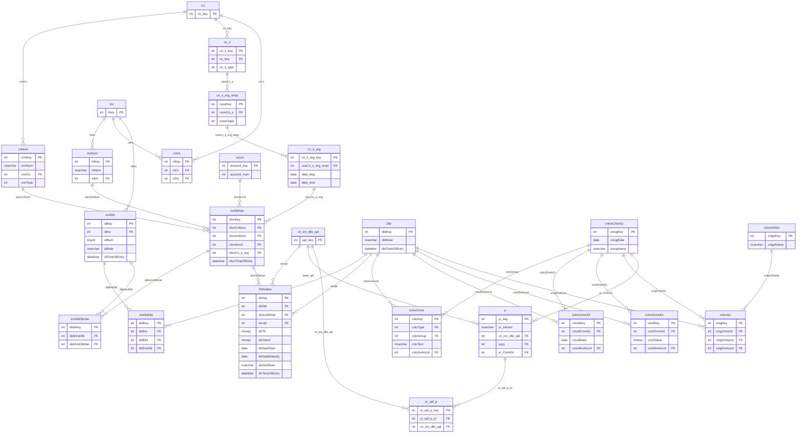

# СУДЗ — целевая физическая схема (песочница `test_sudz`)

**Дата создания:** 2026-08-07  
**Последнее обновление:** 2026-08-07 (S41: мини-витрина `Yr_DbtChanges_mini` на `Dbt`)  
**Статус:** черновик (правим вместе с владельцем)  
**План чата:** [chat-plan-26-0802-sudz.md](../../chats/chat-plan/chat-plan-26-0802-sudz.md)  
**Контекст:** [04-3 проблемы/решения](./04-3_problems-solutions.md) · эскиз [assets/26-0807-sudz-target-sketch-dbtvar.png](./assets/26-0807-sudz-target-sketch-dbtvar.png) · [07-readiness](./07-readiness.md)  
**SQL-пакет:** [docs/development/notes/sql/26-0807-sudz-test-schema/](../../sql/26-0807-sudz-test-schema/)

Документ фиксирует **точный** перечень таблиц, колонок, ключей, индексов и триггеров целевой модели СУДЗ. ER ниже — рабочая диаграмма в Cursor (Mermaid): правим её **параллельно** со спецификацией полей.

### Где физически создаём объекты

| Контур | Схема | Что делаем |
|--------|-------|------------|
| **DEV (сейчас)** | **`test_sudz`** | Создаём/меняем все новые и «оживляемые» таблицы; вносим тестовые данные. Схема уже создана на DEV (2026-08-07). |
| **Ссылки на живое** | **`ags`** | Cross-schema FK на существующие `ags.cn`, `ags.inv`, `ags.cnNum`, `ags.invNum`, `ags.cnInv`, `ags.accnt`, `ags.cn_s*`, `ags.cn_inv_dbt_upl` и т.п. — **без изменения** их DDL. |
| **Прод (позже)** | `ags` (или решение владельца) | Перенос утверждённой модели — отдельный пакет `MSSQL2012/` по [правилам деплоя](../../../deployment/sql-server-deployment-rules.md). Песочницу `test_sudz` на прод **не** переносим. |

Синтаксис на DEV может быть 2016+; перед продом — адаптация под **SQL Server 2012 SP4**.

---

## 0. Легенда ER

| Цвет / стиль | Смысл |
|--------------|--------|
| Без пометки / «живые» | Уже в `ags`, DDL не трогаем; на ER для связей |
| Новые / оживляемые | Создаются в **`test_sudz`** |
| Красный путь | Идентификация долга: `Cn`→…→`invDbtDbt`→`Dbt` |
| Фиолетовый путь | История контекста: `DbtValue`→`invDbtVar`↔`invDbtDbtVar` |

**Не переносится:** `ciaName` / `ciaNameNull` (костыль P2) — см. [04-3 §7.9 / S33](./04-3_problems-solutions.md#79-второй-эскиз-владельца--invdbtvar--invdbtdbtvar-вариант-именования-долга-s32).

---

## 1. ER-диаграмма (Mermaid, правим здесь)

> В Cursor: открыть Preview (`Ctrl+Shift+V`) или Markdown Preview Enhanced — диаграмма обновится после правки блока.

**Как править вместе:** меняете узел/связь в Mermaid → сразу правим соответствующую таблицу в §2–§3. Версию документа поднимаем при каждом согласованном изменении состава.

---

## 2. Новые таблицы (`test_sudz.*`)

Именование — camelCase как на эскизе (решение C6/S30). Префиксы колонок — по аналогии с `cnInv*` / `invDbt*`.  
Все объекты этого раздела создаются в схеме **`test_sudz`**, не в `ags`.

### 2.1. `test_sudz.Dbt` — канон задолженности

Стабильная идентичность долга. **Без** FK на сторону / документ / счёт (см. [04-3 §7.2](./04-3_problems-solutions.md#72-ключевое-отличие-от-черновика-6-у-dbt-нет-fk-на-сторону)).

| Колонка | Тип | Null | Описание |
|---------|-----|------|----------|
| `dbtKey` | `int` IDENTITY | NO | PK |
| `dbtNote` | `nvarchar(255)` | YES | Свободная пометка (не дискриминатор) |
| `dbtTimeOfEntry` | `datetime` | NO | DEFAULT `getdate()` |

| Артефакт | Определение |
|----------|-------------|
| PK | `PK_Dbt` (`dbtKey`) |
| Индексы | пока нет (по потребности UI/отчётов) |
| FK | нет |

**Миграция seed:** 1 строка на `cnInvAccnt.ciaKey` (карта `ciaKey → dbtKey` для перецепления `cnInvCmm*`).

---

### 2.2. `test_sudz.invDbtDbt` — мост `Inv` ↔ `Dbt` через слот `invDbt`

Красный путь идентичности. Каждый исторический «долг проходил через этот СФ/слот» — отдельная строка.

| Колонка | Тип | Null | Описание |
|---------|-----|------|----------|
| `iddKey` | `int` IDENTITY | NO | PK (суррогат) |
| `iddInv` | `int` | NO | FK → `ags.inv.iKey` (денорм. из `invDbt.idInv` для `UNIQUE(inv,dbt)` и читаемости) |
| `iddDbt` | `int` | NO | FK → `test_sudz.Dbt.dbtKey` |
| `iddInvDbt` | `int` | NO | FK → `test_sudz.invDbt.idKey` (слот) |
| `iddTimeOfEntry` | `datetime` | NO | DEFAULT `getdate()` |

| Артефакт | Определение |
|----------|-------------|
| PK | `PK_invDbtDbt` (`iddKey`) |
| UNIQUE | `UX_invDbtDbt_InvDbt` (`iddInv`, `iddDbt`) — один долг ↔ один СФ не более одного раза (S16) |
| UNIQUE | `UX_invDbtDbt_Slot` (`iddInvDbt`) — слот `invDbt` входит в мост один раз (S16) |
| FK | `iddInv` → `ags.inv(iKey)` |
| FK | `iddDbt` → `test_sudz.Dbt(dbtKey)` |
| FK | `iddInvDbt` → `test_sudz.invDbt(idKey)` |
| Триггер | `trg_invDbtDbt_InvMatchesSlot`: `iddInv` = `invDbt.idInv` для выбранного слота (§4.3) |

---

### 2.3. `test_sudz.invDbtVar` — вариант контекста («именование») долга

Фиолетовый путь. Снимок контекста выгрузки: номер договора, № СФ, счёт ГК, сторона-организация. **Без** `ciaName`.

| Колонка | Тип | Null | Описание |
|---------|-----|------|----------|
| `idvvKey` | `int` IDENTITY | NO | PK |
| `idvvCnNum` | `int` | NO | FK → `cnNum.cnnKey` |
| `idvvInvNum` | `int` | NO | FK → `invNum.inKey` |
| `idvvAccnt` | `int` | NO | FK → `accnt.account_key` |
| `idvvCn_s_org` | `int` | NO | FK → `cn_s_org.cn_s_org_key` |
| `idvvTimeOfEntry` | `datetime` | NO | DEFAULT `getdate()` |

| Артефакт | Определение |
|----------|-------------|
| PK | `PK_invDbtVar` (`idvvKey`) |
| UNIQUE | `UX_invDbtVar_Context` (`idvvCnNum`, `idvvInvNum`, `idvvAccnt`, `idvvCn_s_org`) — один и тот же контекст не плодим повторно |
| FK | на `ags.cnNum`, `ags.invNum`, `ags.accnt`, `ags.cn_s_org` |

**Открыто к подтверждению:** ~~достаточно ли UNIQUE по четвёрке, или нужен ещё опциональный текстовый `idvvLabel`?~~ **Закрыто (S36):** UNIQUE по четвёрке без label — создано в БД.

---

### 2.4. `test_sudz.invDbtDbtVar` — мост `invDbt` ↔ `invDbtVar`

| Колонка | Тип | Null | Описание |
|---------|-----|------|----------|
| `iddvKey` | `int` IDENTITY | NO | PK |
| `iddvInvDbt` | `int` | NO | FK → `test_sudz.invDbt.idKey` |
| `iddvInvDbtVar` | `int` | NO | FK → `test_sudz.invDbtVar.idvvKey` |
| `iddvTimeOfEntry` | `datetime` | NO | DEFAULT `getdate()` |

| Артефакт | Определение |
|----------|-------------|
| PK | `PK_invDbtDbtVar` (`iddvKey`) |
| UNIQUE | `UX_invDbtDbtVar_Pair` (`iddvInvDbt`, `iddvInvDbtVar`) |
| FK | `iddvInvDbt` → `test_sudz.invDbt(idKey)`; `iddvInvDbtVar` → `test_sudz.invDbtVar` |
| Триггер | §4.2 — реквизиты `invDbtVar` не «чужие» относительно `invDbt`→`Inv`/`Cn` |

---

### 2.5. `test_sudz.DbtValue` — величина долга в выгрузке

Заменяет роль `cn_inv_dbt` в новом контуре. Контекст — **только** через `invDbtVar` (решение S32).

| Колонка | Тип | Null | Описание | Источник-аналог |
|---------|-----|------|----------|-----------------|
| `dvKey` | `int` IDENTITY | NO | PK | — |
| `dvDbt` | `int` | NO | FK → `Dbt.dbtKey` | `cidCnInvAccntCtpt` → карта |
| `dvInvDbtVar` | `int` | NO | FK → `invDbtVar.idvvKey` | — |
| `dvUpl` | `int` | NO | FK → `cn_inv_dbt_upl.upl_key` | `cn_inv_dbt_upl` |
| `dvTtl` | `money` | NO | Сумма ДЗ | `dbt_ttl` |
| `dvOverd` | `money` | NO | Просрочка | `dbt_overd` |
| `dvDateStart` | `date` | YES | Начало | `cn_inv_date_start` |
| `dvDateMaturity` | `date` | YES | Срок | `cn_inv_date_maturity` |
| `dvDocBase` | `nvarchar(255)` | YES | Текст из свода (вспомог., не для match) | `doc_base` |
| `dvTimeOfEntry` | `datetime` | NO | DEFAULT `getdate()` | `cidTimeOfEntry` |

| Артефакт | Определение |
|----------|-------------|
| PK | `PK_DbtValue` (`dvKey`) |
| UNIQUE | `UX_DbtValue_DbtUpl` (`dvDbt`, `dvUpl`) — один долг — одна строка на выгрузку (как `Задолженность_Выгрузка` на `cn_inv_dbt`) |
| FK | `dvDbt` → `test_sudz.Dbt`; `dvInvDbtVar` → `test_sudz.invDbtVar`; `dvUpl` → **`test_sudz.cn_inv_dbt_upl`** (S39: sandbox-выгрузки; в `ags` нет пакетов новее 30.06.2025) |
| Индекс | `IX_DbtValue_Upl` (`dvUpl`) — выборки по выгрузке |
| Триггер | §4.1 — согласованность `Dbt`↔`invDbtVar` через `invDbtDbt` / membership в `cnInv` |

**Не переносятся в `DbtValue`:** `debt_type`, `link`, `number`, `mark` — уточнить по потребности; пока вне MVP, если не понадобятся отчётам.

---

## 3. Живые таблицы `ags` и зеркала в песочнице

### 3.1. `test_sudz.invDbt` — слот долга у СФ (суррогатный PK, S35)

В песочнице **не копируем** составной PK из `ags.invDbt`: заводим суррогат `idKey`, чтобы FK из мостов были одноколоночными. Бизнес-уникальность слота — `UNIQUE(idInv, idNum)`. На прод при cutover — отдельное решение (оживить `ags.invDbt` с ALTER или мигрировать).

| Колонка | Тип | Null | Описание |
|---------|-----|------|----------|
| `idKey` | `int` IDENTITY | NO | PK (суррогат) |
| `idInv` | `int` | NO | FK → `ags.inv(iKey)` |
| `idNum` | `tinyint` | NO | Номер слота на СФ, DEFAULT 1 |
| `idNote` | `nvarchar(255)` | YES | Пометка |
| `idTimeOfEntry` | `datetime` | NO | DEFAULT `getdate()` |

| Артефакт | Статус |
|----------|--------|
| PK `idKey` | `PK_invDbt` |
| UNIQUE `(idInv, idNum)` | `UX_invDbt_InvNum` |
| FK | `idInv` → `ags.inv(iKey)` |
| Тестовые данные | только в `test_sudz.invDbt` (не в `ags.invDbt`) |

---

### 3.2. `ags.cn_s` — constraint уже есть (не трогаем)

| Артефакт | Статус |
|----------|--------|
| UNIQUE `(cn_key, cn_s_type)` | **уже существует** как индекс `cn_cnSType` (проверено DBHub) — отдельный `ALTER` не нужен |
| Действие | Документировать. Множественность исполнителей — на `cn_s_org_smpl` (1:N) |

---

### 3.3. Без изменений в `ags` (только FK из `test_sudz`)

`ags.cn` / `ags.cnNum` / `ags.inv` / `ags.invNum` / `ags.cnInv` / `ags.accnt` / `ags.cn_s_org` / `ags.cn_s_org_smpl` / `ags.cn_inv_dbt_upl` / `ags.cn_inv_pm*` — DDL не меняем.

Старый контур `ags.cn_inv_dbt` / `ags.cnInvAccnt` / `ags.cnInvAccntSmpl` — архив read-only после будущего cutover.

---

### 3.4. Зеркала комментариев / года (`test_sudz.cnInvCmm*` / `cnInvGr` / `yr`) — S40

Живые `ags.cnInvCmm*` **не** ALTER’им. В песочнице — зеркала с тем же составом колонок; колонки `*InvAccnt` по имени сохранены, но FK ведут на **`test_sudz.Dbt.dbtKey`**.

| Таблица | Назначение | FK на `Dbt` | Прочие FK |
|--------|------------|-------------|-----------|
| `cnInvCmmGr` | Группа комментариев периода («общая» / специалист) | — | — |
| `cnInvCmm` | Текстовый комментарий | `cnicInvAccnt` | `cnicGroup`→`cnInvCmmGr`; `cnicType`→`ags.cnInvCmmTp` |
| `cnInvCmmAg` / `Cst` / `Dt` / `Fn` | Типизированные комментарии | `*InvAccnt` | группа → sandbox `cnInvCmmGr`; типы/`ogAg`/`cstAgPn` → `ags.*` |
| `cnInvGrNm` | Имена произвольных групп долгов | — | sandbox-справочник |
| `cnInvGr` | Долг ∈ именованной группе внутри `cnInvCmmGr` | `cnigInvAccnt` | `cnigCmmGr`, `cnigGrName` |
| `yr` | Год-вариант; база + актуальная группа | — | `cn_inv_dbt_upl`→sandbox upl; `yyyy`→`ags.yyyy`; `yr_CmmGr`→`cnInvCmmGr` |
| `yr_upl_p` | Год → квартальные выгрузки (1:N) | — | `yr`, sandbox `cn_inv_dbt_upl` |

**Seed (скрипт `11_SEED_cmm_yr_2026.sql`):**

| Объект | Ключи / содержание |
|--------|---------------------|
| `cnInvCmmGr` | 901 IV.2025, 902 I.2026, 903 II.2026 — «общие» |
| `yr` | `yr_key=901` «2026», база upl **901**, `yyyy=28`, `yr_CmmGr=903` (актуально II.2026) |
| `yr_upl_p` | 901↔901/902/903 |
| `cnInvCmm` / `Dt` / `Fn` | тестовые строки для `dbtKey` 82 и 85 |
| `cnInvGrNm` | + `901` «Рассмотреть углубленно в сентябре» |
| `cnInvGr` | долг **85** в группе 903 под именем 901 |

Скрипты: `10_CREATE_TABLE_cnInvCmm_mirrors.sql`, `11_SEED_cmm_yr_2026.sql`.

---

### 3.5. Мини-витрина Rslt (`Yr_DbtChanges_mini`) — S41

Заготовка под `ags.Yr_DbtChanges` на модели песочницы. **Не** копия полной процедуры (нет Cst/Ag-пивотов, строек `fnCiasDbtUplCst`, колонок сбора `*_new`).

| Объект | Тип | Назначение |
|--------|-----|------------|
| `test_sudz.vw_Yr_DbtFact` | VIEW | Длинный факт: `yr` × выгрузка × `Dbt` (+ контекст из `invDbtVar`) |
| `test_sudz.vw_Yr_DbtChanges_mini_2026` | VIEW | Широкая витрина seed-года 901: 3 as-of + `mery`/`curator`/`notes`/`forecast_date`/`agent_overd`/`debt_group` |
| `test_sudz.Yr_DbtChanges_mini` | PROC `@yr` | Динамический PIVOT по `uplStatusOnDate` выгрузок года |

**Отличие от `ags.Yr_DbtChanges`:** зерно строки = **`dbtKey`**; комментарии JOIN по `Dbt`, а не по тройке `(iKey, account_num, ciaNameNull)`.

Вызов: `EXEC test_sudz.Yr_DbtChanges_mini @yr = 901;` · скрипт `12_CREATE_Yr_DbtChanges_mini.sql`.

---

## 4. Триггеры

### 4.1. `trg_DbtValue_Consistency` (на `DbtValue`) — **создан в БД (S38)**

После INSERT/UPDATE — из `dvInvDbtVar` взять `idvvCnNum` / `idvvInvNum` / `idvvAccnt` / `idvvCn_s_org`; проверить:

1. `cnNum.cnnCn` ∈ множество договоров `cnInv` для `Inv` из `invNum.inInv`;
2. существует строка `invDbtDbt` с `(iddInv = invNum.inInv, iddDbt = dvDbt)`;
3. существует `invDbtDbtVar`, связывающая слот этого `invDbtDbt` с данным `invDbtVar` (S5 — жёстко).

Детали логики — [04-3 §7.5](./04-3_problems-solutions.md) (адаптировано под перенос FK с `DbtValue` на `invDbtVar`).

### 4.2. `trg_invDbtDbtVar_NoForeignContext` (на `invDbtDbtVar`) — **создан в БД (S37)**

Запрет «чужих» реквизитов (S32): через `iddvInvDbt` → `invDbt.idInv`; `invDbtVar.idvvInvNum` → `invNum.inInv` **должен** совпадать с этим `idInv`; `invDbtVar.idvvCnNum` → `cnNum.cnnCn` **должен** входить в `cnInv` для этого `Inv`.

### 4.3. `trg_invDbtDbt_InvMatchesSlot` (на `invDbtDbt`) — **создан в БД (S35)**

`iddInv` = `invDbt.idInv` для строки `iddInvDbt` → `invDbt.idKey`.

---

## 5. Что сознательно не входит в v0.1

| Тема | Решение |
|------|---------|
| `ciaName` / декоративная метка на `Dbt` | не переносится (S33) |
| Историческая полная реконструкция всех `cn_inv_dbt` → `DbtValue` | отложена (S24); seed — cutover + живой процесс |
| `invDbtValue` (пустая, 0 строк) | deprecate / не использовать; заменена `DbtValue` |
| Права/роли | вне MVP (I1/S27) |
| P8 / Smpl под `cstAgPn` | отложено |

---

## 6. Открытые вопросы спецификации (закрываем по одному)

| # | Вопрос | Рекомендация | Статус |
|---|--------|--------------|--------|
| S1 | Нужен ли суррогат `iddKey` на `invDbtDbt`, или PK = `(iddInv, iddDbt)`? | Суррогат + два UNIQUE — удобнее для логов/FK | ✅ принято (создано в БД) |
| S2 | UNIQUE на `invDbtVar` по четвёрке контекста — ок? | Да | ✅ принято (создано в БД, без label) |
| S3 | Переносить ли `dvDocBase` в MVP? | Да, как вспомогательный текст из свода | ✅ принято (в таблице) |
| S4 | Поля `debt_type` / `link` / `number` / `mark` из `cn_inv_dbt` | Вне MVP, пока не потребуются отчёты | ✅ вне MVP |
| S5 | Жёсткость п.3 триггера 4.1 (`invDbtDbtVar` обязателен) | Да — иначе фиолетовый путь неполон | ✅ принято (в триггере) |

---

## 7. Журнал

### S33 — 2026-08-07

- Создан документ; ER Mermaid v0.1; спецификация новых таблиц `Dbt` / `invDbtDbt` / `invDbtVar` / `invDbtDbtVar` / `DbtValue`; оживление `invDbt`; зафиксировано, что `UNIQUE(cn_key, cn_s_type)` уже есть в БД (`cn_cnSType`); `ciaName` исключён из схемы.

### S34 — 2026-08-07

- Владелец: проектируемые артефакты и тестовые данные — в отдельной схеме **`test_sudz`** (не в `ags`).
- На DEV создана схема `test_sudz` (owner `dbo`); SQL-пакет [26-0807-sudz-test-schema](../../sql/26-0807-sudz-test-schema/).
- Спецификация переведена на `test_sudz.*` + cross-schema FK на `ags.*`; для `invDbt` в песочнице — зеркало структуры, без записи в `ags.invDbt`.
- Создание таблиц — после закрытия вопросов S1–S5 (или по решению владельца начать с `Dbt`/`invDbt`).

### S34b — 2026-08-07

- Создана `test_sudz.Dbt` (`dbtKey` IDENTITY PK, `dbtNote`, `dbtTimeOfEntry` + DEFAULT, `MS_Description`). Скрипт: `01_CREATE_TABLE_Dbt.sql`.
- Создана `test_sudz.invDbt` — зеркало `ags.invDbt` (PK `(idInv,idNum)`, FK → `ags.inv`, DEFAULT на `idNum`/`idTimeOfEntry`). Скрипт: `02_CREATE_TABLE_invDbt.sql`. Следующая по зависимостям — `invDbtDbt`.
- Создана `test_sudz.invDbtDbt` — мост с PK-суррогатом `iddKey`, `UX_invDbtDbt_InvDbt`, `UX_invDbtDbt_Slot`, FK на `ags.inv` / `test_sudz.Dbt` / `test_sudz.invDbt`. Скрипт: `03_CREATE_TABLE_invDbtDbt.sql`. S1 закрыт.

### S35 — 2026-08-07

- Владелец: суррогатный PK на `invDbt` для упрощения FK.
- Пересозданы `test_sudz.invDbt` (`idKey` IDENTITY PK + `UNIQUE(idInv,idNum)`) и `test_sudz.invDbtDbt` (одна колонка `iddInvDbt` → `idKey`; триггер `trg_invDbtDbt_InvMatchesSlot`).
- Скрипты: `04_RECREATE_invDbt_surrogate.sql`; обновлены `02`/`03`. Спека §2.2 / §2.4 / §3.1 / §4.3 синхронизирована. Следующая — `invDbtVar`.

### S36 — 2026-08-07

- Создана `test_sudz.invDbtVar` (`idvvKey`, FK на `ags.cnNum`/`invNum`/`accnt`/`cn_s_org`, `UX_invDbtVar_Context` по четвёрке, без label). Скрипт: `05_CREATE_TABLE_invDbtVar.sql`. S2 закрыт. Следующая — `invDbtDbtVar`.

### S37 — 2026-08-07

- Создана `test_sudz.invDbtDbtVar` + триггер `trg_invDbtDbtVar_NoForeignContext` (совпадение `invNum.inInv` со слотом; `cnNum.cnnCn` ∈ `cnInv` для этого `Inv`). Скрипт: `06_CREATE_TABLE_invDbtDbtVar.sql`. Следующая — `DbtValue`.

### S38 — 2026-08-07

- Создана `test_sudz.DbtValue` (`dvDocBase` включён; `debt_type`/`link`/`number`/`mark` — нет) + триггер `trg_DbtValue_Consistency` (в т.ч. обязательный `invDbtDbtVar`). Скрипт: `07_CREATE_TABLE_DbtValue.sql`.
- S3/S4/S5 закрыты. **Ядро песочницы собрано:** `Dbt`, `invDbt`, `invDbtDbt`, `invDbtVar`, `invDbtDbtVar`, `DbtValue` + 3 триггера.

### S39 — 2026-08-07

- В `ags.cn_inv_dbt_upl` нет выгрузок IV.2025–II.2026 → заведена `test_sudz.cn_inv_dbt_upl` (901/902/903); FK `DbtValue.dvUpl` переключён на неё. **DDL/данные `ags.*` не менялись.**
- Seed долгов **82** и **85** за три квартала (скрипт `09_SEED_dbt_82_85_Q4Q1Q2.sql`): один `Dbt` на каждый; у 85 — два слота `invDbt`/`invDbtDbt` (А19 и `90`) и смена `invDbtVar` между выгрузками; у 82 — стабильный СФ `7947`, во II–III сдвиг срока/обнуление просрочки.
- Скрин ER из SSMS: [assets/26-0807-sudz-ssms-er-test_sudz.png](./assets/26-0807-sudz-ssms-er-test_sudz.png).

### S40 — 2026-08-07

- Зеркала комментариев и года в `test_sudz`: `cnInvCmmGr`, `cnInvCmm`/`Ag`/`Cst`/`Dt`/`Fn`, `cnInvGr`/`cnInvGrNm`, `yr`/`yr_upl_p`. FK долга → `Dbt` (имена колонок `*InvAccnt` сохранены). Справочники типов — cross-schema на `ags`.
- Seed цикла **2026** с II.2026: группы 901–903, `yr_key=901` (база 901, `yr_CmmGr=903`), `yr_upl_p` на 901/902/903; тестовые `cnInvCmm`/`Dt`/`Fn` для 82/85; пример `cnInvGr` («рассмотреть углубленно в сентябре») на долг 85.
- **`ags.*` не изменялись.** Следующий шаг контура отчёта — мини-витрина / заготовка под `Yr_DbtChanges` на sandbox-данных.

### S41 — 2026-08-07

- Мини-витрина: `vw_Yr_DbtFact`, `vw_Yr_DbtChanges_mini_2026`, процедура `Yr_DbtChanges_mini(@yr)`.
- Проверено на 82/85: осцилляция СФ у 85 (А19→90), сдвиг срока/обнуление просрочки у 82, `mery` и `debt_group` из группы `yr_CmmGr=903`.
- Скрипт: `12_CREATE_Yr_DbtChanges_mini.sql`.
