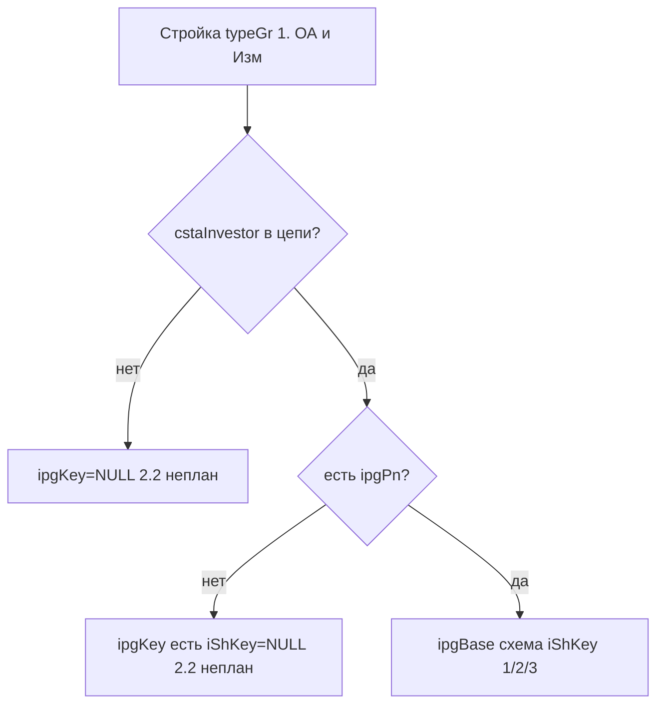
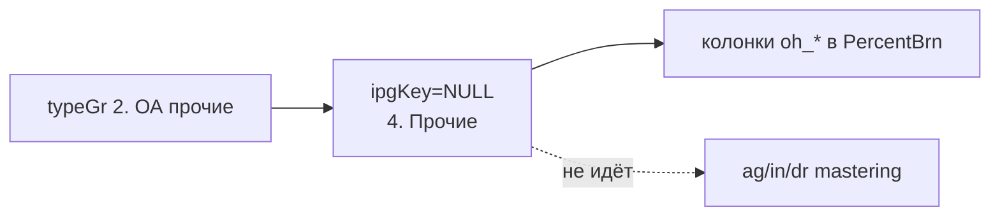
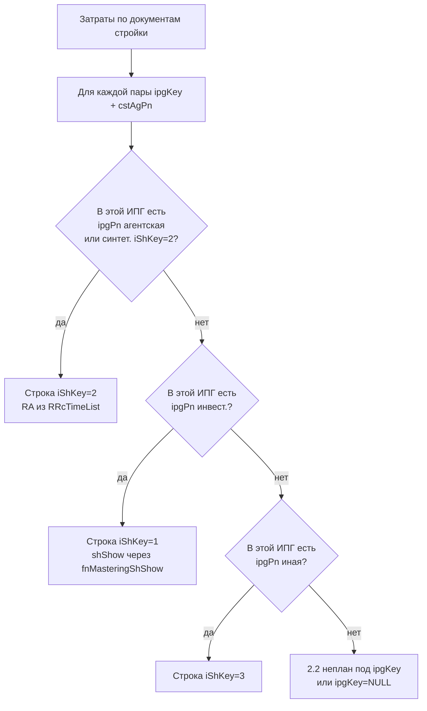

# Каскадное распределение освоения по схемам реализации

**Дата:** 2026-06-11  
**Обновлено:** 2026-06-29 (примеры `np_` / `oh_`; фильтр `stIpg` vs раскладка по схемам)  
**Контекст:** бизнес-правило, подтверждённое в стеке `_2605` / `_2408` и в цепочке `fnMastering*`  
**Связанные объекты:** `fnMasteringCstAgPn`, `fnMasteringCstAgPnSh`, `fnMasteringShShow`, `fnIpgChRsltCstUtl_2408`, `fnIpgChRsltCstUtl2_2605`, `fnIpgChRsltCstUtl2_2606`, `fnIpgChContractsForStIpg_2606`, `fnIpgChRsltCstUtlPercentBrn_2605`

---

## Бизнес-правило

На практике по стройке **инвестиционной** схемы иногда принимаются документы, оформленные «как по агентской» схеме (и аналогично для **иной** схемы). Принятые суммы **нельзя терять** — они должны попасть в отчёт к «родной» схеме по приоритету.

**Приоритет схем освоения ИПГ** (только капзатраты, `typeGr = '1. ОА и Изм.'`):

| Приоритет | `ipgpSh` | Схема |
|-----------|----------|-------|
| 1 | 2 | Агентская |
| 2 | 1 | Инвестиционная |
| 3 | 3 | Иная |
| 4 | — | Без схемы в `ipgPn` → `2.2. Агентская, неплан` |

**Каскад** (в **отчёте** — внутри каждой ИПГ отдельно, только для капзатрат):

1. если в **данной ИПГ** есть пункт `ipgPn` агентской схемы (или синтетическая `iShKey=2`) → освоение к агентской строке;
2. иначе, если в этой ИПГ есть **инвестиционная** → к инвестиционной строке;
3. иначе, если в этой ИПГ есть **иная** → к строке иной схемы;
4. иначе → `2.2. Агентская, неплан` (с `ipgKey` или без).

Симметрично: инвестиционная схема «поглощает» агентские документы, только если агентского пункта `ipgPn` **в данной ИПГ** нет; иная — только если в этой ИПГ нет ни агентского, ни инвестиционного.

### `4. Прочие` — отдельный контур (вне Mstrg)

Тип **`4. Прочие`** (`typeGr = '2. ОА, прочие и Изм'`, `typeGrTtl` в отчёте) **не участвует**
в освоении инвестпрограммы и **не входит в Mstrg** (mastering):

| Аспект | Капзатраты (каскад схем) | `4. Прочие` |
|--------|--------------------------|-------------|
| Влияние на освоение ИПГ | да — лимиты, планы, % освоения | **нет** |
| Стек `fnMastering*` | да (`fnMasteringCstAgPnSh`, …) | **нет** — не вызывается |
| `ipgPn` / `iShKey` / `lim` | да | **нет** (`ipgKey` всегда `NULL`) |
| Колонки `ag_*` / `in_*` / `dr_*` в `PercentBrn` | да | **нет** |
| Колонки `oh_*` в `PercentBrn` | — | **да** — справочно, рядом со строкой ИПГ |

Некапитальные затраты **живут отдельной жизнью**: свой `typeGr`, свой факт из тех же
источников (RA, АВ с `oafCapex ≠ 'Кап'`, …), но **параллельный** поток данных. На лимит,
план и процент освоения ИПГ (`ag_LimPercent`, `ag_percentDev`, …) **не влияют**.

В `fnIpgChRsltCstUtlPercentBrn_2408` суммы `4. Прочие` попадают только в колонки `oh_*`
(отдельный `LEFT JOIN` по `typeGrTtl = '4. Прочие'`), а не в `ag_accepted` / `in_accepted`.
Это **не слияние в mastering**, а **отображение рядом** для той же стройки в том же месяце.

---

## Автономия инвестпрограммы и уникальность схем

Пункт `ipgPn` задаёт привязку **стройка + схема** к конкретной **инвестпрограмме** (`ipgpIpg`), а не к цепи в целом.

### Правила размещения стройки в `ipgPn`

| Область | Правило |
|---------|---------|
| **Внутри одной ИПГ** | Стройка (`ipgpCstAgPn`) с **одной и той же** схемой (`ipgpSh`) — **не более одного** пункта `ipgPn`. |
| **Внутри одной ИПГ** | С **разными** схемами — **несколько** пунктов: до трёх строк (агентская, инвестиционная, иная). |
| **Между разными ИПГ** | Даже в рамках **одной цепи** у одной стройки набор схем **может отличаться**: в ИПГ A только инвестиционная, в ИПГ B — агентская и инвестиционная. **ИПГ автономна.** |

Пример (цепь из трёх ИПГ, одна стройка `cstAgPn = 2102`):

| `ipgKey` | `ipgpSh` в `ipgPn` | Строки отчёта `_2408` |
|----------|-------------------|------------------------|
| 6 | 1 (инвест.) | инвест. + синтет. агент. (`iShKey=2`, `lim=NULL`) |
| 8 | 1 (инвест.) | то же, независимо от ИПГ 6 |
| 11 | 1 (инвест.) | то же, независимо от ИПГ 6 и 8 |

Каскад «куда положить освоение» и флаг `shShow` вычисляются **отдельно для каждой пары (`ipgKey`, `cstAgPn`)**, а не один раз на всю цепь.

### Два уровня в коде

| Уровень | Область действия | Объекты | Назначение |
|---------|------------------|---------|------------|
| **Отчётный** (`_2408`, `fn2_2605`, `fn2_2606`) | **одна ИПГ** | `fnMasteringShShow(@ipg, …)`, CTE `ipgPnSchemePts` с ключом `ipgpIpg` | Разворот строк отчёта: `(месяц × ipgKey × стройка × схема)`; каскад и `shShow` — внутри ИПГ |
| **Mastering-агрегация** | **вся цепь** | `@masteringTrue`, `@ShType` в `fnMasteringCstAgPnSh` | Сведение освоения в колонки `ag*` / `in*` / `dr*` по стройке для пути `fnMasteringStIpgStCost`; PIVOT по всем ИПГ цепи |

Стек **`_2408`** (и наследующий его `_2605`) с автономией ИПГ **справлялся**: отчётные строки и каскад привязаны к `ipgKey`, синтетическая агентская схема добавляется **per `ipgpIpg`**, `fnMasteringShShow` фильтрует `WHERE p.ipgpIpg = @ipg`.

Стек **`_2606`** сохраняет тот же per-ИПГ разворот через `ipgPnSchemePts` / `ipgSchemeCombo` (паритет `fn_2408`, см. `diag-07h-stIpg61-half-rows.md`).

---

## Где реализовано в коде

Логика реализована **в двух связанных слоях**. Стек `_2605` (`spMstrg_2605` → `fnIpgChRsltCstUtlPercentBrn_2605` → `fnIpgChRsltCstUtl2_2605`) вызывает `fnIpgChRsltCstUtl_2408`, который использует оба слоя.

### Слой A — mastering-агрегация по цепи (`fnMastering*`)

Используется при расчёте факта для колонок `ag*` / `in*` / `dr*` (через `fnMasteringStIpgStCost` → `fnMasteringCstAgPnSh`).  
**Важно:** здесь приоритет схем определяется по **всей цепи** (PIVOT `@ShType` группирует по `ipgcrChain + ipgpCstAgPn`, без `ipgpIpg`). Это слой агрегации освоения, не разворот отчёта по ИПГ.

#### A.1. `fnMasteringCstAgPn` — флаг `@masteringTrue`

Для каждого вызова с параметром `@ipgSh` решает, **нужно ли** считать освоение для данной схемы, если в **цепи** есть пункт `ipgPn` со схемой более высокого приоритета:

| `@ipgSh` | Условие `@masteringTrue = true` |
|----------|----------------------------------|
| 2 (агентская) | **всегда** |
| 1 (инвестиционная) | нет пункта `ipgPn` с `ipgpSh = 2` для этой стройки **ни в одной ИПГ цепи** |
| 3 (иная) | нет пунктов `ipgPn` с `ipgpSh IN (1, 2)` для этой стройки **ни в одной ИПГ цепи** |

Объекты: `ags.fnMasteringCstAgPn` (legacy, продуктив), `ags.fnMasteringCstAgPn_2606` (клон с `ipgChRlV` вместо `ipgChRl`).

Фрагмент `_2606` (идентичен legacy по смыслу):

```sql
IF @ipgSh = 2
    SET @masteringTrue = 'true';
ELSE IF @ipgSh = 1
    IF EXISTS (... ipgpSh = 2 ...) SET @masteringTrue = 'false';
    ELSE SET @masteringTrue = 'true';
ELSE
    IF EXISTS (... ipgpSh IN (1, 2) ...) SET @masteringTrue = 'false';
    ELSE SET @masteringTrue = 'true';
```

Если `@masteringTrue = 'false'`, INSERT в результат **не выполняется** — суммы не дублируются, они попадут в колонку схемы более высокого приоритета через `fnMasteringCstAgPnSh`.

#### A.2. `fnMasteringCstAgPnSh` — выбор целевой колонки `@ShType`

PIVOT по фактическим `ipgpSh` стройки **во всех ИПГ цепи** → `min(toShNum)` (группировка `ipgcrChain + ipgpCstAgPn`):

| Наличие схем у стройки в цепи (любая ИПГ) | `@ShType` | Освоение пишется в колонку |
|-------------------------------------------|-----------|----------------------------|
| есть агентская (любая комбинация) | 1 | `ag*` — вызов `fnMasteringCstAgPn(..., @ipgSh=2)` |
| нет агентской, есть инвестиционная | 2 | `in*` — вызов `fnMasteringCstAgPn(..., @ipgSh=1)` |
| только иная | 3 | `dr*` — вызов `fnMasteringCstAgPn(..., @ipgSh=3)` |

При `@ShType = 1` колонки `in*` / `dr*` для освоения заполняются `NULL` (остаются только лимиты). При `@ShType = 2` — освоение только в `in*`, `ag*` пусто. Это и есть «не терять суммы, но показать в одной схеме».

Объекты: `ags.fnMasteringCstAgPnSh` (legacy), `ags.fnMasteringCstAgPnSh_2606`.

### Слой B — отчётный разворот per ИПГ (`fn_2408` / `fn2_2605` / `fn2_2606`)

Каждая строка результата идентифицируется `(yKey, mNum, ipgKey, cstAgPnKey, iShKey, typeGr)`.  
JOIN лимитов: `ipg.ipgKey = lim.ipgKey AND cstAgPnKey = lim.ipgpCstAgPn` — схемы и каскад **внутри ИПГ не смешиваются**.

#### B.1. Синтетическая агентская строка (per `ipgpIpg`)

В подзапросе лимитов `fnIpgChRsltCstUtl_2408` (и CTE `ipgPnSchemePts` в `fn2_2606`):

```sql
SELECT ipgpIpg, ipgpCstAgPn, ipgpSh FROM ipgPn   -- фактические пункты ИПГ
UNION
SELECT ipgpIpg, ipgpCstAgPn, 2 FROM ipgPn WHERE ipgpSh = 1  -- только в этой ИПГ
```

Если у стройки **в данной ИПГ** есть только инвестиционный пункт, добавляется **виртуальная** агентская строка (`iShKey = 2`, `lim = NULL`) **только для этой `ipgpIpg`**. Наличие агентской схемы в другой ИПГ той же цепи на синтетику **не влияет**.

Одна стройка с тремя схемами в одной ИПГ даёт до **трёх** фактических строк (+ синтетическая агентская при `ipgpSh=1` без `ipgpSh=2`); в соседней ИПГ — свой набор.

#### B.2. Разделение источников факта по `iShKey`

В `ipgBase` (`fn2_2606`, паритет `fn_2408`):

| `iShKey` | Источник presented / accepted (RA) |
|----------|-------------------------------------|
| 2 (агентская) | `raFact2408` / `RRcTimeList` напрямую по `cstAgPnKey` |
| 1, 3 | `mstrPresented` / `mstrAccepted` из mastering (`fnMasteringCstAgPnSh`) |

Условие для RA на агентской строке: `iShKey = 2 AND shShow = 'true'`.

На агентской строке (`iShKey = 2`) RA-факт берётся из `RRcTimeList` **для каждой ИПГ отдельно** (одни и те же суммы по контракту повторяются на строках всех ИПГ, где есть агентская или синтетическая схема — как в `fn_2408`). Освоение инвестиционной строки в отчёте подавляется, если в **этой ИПГ** есть агентский пункт (`fnMasteringShShow`).

#### B.3. `fnMasteringShShow` — каскад внутри одной ИПГ

```sql
fnMasteringShShow(@ipg, @cstAgPn, @toShNum)
-- фильтр: WHERE p.ipgpIpg = @ipg AND p.ipgpCstAgPn = @cstAgPn
```

Это **основной** механизм каскада для отчёта `_2408` / `_2605`. Иерархия приоритетов — как в бизнес-правиле, но **только внутри `@ipg`**:

| `@toShNum` | `@rslt = true` когда |
|------------|----------------------|
| 1 (агентская) | всегда |
| 2 (инвестиционная) | нет `ipgPn` с `ipgpSh = 2` для стройки **в этой ИПГ** |
| 3 (иная) | нет `ipgPn` с `ipgpSh IN (1, 2)` **в этой ИПГ** |

Вызов в `fnIpgChRsltCstUtl_2408`:

```sql
ags.fnMasteringShShow(z.ipgKey, z.cstAgPnKey,
    CASE z.iShKey WHEN 1 THEN 2 WHEN 3 THEN 3 ELSE 1 END) = 'true'
```

Таким образом, в ИПГ с одной инвестиционной схемой каскад «агентские документы → инвестиционная строка» срабатывает **локально**, даже если в другой ИПГ цепи у той же стройки есть отдельный агентский пункт.

### Слой C — капзатраты «мимо схемы» (`2.2. Агентская, неплан`)

Отдельно от **`4. Прочие`** (см. выше) — капзатраты без пункта `ipgPn` или без привязки
инвестора к ИПГ цепи. Это **ещё в контуре Mstrg** (идут в `fn2` / `PercentBrn` как строки
с `typeGr = '1. ОА и Изм.'`), но **без схемы и лимита**:

| `typeGrTtl` | `ipgKey` | Смысл |
|-------------|----------|-------|
| **`2.2. Агентская, неплан`** | `NULL` | Капзатраты, инвестор **не** в цепи |
| **`2.2. Агентская, неплан`** | **заполнен** | Инвестор в ИПГ (`cstaInvestor = ipg.ipgOg`), но **нет `ipgPn`** |

#### C.1. Пути капзатрат «мимо» схемы `ipgPn`



**`extraBase`** / **`masExtraBase`** (`fn2_2606`, паритет `fn_2408`) — пути NP2; см. `04_CREATE_FUNCTION_fnIpgChRsltCstUtl2_2606.sql`.

| CTE | Условие | Типичный случай |
|-----|---------|-----------------|
| **`extraBase`** | капзатрата в `ipgChContracts`, **нет** в `@schemeRows` / `ipgPn` цепи, инвестор ∈ ИПГ цепи | ~288 контрактов «только по факту» без пункта ИПГ |
| **`masExtraBase`** | контракт **в** mastering (`@schemeRows`), но для **данной** `ipgKey` нет `ipgPn` | стройка в `ipgPn` на ИПГ 8/11, факт на ИПГ 6 |

#### C.2. `PercentBrn` — колонки `np_*` (капзатраты «вне плана»)

`fnIpgChRsltCstUtlPercentBrn_2408` / `_2605` / `_2606` агрегирует строки `fn2` с `typeGrTtl = '2.2. Агентская, неплан'` в префикс **`np_`** (не в `ag_*`):

```sql
sum(case when typeGrTtl = '2.2. Агентская, неплан' then accepted end) as np_accepted
```

| `typeGrTtl` в `fn2` | Префикс в `PercentBrn` | Лимит / план ИПГ |
|---------------------|------------------------|------------------|
| `2. Агентская, план` | `ag_*` | да |
| `1. Инвестиционная` | `iv_*` | да |
| `1.2. Инв. (Аг., неплан)` | `ia_*` | синтет. агент. при `ipgpSh=1` |
| **`2.2. Агентская, неплан`** | **`np_*`** | **нет** (`lim=NULL`, не в mastering) |
| `4. Прочие` | `oh_*` | нет (отдельный контур, см. слой D) |

**Важно:** `np_*` — это **капитальное** освоение без пункта `ipgPn` (или без схемы на данной ИПГ). Оно **видно в отчёте**, но **не увеличивает** `ag_LimPercent` / `ag_percentDev` на плановых строках.

### Слой D — `4. Прочие` (вне Mstrg, `fn_2408` / `fn2_*`)

Некапитальные затраты — **отдельный контур**, не часть каскада схем и **не часть mastering**:

| Свойство | Значение |
|----------|----------|
| `typeGr` | `'2. ОА, прочие и Изм'` |
| `typeGrTtl` | `'4. Прочие'` |
| `ipgKey` | всегда `NULL` (JOIN к `ipg` в `fn_2408` не срабатывает) |
| `lim`, `iShKey` | всегда `NULL` |
| `fnMastering*` | **не используется** |
| Mstrg / `ag_*` / `in_*` / `dr_*` | **не заполняются** |

Каскад ag→inv→dr к **`4. Прочие` не применяется** — это другой вид затрат.

#### D.1. Универсум строек — `fnIpgChRsltCst`

Перечень `(cstAgPnKey, mKey, typeGr)` строится из **всех источников факта** за год цепи:

- `ogAgFee` / `ogAgFeeP` (АВ; `oafCapex` → `typeGr`)
- `ra` / `ra_change` (ОА)
- `ralp`, `cn_PrDocP` (хранение), `cstAgPnMnrl` (ОПИ)
- стройки из `ipgPn` цепи

Далее `CROSS JOIN mmmm × ra_typeGr` — для каждой стройки до **двух** групп `typeGr`
(капитальные и прочие), × 12 месяцев.

#### D.2. Назначение `ipgKey` в `fnIpgChRsltCstUtl_2408`

Ядро — подзапрос `z` (месяцы × `fnIpgChRsltCst`):

```sql
LEFT JOIN (
    SELECT ipg.*, '1. ОА и Изм.' AS typeGr
    FROM ags.ipg ipg
    JOIN ags.ipgChRl cr ON ipg.ipgKey = cr.ipgcrIpg
    WHERE cr.ipgcrChain = @ipgChKey
) ipg ON y.yKey = ipg.ipgYy
     AND a.cstaInvestor = ipg.ipgOg
     AND x.typeGr = ipg.typeGr          -- только для капзатрат!
LEFT JOIN ( /* lim: ipgPn + синтет. UNION */ ) lim
    ON ipg.ipgKey = lim.ipgKey AND x.cstAgPnKey = lim.ipgpCstAgPn
```

| Условие | Результат |
|---------|-----------|
| `typeGr = '2. ОА, прочие и Изм'` | JOIN к `ipg` **не срабатывает** (`ipg.typeGr` всегда `'1...'`) → **`ipgKey = NULL`** |
| `typeGr = '1. ОА и Изм.'`, `cstaInvestor` совпал с `ipg.ipgOg` | `ipgKey` назначен |
| `typeGr = '1...'`, инвестор **не** в цепи | `ipgKey = NULL` |
| `ipgKey` есть, стройка **не** в `ipgPn` этой ИПГ | `lim = NULL`, `iShKey = NULL` |
| `typeGr = '2...'` | `lim` принудительно `NULL` (даже при гипотетическом join) |

Привязка к ИПГ — **не через `ipgPn`**, а через **инвестора** (`cstaInvestor = ipg.ipgOg`).
Пункт `ipgPn` нужен уже для схемы и лимита.

#### D.3. Факт на строках `4. Прочие`

Факт (RA, АВ, РАЛП, …) подключается `LEFT JOIN` по `(yKey, cstAgPnKey, mKey, typeGr)`.

Дополнительно на join RA/АВ/РАЛП в `fn_2408`:

```sql
AND ags.fnMasteringShShow(z.ipgKey, z.cstAgPnKey,
        CASE z.iShKey WHEN 1 THEN 2 WHEN 3 THEN 3 ELSE 1 END) = 'true'
```

Для `4. Прочие` (`ipgKey IS NULL`, `iShKey IS NULL`) условие `fnMasteringShShow` формально
выполняется (`toShNum = 1`), но это **не каскад mastering** — просто пропуск факта на
отдельную строку, не связанную с ИПГ.

#### D.4. Путь `4. Прочие` (вне Mstrg)



**`nullIpgBase`** (`fn2_2606`): только `typeGr = '2. ОА, прочие и Изм'`.

#### D.5. `PercentBrn` — `oh_*` рядом с Mstrg, но не внутри него

`fnIpgChRsltCstUtlPercentBrn_2408` выносит суммы `4. Прочие` в **отдельные** колонки `oh_*`
(справочный блок «прочие затраты по стройке»), **не** в `ag_accepted` / `in_accepted` / `ag_LimPercent`:

```sql
-- сколько ИПГ-строк у стройки в этом месяце (NULL не считается)
COUNT(t.ipgKey) OVER (PARTITION BY t.yKey, t.mKey, t.ogaKey, t.cstAgPnCode) AS ipgCount

-- суммы из 4. Прочие — на все строки той же стройки/месяца
SUM(CASE WHEN t.typeGrTtl = '4. Прочие' THEN presented END)
    OVER (PARTITION BY t.yKey, t.mKey, t.ogaKey, t.cstAgPnCode) AS oh_presented
```

**Фильтр видимости:**

```sql
WHERE NOT (ipgKey IS NULL AND ipgCount > 0)
```

| Ситуация в месяце | Поведение |
|-------------------|-----------|
| Только `4. Прочие` (`ipgKey=NULL`) | Отдельная строка; суммы в полях `presented`/`accepted` строки `4. Прочие` |
| Есть `4. Прочие` и строки Mstrg с `ipgKey` | Строка `4. Прочие` **скрывается** (`ipgCount > 0`); те же суммы — в **`oh_*`** на ИПГ-строке |
| Нет строк Mstrg в месяце | Строка `4. Прочие` остаётся единственной (`ipgCount = 0`) |

Комментарий в коде: *«уберёт строки прочих расходов для месяцев, где имеется освоение по
другим направлениям…»* — имеются в виду **направления Mstrg** (капзатраты по ИПГ), не слияние
в `ag_*`.

**Важно:** `oh_*` — **не освоение ИПГ**. Суммы `4. Прочие` **не увеличивают** `ag_accepted`,
не участвуют в `ag_LimPercent` / `ag_percentDev`. Это параллельный справочный срез для отчёта
`spMstrg`.

#### D.6. Итог: два контура в одном отчёте

| Контур | `typeGrTtl` | Mstrg / mastering | Лимит ИПГ |
|--------|-------------|-------------------|-----------|
| Освоение ИПГ | `1.`, `2.`, `3.`, `1.2.`, `2.2.` (кап) | **да** | да / нет (неплан) |
| Прочие затраты | **`4. Прочие`** | **нет** | нет |

Логика `typeGrTtl` — в `fnIpgChRsltCstUtl2_2408` / `_2605` / `_2606` (одинаковая формула `IIF`).

---

## Два уровня «вне инвестпрограммы» (не путать)

В обсуждении и в коде встречаются **два независимых** фильтра:

| Уровень | Вопрос | Механизм | Влияет на `ag_` / `np_` / `oh_`? |
|---------|--------|----------|-----------------------------------|
| **Нет пункта `ipgPn`** (или нет на *этой* ИПГ) | куда положить **факт** по схемам? | `typeGrTtl` в `fn2` → `PercentBrn` | **да** — определяет колонку (`np_` vs `ag_` …) |
| **Не в разделе `stIpg`** | какие **стройки** показать в RS? | `_2605`: `importIpgSt_26-0320`; `_2606`: `fnIpgChContractsForStIpg_2606` (IN_GROUP ∪ OUT_GROUP) | **нет** — только видимость стройки при `@ipgSt` / `@ipgStKey` |

Фильтр `stIpg` (этап **19.3**) **не меняет** раскладку факта внутри стройки: если стройка попала в RS, её капфакт без `ipgPn` по-прежнему идёт в **`np_*`**, прочие затраты — в **`oh_*`**.

---

## Примеры на данных (цепь 5, FishEye dev, 2022)

Проверено запросами к `fnIpgChRsltCstUtl2_2605(5, NULL)` и `fnIpgChContractsForStIpg_2606(5, …)` @ `10.7.0.3` (**2026-06-29**).

### Пример 1 — капзатрата с фактом, `ipgPn` не на всех ИПГ → `np_`

**Стройка:** `051-2004714` (`cstAgPnKey = 1129`, тип кода `2` — КПР).

| Факт | Значение |
|------|----------|
| `ipgPn` в цепи 5 | только ИПГ **8**, **11** (`ipgpSh = 2`, агентская) |
| Апрель, ИПГ **6** (`Утверждённая`) | `typeGrTtl = 2.2. Агентская, неплан`, `iShKey = NULL`, `accepted ≈ 5.09 млрд` |
| Источник строки | **`masExtraBase`** — mastering-контракт, но на ИПГ 6 нет `ipgPn` |

На ИПГ **8** в том же месяце при наличии `ipgPn` факт уходит в **`ag_accepted`** (`typeGrTtl = 2. Агентская, план`). Одна стройка, один месяц — **две колонки**: плановая на ИПГ с пунктом, неплановая на остальных ИПГ инвестора.

### Пример 2 — кап + прочие затраты на одной стройке → `np_` и `oh_`

**Стройка:** `033-2000973` (`cstAgPnKey = 759`, тип `2`).

| Месяц | `typeGr` | `typeGrTtl` | `ipgKey` | `accepted` | Колонка PercentBrn |
|-------|----------|-------------|----------|------------|-------------------|
| 3 | `1. ОА и Изм.` | `2.2. Агентская, неплан` | 6 | 508 млн | `np_accepted` |
| 3 | `2. ОА, прочие и Изм` | `4. Прочие` | NULL | NULL | — |
| 11 | `2. ОА, прочие и Изм` | `4. Прочие` | NULL | 1.76 млрд | `oh_accepted` (окно по стройке/месяцу) |

Капитальное и некапитальное освоение — **параллельные контуры** (`CROSS JOIN ra_typeGr` в `fnIpgChRsltCst`). Прочие **не входят** в `ag_accepted` и не двигают % лимита.

### Пример 3 — фильтр `@ipgStKey` (_2606) vs раскладка по схемам

Те же стройки **759**, **1129**, **13** (`039-2001223`, в `ipgPn` цепи 5 нет):

| `@ipgStKey` | В `fnIpgChContractsForStIpg_2606`? | Пояснение |
|-------------|-----------------------------------|-----------|
| `NULL` | да (все трое) | полная цепь |
| **1** (корень) | да | IN ∪ OUT на корне |
| **51** | да | OUT_GROUP: тип `2` разрешён в `stIpgOutLimPn`, стройки вне IN_GROUP узла 51 |
| **42** (лист, нет строк OUT) | **нет** | не в поддереве IN_GROUP; OUT для узла не настроен |

После **19.3** при `@ipgStKey = 42` эти стройки **не попадут в RS**, хотя на полной цепи их капфакт шёл бы в `np_*`, а прочие — в `oh_*`.

### Пример 4 — `_2605` и ручной справочник

При `@ipgSt` ≠ NULL стройка видна только если код есть в `ags.importIpgSt_26-0320` с нужным `cst_type` (`99ОСТ`, `23КПР`, …). Раскладка `np_` / `oh_` та же, что в `_2408` / `_2606`.

---

## Сводка: куда попадает освоение

| Ситуация | Mastering / лимит | `typeGrTtl` | PercentBrn | `_2605` фильтр | `_2606` фильтр |
|----------|-------------------|-------------|------------|-----------------|----------------|
| Кап, есть `ipgPn`, агент. план | да | `2. Агентская, план` | `ag_*` | `importIpgSt` | IN ∪ OUT |
| Кап, нет `ipgPn` на ИПГ, есть факт | нет | `2.2. неплан` | `np_*` | то же | то же |
| Прочие затраты (некап.) | нет | `4. Прочие` | `oh_*` | то же | то же |
| Кап, инвестор вне цепи | нет | `2.2. неплан`, `ipgKey=NULL` | `np_*` | то же | то же |

---

## Сводная схема каскада (отчёт `_2408`, per ИПГ)



Другая ИПГ той же цепи для той же стройки проходит этот же алгоритм **независимо** (автономия ИПГ).

---

## Проверка наличия в стеке `_2605`

| Компонент | Статус | Примечание |
|-----------|--------|------------|
| `@masteringTrue` в `fnMasteringCstAgPn` | ✅ есть | legacy в БД, используется mastering-стеком |
| `@ShType` в `fnMasteringCstAgPnSh` | ✅ есть | legacy в БД |
| `fnMasteringShShow` (каскад **per ИПГ**) | ✅ есть | `WHERE ipgpIpg = @ipg` в `fnIpgChRsltCstUtl_2408` |
| Синтетическая агентская схема (UNION per `ipgpIpg`) | ✅ есть | в `fnIpgChRsltCstUtl_2408` |
| Автономия ИПГ (разные схемы в разных ИПГ цепи) | ✅ есть | JOIN `lim` по `ipgKey`; `_2408` эталон |
| RA на `iShKey=2` vs mastering на `iShKey=1` | ✅ есть | в `fn_2408` / `fn2_2606` |
| Капзатраты без схемы (`extra` / `masExtra`, `2.2 неплан`) | ✅ есть | в контуре Mstrg |
| `4. Прочие` вне Mstrg (`nullIpgBase`, `oh_*`) | ✅ есть | не в `fnMastering*`; не в `ag_*`/`in_*`/`dr_*` |
| `PercentBrn`: `ipgCount` + `oh_*` (справочно) | ✅ есть | `fnIpgChRsltCstUtlPercentBrn_2408`; наследуется `_2605` |
| `fnIpgChRsltCstUtl2_2605` | ✅ обёртка | вызывает `fn_2408`, наследует всю логику; добавляет фильтр `@ipgSt` и отсечение all-NULL строк |

**Вывод:** бизнес-правило и **автономия ИПГ** реализованы в `_2408` (эталон для `_2605`). Каскад в отчёте — через `fnMasteringShShow` и `ipgPnSchemePts` per `ipgpIpg`; уникальность «одна схема — один раз в ИПГ» обеспечивается моделью `ipgPn`. Стек `_2606` сохраняет паритет с `fn_2408` (`ipgPnSchemePts`, v7.1).

---

## Файлы исходников

| Объект | Путь в репозитории |
|--------|-------------------|
| `fnIpgChRsltCstUtl2_2605` | `docs/development/notes/sql/26-0508/01_CREATE_FUNCTION_fnIpgChRsltCstUtl2_2605.sql` |
| `fnIpgChRsltCstUtl2_2408` | `docs/development/notes/sql/26-0416/CREATE_FUNCTION_ags_fnIpgChRsltCstUtl2_2408.sql` |
| `fnIpgChRsltCst` | БД `ags.fnIpgChRsltCst` |
| `fnIpgChRsltCstUtlPercentBrn_2408` | `docs/development/notes/sql/26-0416/CREATE_FUNCTION_ags_fnIpgChRsltCstUtlPercentBrn.sql` |
| `fnIpgChRsltCstUtl2_2606` | `docs/development/notes/sql/26-0604/04_CREATE_FUNCTION_fnIpgChRsltCstUtl2_2606.sql` |
| `fnIpgChContractsForStIpg_2606` | `docs/development/notes/sql/26-0604/10d_CREATE_FUNCTION_fnIpgChContractsForStIpg_2606.sql` |
| `fnMasteringCstAgPnSh_2606` | `docs/development/notes/sql/26-0604/03c_CREATE_FUNCTION_fnMasteringCstAgPnSh_2606.sql` |
| Диагностика синтетической схемы | `docs/development/notes/sql/26-0604/docs/diag-07h-stIpg61-half-rows.md` |
| Карта вычислений | `docs/development/notes/sql/26-0604/docs/04-computation-map.md` |

Legacy-объекты `fnMasteringCstAgPn`, `fnMasteringCstAgPnSh`, `fnMasteringShShow`, `fnIpgChRsltCstUtl_2408` — в БД FishEye (`OBJECT_DEFINITION`).

---

*Создан: 2026-06-11. Обновлён: 2026-06-29 (примеры `np_`/`oh_`, фильтр `stIpg`). Автор: Александр.*
